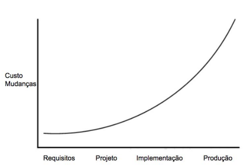

## Exercicios:
1. Os custos com manutenção podem alcançar 80% dos custos totais alocados a um projeto de software durante o seu ciclo de vida. Por que esse valor é tão alto?
> A manutenção de software é cara (até 80% do custo total) porque o software tem uma vida útil longa e precisa ser constantemente atualizado para corrigir bugs, adaptar-se a novas tecnologias e atender a novas solicitações dos usuários, tornando-se mais complexo com o tempo.


2. Suponha que você tenha que construir uma ponte. Como seria o projeto dessa ponte usando:  
   a. Um método Waterfall  
   b. Um método Ágil
> [a] - No método Waterfall, a construção da ponte seguiria fases sequenciais e rígidas (levantamento de requisitos, análise estrutural, projeto detalhado, construção, testes e entrega final).
> [b] - Com Ágil, o projeto seria dividido em etapas menores e mais flexíveis, com foco na colaboração e adaptação contínua, embora a construção física ainda seguisse uma ordem lógica.


3. Refactoring é uma transformação de código que preserva comportamento. Qual o significado da expressão "preservar comportamento"?
> "Preservar comportamento" em refatoração significa alterar a estrutura interna do código para melhorá-lo (torná-lo mais limpo e eficiente) sem mudar o que ele faz externamente; ou seja, a funcionalidade do programa continua exatamente a mesma para o usuário.


4. Em testes, existe uma frase muito famosa, de autoria de Edsger W. Dijkstra, que diz:  
   “Testes de software mostram a presença de bugs, mas não a sua ausência.”  
   Por que testes são incapazes de mostrar a ausência de bugs?
> A frase de Dijkstra significa que é impossível testar todas as combinações de entradas e cenários de um software; por isso, os testes podem provar que existem bugs (ao encontrá-los), mas nunca podem garantir que não existem mais bugs escondidos.


5. Em gerência de projetos de software, existe uma lei empírica muito famosa, chamada Lei de Brooks, que diz:  
   “Incluir novos desenvolvedores em um projeto que está atrasado vai deixá-lo mais atrasado ainda.”  
   Por que essa lei tende a ser verdadeira?
> Adicionar mais desenvolvedores a um projeto de software atrasado geralmente o atrasa ainda mais porque os novos membros precisam de tempo para aprender (e consomem o tempo dos antigos para ensinar), a comunicação se torna mais complexa e nem todas as tarefas podem ser facilmente divididas.


6. Seja o seguinte gráfico, que mostra — para um sistema — como os custos de mudanças variam conforme a fase do desenvolvimento. (a) Qual método de desenvolvimento você recomendaria para esse sistema?
>  O gráfico mostra que o custo para alterar o sistema aumenta drasticamente com o tempo. Por isso, o método recomendado é o Ágil, pois ele é projetado para lidar com mudanças de forma barata e constante, através de ciclos curtos e feedback contínuo, evitando os custos exponenciais de mudanças tardias que ocorrem em modelos tradicionais como o Waterfall.

---


---


11. Em 2015, descobriu-se que mais de 11 milhões de carros da Volkswagen emitiam poluentes dentro das normas legais apenas quando eles estavam sendo testados em um laboratório de certificação. Fora do laboratório, os carros emitiam mais poluentes, para melhorar o desempenho. Ou seja, o código incluía uma estrutura de decisão como a seguinte (meramente ilustrativa, para fins deste exercício):

````
if "Carro sendo testado em um laboratório"
"Emita poluentes dentro das normas"
else 
"Emita poluentes fora das normas"
````

O que você faria se seu chefe pedisse para escrever um if como esse?
> Não realizaria a ação, pois isso poderia comprometer e grava um grande público, não sendo ético.
