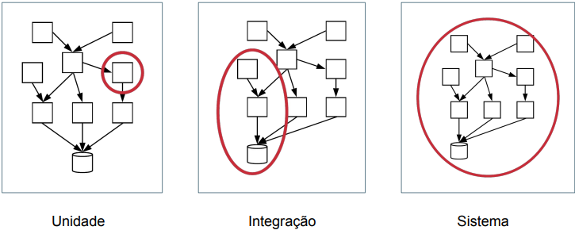

## 	1. Visão geral sobre a engenharia de software:
### 1.1. Conceitos básicos
####  Definições e contexto
- Softwares no mundo todo e está também embarcado em diferentes (dispositivos e produtos de engenharia, incluindo automóveis, aviões, satélites, robôs, etc.).

- Engenharia de Software trata da aplicação de abordagens sistemáticas, disciplinadas e quantificáveis para desenvolver, operar, manter e evoluir software. Ou seja, Engenharia de Software é a área da Computação que se preocupa em propor e aplicar princípios de engenharia na construção de software de forma produtiva e com qualidade.
- Termos: soluções e sistemas de software. 

- **Conferência da OTAN**: O objetivo da conferência era chamar a atenção para um problema crucial do uso de computadores, o chamado software. A conferência produziu um relatório, com mais de 130 páginas, que afirmava a necessidade de que software fosse construído com base em princípios práticos e teóricos, tal como ocorre em ramos tradicionais e bem estabelecidos da Engenharia. 

- Passados mais de cinquenta anos desde a Conferência da OTAN, o desenvolvimento de software evoluiu para métodos mais flexíveis, com uso de padrões, bibliotecas e frameworks que permitem reaproveitar soluções existentes sem precisar reinventar a roda. Além disso, práticas de teste e manutenção contínua garantem a qualidade e a longevidade dos sistemas, assim como acontece em outras engenharias.

- **Existem dois tipos de dificuldades em desenvolvimento de software**: dificuldades essenciais e dificuldades acidentais. *As essenciais* são da natureza da área e dificilmente serão superadas por qualquer nova tecnologia.

> As dificuldades essenciais são as seguintes:
- Tornam Engenharia de Software diferente de outras engenharias.
* **Complexidade:** Software é uma das construções humanas mais desafiadoras e complexas, superando até certas engenharias tradicionais.
* **Conformidade:** Software precisa se adaptar constantemente a mudanças no ambiente, como novas leis ou regulamentações.
* **Facilidade de mudanças:** Sistemas de software devem evoluir continuamente, incorporando novas funcionalidades conforme crescem em sucesso.
* **Invisibilidade:** Por ser abstrato, é difícil visualizar e estimar o esforço necessário para construir um sistema de software.

- *As dificuldades acidentais* do desenvolvimento de software estão relacionadas a problemas tecnológicos, como ferramentas mal documentadas, bugs em IDEs ou interfaces pouco intuitivas, e podem ser resolvidas por engenheiros de software treinados com acesso adequado a tecnologias e recursos.

#### 1.2 O que se Estuda em Engenharia de Software?
- Engenharia de Requisitos.
- Projeto de Software.
- Construção de Software.
- Testes de Software.
- Manutenção de Software.
- Gerência de Configuração.
- Gerência de Projetos.
- Processos de Software.
- Modelos de Software.
- Qualidade de Software.
- Prática Profissional.
- Aspectos Econômicos.

#### 1.2.1 Engenharia de Requisitos
- Os requisitos de um sistema definem o que ele deve fazer e como ele deve operar. Assim, a Engenharia de Requisitos inclui o conjunto de atividades realizadas com o objetivo de definir, analisar, documentar e validar os requisitos de um sistema. Em uma primeira classificação, os **requisitos podem ser funcionais ou não-funcionais**.

> Requisitos funcionais definem o que um sistema deve fazer; isto é, quais funcionalidades ou serviços ele deve implementar.

> Já os requisitos não-funcionais definem como um sistema deve operar, sob quais restrições e com qual qualidade de serviço. São exemplos de requisitos não-funcionais: desempenho, disponibilidade, tolerância a falhas, segurança, privacidade, interoperabilidade, capacidade, manutenibilidade e usabilidade.

#### 1.2.2 Projeto de Software
- Durante o **projeto de software**, definem-se as principais unidades de código e suas **interfaces**:  

- **Interfaces providas**: serviços que a unidade oferece para o restante do sistema.  
- **Interfaces requeridas**: serviços dos quais a unidade depende para funcionar (também chamadas de dependências).  

- A implementação interna de cada unidade não é detalhada neste estágio.  

- Quando o projeto é feito em nível mais alto, envolvendo pacotes ou módulos, ele é chamado de **projeto arquitetural**, que organiza o sistema em um nível de abstração superior ao das classes individuais.

#### 1.2.3 Construção de Software
- Construção trata da implementação, isto é, codificação do sistema. Nesse momento, existem diversas decisões que precisam ser tomadas, como, por exemplo: definir os algoritmos e estruturas de dados que serão usados, definir os frameworks e bibliotecas de terceiros que serão usados. 

#### 1.2.4 Testes de Software
- **Testes de software** consistem em executar um programa com casos específicos para verificar se ele se comporta como esperado, lembrando que **testes mostram a presença de bugs, mas não a sua ausência**.

### Tipos de Testes
- **Unitários**: verificam pequenas partes do código, como métodos ou classes, garantindo que cada unidade funcione corretamente isoladamente.  
- **Integração**: testam conjuntos de unidades juntas, verificando se a comunicação e interação entre elas ocorrem conforme esperado.  
- **Teste de sistema**: avalia o software completo, garantindo que todas as funcionalidades atendam aos requisitos e funcionem corretamente em seu ambiente real.

---

---
- **Performance**: verificam o desempenho sob carga.  
- **Usabilidade**: avaliam a interface do sistema.

### Objetivos
- **Verificação**: garantir que o sistema atende à sua especificação.  
  *Pergunta:* "Estamos implementando o sistema corretamente?"  
- **Validação**: garantir que o sistema atende às necessidades do cliente.  
  *Pergunta:* "Estamos implementando o sistema correto?"

### Conceitos Importantes
- **Defeito / bug / erro / falta**: código que não segue a especificação.  
- **Falha**: ocorre quando um código defeituoso é executado e gera um resultado incorreto.

### Exemplo Real
A explosão do foguete **Ariane 5 (1996)** foi causada por um defeito em poucas linhas de código que nunca havia sido testado em uma situação específica, mostrando que falhas podem ter consequências graves mesmo quando o erro é pequeno.

#### 1.2.5 Manutenção e Evolução de Software:
- O software, assim como outros produtos de engenharia, precisa de **manutenção**, que pode ser classificada em cinco tipos:

* **Corretiva**: corrige bugs que já causaram falhas nos usuários, OU SEJA, corrigir bugs reportados por usuários ou outros desenvolvedores.

* **Preventiva**: corrige falhas latentes antes que causem problemas, como a adaptação de sistemas antes do ano 2000 (corrigir bugs latentes no código, que ainda não causaram falhas junto aos usuários do sistema).

* **Adaptativa**: ajusta o sistema a mudanças no ambiente, legislação, tecnologia ou clientes, como migrações de versões de linguagem ou customizações (daptar um sistema a uma mudança em seu ambiente, incluindo tecnologia, legislação, regras de integração com outros sistemas ou demandas de novos clientes.).

* **Refactoring**: melhora o código sem alterar seu comportamento, tornando-o mais legível e organizado (modificações realizadas em um software preservando seu comportamento e visando exclusivamente a melhoria de seu código ou projeto).

* **Evolutiva**: adiciona novas funcionalidades ou aprimora existentes, garantindo que sistemas antigos continuem úteis, como sistemas bancários desenvolvidos em COBOL e atualizados para Web e mobile ( para incluir uma nova funcionalidade ou introduzir aperfeiçoamentos importantes em funcionalidades existentes).

> Sistemas **legados** são antigos e tecnológicos ultrapassados, tornando a manutenção mais custosa, mas ainda críticos para os clientes.

#### 1.2.8 Processos de Desenvolvimento de Software
- Um **processo de desenvolvimento de software** define as etapas e atividades necessárias para construir e entregar um sistema, de forma semelhante à construção de um prédio, que segue etapas como fundação, alvenaria e acabamento.

### Tipos de Processos

- **Waterfall (Cascata)**: método sequencial inspirado em engenharias tradicionais, com etapas como levantamento de requisitos, análise, projeto detalhado, codificação e testes, liberando o sistema somente ao final. Foi muito usado até os anos 1990, especialmente em projetos militares, mas apresenta problemas de adaptação a mudanças, já que a validação ocorre tardiamente.

- **Ágeis (Iterativos e Incrementais)**: surgiram em 2001 como alternativa ao Waterfall, construindo o software em pequenos incrementos, revisados e validados pelos usuários periodicamente. Métodos ágeis, como **Scrum, XP, Kanban e Lean**, promovem práticas como testes automatizados, test-driven development e **integração contínua**, reduzindo conflitos e melhorando a adaptação a mudanças.

- Enquanto Waterfall segue um planejamento rígido e sequencial, os processos ágeis focam em ciclos curtos de entrega e feedback contínuo, aumentando flexibilidade e qualidade do software.

#### 1.2.11 Prática Profissional
- A prática profissional em Engenharia de Software envolve formação acadêmica adequada, regulamentação da profissão e responsabilidade ética no desenvolvimento de sistemas que impactam a sociedade.  

- Profissionais devem seguir códigos de ética, como os da **ACM**, **IEEE** e **SBC**, garantindo competência técnica, sigilo, respeito às leis, inclusão, responsabilidade e honestidade em suas atividades. Ainda deve-se pensar de forma ética sobre o software produzido. 

#### 1.3 Classificação de Sistemas de Software

- O software varia muito em tamanho, criticidade e requisitos, e não existe um único modo de desenvolvimento adequado para todos os tipos. Bertrand Meyer propôs uma classificação que ajuda a entender os sistemas e os princípios de Engenharia de Software mais recomendados para cada categoria:

### Sistemas C (Casuais)
- São pequenos, de baixo risco e sem pressão por alta qualidade.  
- Podem ter bugs, código duplicado ou interfaces simples, geralmente desenvolvidos por 1-2 programadores.  
- **Exemplos**: um script para trabalho acadêmico, um programa de conversão de arquivos usado uma única vez, ou um sistema simples para gerenciar salas de reunião na empresa.  
- Não exigem técnicas avançadas de Engenharia de Software; o maior risco é **over-engineering**, ou seja, usar soluções complexas onde não são necessárias.

### Sistemas A (Acute / Missão crítica)
- Falhas podem causar grandes prejuízos ou até perda de vidas.  
- Exigem processos rígidos, revisões de código, certificação externa, redundância de hardware/software e, muitas vezes, especificações formais.  
- **Exemplos**: sistemas de controle de carros autônomos, usinas nucleares, aviões, equipamentos de UTI ou trens de metrô.  
- **Aviso**: estes sistemas não serão tratados neste livro, mas é importante entender que requerem cuidados extremos.

### Sistemas B (Business)
- São sistemas corporativos, aplicativos web, bibliotecas ou softwares de uso geral, sendo os mais comuns em empresas.  
- Podem se beneficiar das boas práticas de Engenharia de Software, aumentando produtividade, qualidade interna (manutenção e legibilidade) e externa (menos bugs em produção).  
- **Exemplos**: sistemas de gestão financeira, recursos humanos, logística, sistemas de e-commerce, redes sociais, editores de texto ou planilhas, IDEs e bancos de dados.
