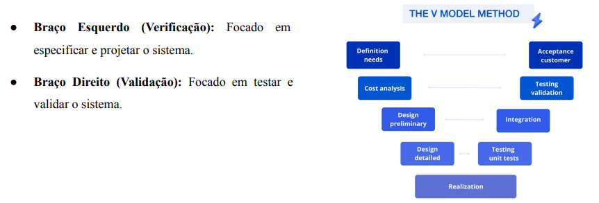
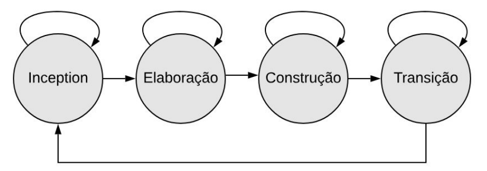
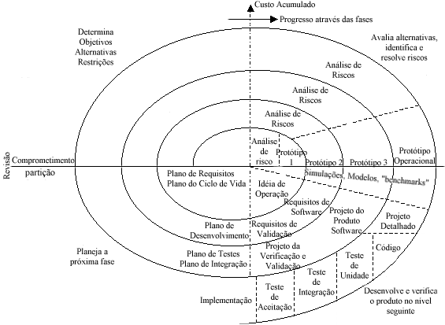
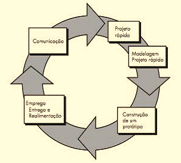

## Modelos de processo de software
- Um Modelo de Processo de Software é uma representação simplificada e estruturada das etapas, atividades, e tarefas envolvidas na produção de um software, desde a sua concepção inicial até a entrega final e manutenção.

### 1. (Sequenciais) Modelo em Cascata (Waterfall)
- *Definição*: O Modelo em Cascata é uma abordagem sequencial e linear para o desenvolvimento de software. Nele, as fases do projeto são executadas em uma ordem estrita, onde o início de uma fase depende da conclusão bem-sucedida da anterior, semelhante a uma cascata de água.
- Seguem uma ordem fixa, onde cada fase deve ser totalmente concluída antes que a próxima seja iniciada. Esse fluxo unidirecional, como uma cascata, é o que dá nome à metodologia.
> Etapas e Fluxo do Modelo:

- **0.1 Levantamento de Requisitos**: 
- Nesta etapa, a equipe de projeto se reúne com o cliente para coletar e documentar todos os requisitos do sistema. O objetivo é entender o que o cliente quer, quais são as funcionalidades esperadas e as restrições do projeto. O resultado é um documento detalhado e formal, que serve como base para todas as fases seguintes.

- **0.2 Design (Projeto)**:
- Nesta fase, os analistas e arquitetos de sistemas traduzem os requisitos em um projeto técnico detalhado. Isso inclui a arquitetura do software, o design da interface (UI/UX), a estrutura do banco de dados e os algoritmos que serão utilizados. O objetivo é criar um "mapa" completo para a equipe de desenvolvimento.

- **0.3 Implementação (Desenvolvimento)**:
- A equipe de desenvolvimento começa a escrever o código do software, com base no projeto detalhado na fase anterior.

**Testes**: Verificação e validação do software para garantir que ele atende aos requisitos definidos. Correção de erros.

**Manutenção**: A última etapa envolve a entrega do produto final ao cliente. A equipe instala e configura o software no ambiente do cliente. Após a entrega, inicia-se a fase de manutenção, que inclui correções de bugs, atualizações e melhorias, garantindo que o software continue funcional e relevante ao longo do tempo.

> Vantagens:
- Ênfase na Documentação. Simplicidade de Gerenciamento. Requisitos Definidos no Início. Estrutura Clara e Organizada.

> Desvantagens:
- Rigidez. Pouca flexibilidade. Risco de falhas tardias. Demora na entrega. Baixa adaptação a projetos complexos

**Riscos Acumulados**: Erros identificados tardiamente nos testes podem ser caros e difíceis de corrigir.

- **Cenário Adequado para Aplicação**: Militar: sistemas de lançamento de
mísseis, radares de defesa.

- **Maior Risco de Usá-lo**: O maior risco reside na possibilidade de os requisitos do cliente não terem sido completamente compreendidos no início ou mudarem ao longo do tempo, levando a um produto final que não atende às suas reais necessidades.

### 2. (Sequenciais) Modelo V
- *Definição*: O Modelo V é uma extensão do Modelo em Cascata, que enfatiza a relação entre cada fase de desenvolvimento e sua fase de teste correspondente. A representação gráfica em forma de "V" ilustra a validação e a verificação ocorrendo em paralelo com o desenvolvimento.

---

---
> Etapas e Fluxo do Modelo:
- O lado esquerdo do "V" representa as fases de desenvolvimento, enquanto o lado direito representa as fases de teste correspondentes:
Desenvolvimento (Lado Esquerdo):

- **Análise de Requisitos de Negócio**: É a fase inicial, onde as necessidades e expectativas do cliente são coletadas, analisadas e documentadas em detalhe. O foco é entender o problema de negócio que o software deve resolver.

- **Projeto do Sistema**: A equipe de arquitetura e design utiliza os requisitos para criar a estrutura geral do sistema. Define-se a arquitetura, os componentes principais, hardware, sistemas operacionais e como eles se comunicarão.

- **Projeto da Arquitetura**: Os componentes definidos na fase anterior são detalhados. Esta fase específica o design dos módulos, suas interfaces, dependências e a relação entre eles.

- **Projeto Detalhado do Módulo**: Cada módulo ou unidade do software é projetado em seus mínimos detalhes, incluindo a lógica interna, os algoritmos e as estruturas de dados que serão utilizados.

> Vértice do "V"
Codificação: É o ponto mais baixo do "V". Nesta fase, os desenvolvedores escrevem o código-fonte para cada módulo, com base nas especificações do projeto detalhado.

> Lado Direito
- **Teste de Unidade**: Cada pequena parte do código (função, método ou classe) é testada de forma isolada para garantir que funcione conforme sua especificação.

- **Teste de Integração**: Os módulos que já foram testados unitariamente são combinados em grupos. O objetivo é verificar se a comunicação e a interação entre eles ocorrem sem falhas.

- **Teste de Sistema**: O sistema completo é testado de ponta a ponta para garantir que ele atende a todos os requisitos funcionais e não funcionais (desempenho, segurança, usabilidade).

- **Teste de Aceitação**: Geralmente executado pelo cliente ou usuários finais, este teste verifica se o software atende às expectativas e necessidades de negócio originais e se está pronto para ser implantado no ambiente de produção.

> Vantagens
- Requisitos definidos no início.  
- Antecipa o planejamento de testes.  
- Identificação precisa de erros.  
- Boa opção para projetos de médio a grande porte.  

> Desvantagens
- Alta rigidez.  
- Baixa flexibilidade.  
- Demora na entrega e documentação extensa.  
- Baixa adaptação a projetos complexos.  

> Cenário Real
Muito utilizado em **sistemas críticos**, onde a correspondência entre requisitos e testes garante confiabilidade e segurança.  
Exemplos: **freios ABS** e **airbags**, em que cada requisito de segurança precisa de um teste correspondente.  

> Maior Risco
- Altíssimo custo de mudança, podendo atrasar ou inviabilizar o projeto.  

### 3. (Incrementais) Modelo incremental 
- **Defiição:** Melhoria do modelo cascata. O projeto do software é dividido em pequenas partes, com cada uma sendo entregue separadamente. É uma metodologia baseada em **incrementos**, onde cada entrega adiciona novas funcionalidades ao sistema.  

> As Etapas
Cada *incremento* é como um mini-projeto, que contém 5 etapas:
- **Comunicação**: Levantamento dos requisitos.  
- **Planejamento**: Definição de metas e organização do trabalho.  
- **Modelagem**: Análise e projeto da arquitetura.  
- **Construção**: Codificação e testes.  
- **Emprego**: Entrega ao cliente e coleta de feedback.  

> O Fluxo
- Funciona em sequências lineares escalonadas.  
- Cada incremento é entregue ao cliente.  
- O cliente avalia, fornece feedback e isso é usado para planejar o próximo incremento.  
- O processo se repete até que o produto esteja completo.  
- Resultado: refinamentos sucessivos e melhorias a cada iteração.  

> Vantagens
- O cliente pode receber parte do projeto e já utilizá-lo.  
- Implementação por pedaços.  
- Foco em partes importantes inicialmente.  
- Primeiros incrementos podem ser desenvolvidos por equipes menores.  
- Complementação posterior (incrementar funcionalidades).  
- Custos menores para acomodar mudanças de requisitos.  
- Documentação reduzida em comparação ao modelo cascata.  
- Feedback facilitado pelo cliente, que pode avaliar e testar.  
- Maior facilidade de avaliação.  
- Entregas e implementação rápidas, mesmo sem todas as funcionalidades concluídas.  
- Clientes podem obter ganhos iniciais com versões básicas do software.  

> Desvantagens
- Problemas críticos em sistemas grandes.  
- Grandes equipes demandam alinhamento posterior.  
- Sistemas de grande porte podem exigir frameworks robustos.  
- Necessidade de responsabilidades bem definidas.  
- A estrutura do sistema pode degradar com novos incrementos.  
- Tempo e dinheiro necessários para refatorações.  
- Mudanças sem planejamento futuro podem corromper o software.  

> Cenário Real
Um exemplo real é o desenvolvimento de aplicativos de celular.  
- Primeira versão: funções básicas (cadastro e visualização de restaurantes).  
- Segundo incremento: adição de pagamento online.  
- Próximos incrementos: rastreamento de pedidos em tempo real.  
O cliente já utiliza o app desde o início, e cada entrega o torna mais completo, aproveitando o feedback dos usuários.  

> Maior Risco
- Projetos de grande porte.  
- Muitas equipes envolvidas.  
- Pressão por prazos e entregas rápidas.  
- Arquitetura fraca ou mal planejada.  
- Incrementos adicionados sem refatoração adequada.  
- Estrutura do sistema tende a se degradar.  
- Crescimento dos custos de manutenção ao longo do tempo.  
- Mudanças futuras podem corromper o software.  
- Refatorações geram custos de tempo e dinheiro.  

### 4. (Incrementais) Modelo RAD (Rapid Application Development)

> O **RAD** é um modelo de processo de software **incremental** que enfatiza ciclos de desenvolvimento muito curtos.  
> O objetivo é **entregar rapidamente sistemas funcionais de alta qualidade**, com forte **envolvimento do usuário** e uso intensivo de **protótipos funcionais**.

> Etapas do RAD
1. **Modelagem do Negócio**  
   - Análise do problema, definição do escopo e mapeamento do fluxo de informações.  
2. **Modelagem de Dados**  
   - Identificação dos dados, estrutura das informações e modelo do banco de dados.  
3. **Modelagem de Processos**  
   - Definição das funções, lógica de negócio e fluxo de trabalho.  
4. **Geração da Aplicação**  
   - Prototipagem rápida, ciclos de feedback e construção iterativa.  
5. **Teste e Modificação**  
   - Testes finais, integração de componentes e entrega ao cliente.  

> Fluxo do RAD
- Iterativo e cíclico.  
- Começa com uma fase rápida de modelagem.  
- Entra em ciclos repetitivos de prototipação:  
  - Construir um protótipo.  
  - Apresentar ao usuário.  
  - Receber feedback.  
  - Refinar o protótipo.  
- Finaliza quando o protótipo evolui para o produto final, que passa por testes finais e é entregue.  

> Vantagens
- **Desenvolvimento rápido**: tempo entre requisitos e entrega funcional é reduzido.  
- **Envolvimento do cliente**: feedback contínuo garante aderência às expectativas.  
- **Reutilização de componentes**: acelera o desenvolvimento e reduz retrabalho.  
- **Entrega incremental**: cliente já começa a usar partes do sistema antes da conclusão.  

> Desvantagens
- **Necessita equipes experientes** para lidar com ciclos curtos e prototipação.  
- **Pouco adequado para projetos grandes e complexos**, devido à falta de estrutura robusta.  
- **Risco de qualidade menor**, com arquitetura e requisitos não funcionais sendo negligenciados.  
- **Documentação insuficiente**, já que o foco é a entrega rápida.  

> Cenário Real
**Sistema de Agendamento para uma Clínica de Estética**  
- Problema: a clínica perdia clientes ao usar planilhas e papel.  
- Necessidade: sistema rápido com agendamento online, lembretes automáticos e disponibilidade em tempo real.  
- Aplicação do RAD:  
  - Requisitos definidos em workshops curtos.  
  - Protótipos de telas apresentados e ajustados com feedback imediato.  
  - Em 2 semanas já havia versão funcional para agendamentos.  
  - Entrega por partes: agendamento → cadastro → relatórios.  
- Resultado: em menos de 3 meses o sistema estava pronto, lançado junto com a campanha de marketing, com usuários já treinados durante os testes.  

> Maior Risco
- **Falta de planejamento detalhado** e arquitetura sólida.  
- **Escalabilidade limitada**, prejudicando grandes projetos.  
- **Qualidade reduzida** se a velocidade comprometer requisitos não funcionais.  
- **Expansão descontrolada do escopo (scope creep)** por excesso de flexibilidade e feedback.  
- **Dependência de equipes altamente qualificadas** e clientes engajados.  

### 5. (Híbrido) Processo Unificado

- O **Processo Unificado (UP)** é um modelo de desenvolvimento de software que combina práticas iterativas, incrementais e orientadas a objetos.
- Um mapa flexível para construir software complexo. 
- O sistema é construído gradualmente, com cada iteração entregando uma versão funcional e mais completa do software.

> Ciclos Iterativos e Incrementais

- **Como funciona:**
    - O projeto é dividido em iterações, que são mini-projetos de duração fixa (geralmente de duas a seis semanas).
    - Ao final de cada iteração, é entregue um sistema executável, ainda que incompleto.
    - O sistema evolui incrementalmente: a cada ciclo, novas funcionalidades são adicionadas ou aprimoradas com base nas experiências das iterações anteriores.
    - O feedback obtido em cada iteração é utilizado para refinar e adaptar os requisitos e o projeto nas próximas iterações.

---

> Cada etapa da imagem corresponde a uma fase do Processo Unificado: Inception (definição do escopo e riscos), Elaboração (detalhamento dos requisitos e arquitetura), Construção (implementação incremental das funcionalidades) e Transição (entrega final e implantação para o usuário).
---
- Fluxo: ciclo iterativo e incremental que percorre as fases.
- O modelo enfatiza a documentação essencial, o envolvimento do cliente e a adaptação contínua às mudanças de requisitos.
- É flexível e pode ser adaptado para projetos de diferentes tamanhos e complexidades.

> **Vantagens**
- Permite mudanças ao longo do projeto.
- Reduz riscos com entregas frequentes e revisões constantes.
- Foco em arquitetura robusta e qualidade do software.
- Facilita o envolvimento do cliente e feedback contínuo.

> **Desvantagens**
- Pode ser complexo de gerenciar sem experiência.
- Exige disciplina e organização da equipe.
- Documentação e processos podem ser extensos se não adaptados.

> **Cenário Real**
Muito utilizado em projetos de médio a grande porte, especialmente quando há incertezas nos requisitos ou necessidade de evolução constante do sistema.

> **Maior Risco**
- Falta de adaptação do processo à realidade do projeto pode gerar burocracia desnecessária ou perda de controle.
- Equipes sem experiência podem se perder na gestão das iterações e fases.

### 6. (Evolutivos) Modelo Espiral
---

---
- **Definição:**  
    O Modelo Espiral é um processo evolutivo de desenvolvimento de software que combina elementos dos modelos sequenciais e incrementais, com forte foco na análise e gestão de riscos. O desenvolvimento ocorre em ciclos (ou voltas da espiral), onde cada ciclo representa uma versão mais completa e refinada do sistema.

> **Etapas do Modelo Espiral**
Cada ciclo da espiral é composto por quatro grandes etapas:
1. **Determinação de Objetivos**  
     - Identificação dos objetivos, requisitos e restrições para aquela iteração.
2. **Avaliação e Redução de Riscos**  
     - Análise dos riscos técnicos, de negócio e de projeto. Planejamento de ações para mitigar ou eliminar esses riscos.
3. **Desenvolvimento e Validação**  
     - Construção de protótipos, implementação de funcionalidades e validação com o cliente.
4. **Planejamento da Próxima Iteração**  
    - Revisão dos resultados, definição de melhorias e planejamento do próximo ciclo.

    > **Vantagens**
    - Forte foco na identificação e mitigação de riscos.
    - Permite adaptações frequentes conforme o projeto evolui.
    - Adequado para projetos grandes, complexos ou inovadores.
    - Integra prototipação e feedback contínuo do cliente.
    - Reduz a chance de falhas graves ao longo do desenvolvimento.

    > **Desvantagens**
    - Processo mais complexo de gerenciar e planejar.
    - Pode demandar mais tempo e recursos devido às iterações e análises de risco.
    - Exige equipes experientes em gestão de riscos.
    - Possibilidade de ciclos indefinidos se não houver critérios claros de encerramento.

> **Fluxo**
- O projeto avança em espiral, passando repetidamente pelas quatro etapas.
- A cada volta, o sistema é incrementado e os riscos são continuamente avaliados e tratados.
- O processo termina quando o produto está suficientemente maduro para ser entregue.

> **Cenário Real**
- Muito utilizado em projetos grandes, inovadores ou com alto grau de incerteza, como sistemas bancários, softwares embarcados em aviões ou projetos de pesquisa e desenvolvimento.
- Exemplo: desenvolvimento de um sistema de controle de voo, onde protótipos são validados com engenheiros e riscos de segurança são avaliados a cada ciclo.

> **Maior Risco**
- Complexidade de gerenciamento: exige experiência para identificar e tratar riscos corretamente.
- Se a análise de riscos for negligenciada, o projeto pode perder o controle ou consumir recursos excessivos.
- Possibilidade de ciclos intermináveis se não houver critérios claros de encerramento.

### 7. (Evolutivos) Prototipação

> Definição
A prototipação é um modelo evolutivo de desenvolvimento de software que utiliza protótipos — versões simplificadas e funcionais do sistema — para validar requisitos, explorar soluções e obter feedback do usuário antes da implementação final. O objetivo é reduzir incertezas, alinhar expectativas e refinar funcionalidades por meio de iterações rápidas.

---

---

> Etapas e Fluxo

1.  **Comunicação:**
    * **O que acontece:** É o ponto de partida onde a equipe de desenvolvimento e o cliente se reúnem. O objetivo principal é coletar os **requisitos iniciais e básicos** do sistema. Não se busca uma especificação completa e detalhada de imediato, mas sim uma compreensão fundamental do que o usuário precisa.

2.  **Projeto Rápido:**
    * **O que acontece:** Com base nos requisitos preliminares da fase de Comunicação, a equipe desenvolve um **projeto de software simplificado e de baixo custo**. O foco não é na otimização ou na arquitetura robusta, mas sim na velocidade para construir algo funcional. Muitas vezes, utiliza-se o termo "Modelagem/Projeto Rápido" para reforçar a agilidade.

3.  **Construção de um Protótipo:**
    * **O que acontece:** Utilizando o projeto rápido, a equipe rapidamente **codifica e desenvolve uma versão funcional do sistema**, o protótipo. Este protótipo pode ter funcionalidades limitadas, uma interface simplificada ou ainda não tratar todos os erros, mas é algo que o usuário pode interagir.

4.  **Emprego, Entrega e Realimentação (Feedback):**
    * **O que acontece:** O protótipo é **apresentado e entregue ao cliente**. O cliente o "emprega" (usa), avalia, testa e fornece um **feedback detalhado** à equipe. Esta é a etapa crucial onde o cliente valida se o protótipo atende (ou não) às suas necessidades e sugere mudanças e melhorias.

5.  **Retorno ao Início (Ciclo Iterativo):**
    * **O que acontece:** O feedback do cliente é usado para **refinar e ajustar os requisitos iniciais** (voltando à "Comunicação" ou a uma fase de revisão de requisitos). O ciclo se repete: novo projeto rápido, nova construção de protótipo e nova avaliação. Esse processo continua até que o cliente esteja satisfeito e os requisitos estejam claros e estáveis.

O fluxo é iterativo: protótipo → feedback → refinamento, até atingir o entendimento desejado.

> Vantagens
- Reduz riscos de mal-entendidos nos requisitos.
- Permite validação precoce de funcionalidades.
- Facilita o envolvimento do usuário e o alinhamento de expectativas.
- Identifica problemas e melhorias antes do desenvolvimento completo.
- Flexível para mudanças durante o processo.

> Desvantagens
- Pode gerar expectativas irreais se o protótipo for confundido com o produto final.
- Protótipos descartáveis podem aumentar o custo se não forem reaproveitados.
- Documentação pode ser negligenciada.
- Foco excessivo em interface pode deixar requisitos não funcionais de lado.

> Cenário Real
Muito utilizado em projetos onde os requisitos não estão totalmente definidos ou são difíceis de expressar, como sistemas inovadores, aplicativos com forte interação com o usuário ou soluções customizadas. Exemplo: desenvolvimento de um sistema de autoatendimento bancário, onde protótipos de telas são validados com clientes antes da implementação.

> Maior Risco
- O maior risco é o cliente acreditar que o protótipo já representa o produto final, levando a frustrações com desempenho, segurança ou funcionalidades ausentes. Além disso, se o protótipo não for bem gerenciado, pode resultar em retrabalho ou aumento de custos.