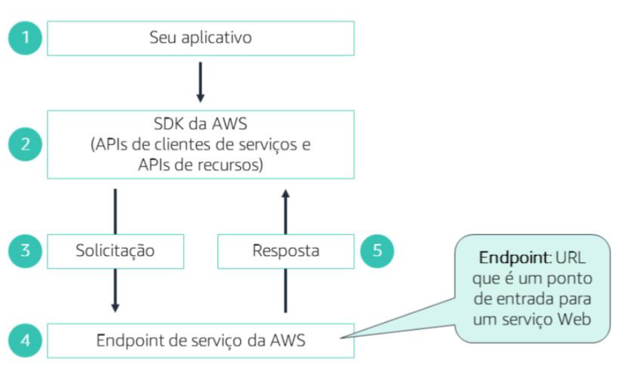

## Desenvolvimento de nuvem da AWS
### Ciclo de vida do desenvolvimento de sistemas
- O SDLC é um modelo conceitual usado no gerenciamento de projetos. Ele descreve os estágios em um projeto de desenvolvimento de sistemas de informação. 

- DLC segue estas etapas: planejar, definir, projetar, desenvolver, implantar e manter. 

- Na fase Desenvolver, o novo sistema é desenvolvido. Novos componentes e programas devem ser obtidos e instalados. Se necessário, os erros devem ser corrigidos e devem ser feitos ajustes para melhorar a performance. 

#### Metodologias:
> Metodologia Cascata (ou tradicional): 
- O modelo Cascata descreve um método de desenvolvimento sequencial em que cada fase de desenvolvimento tem metas e tarefas distintas que devem ser concluídas antes que a próxima fase possa ser iniciada. 

> Metodologia de desenvolvimento de software Ágil:
- Ágil é uma nova estrutura conceitual que oferece suporte ao desenvolvimento de software rápido e iterativo. Sob esse novo paradigma, as equipes de produtos enviam seu trabalho aos clientes o mais rápido possível para que eles possam coletar feedback e aprimorar a iteração anterior de seus produtos. 
- Um ciclo.

> As cinco principais fases do desenvolvimento de software são: Codificar, Compilar, Testar, Implantar e Manter. 

- Codificar: Os desenvolvedores escrevem o código e salvam as alterações em um repositório, usando revisões ou programação em pares para melhorar a qualidade.

Compilar: O código é compilado e passa por testes automatizados e verificações de qualidade.

Testar: São realizados testes mais completos em ambiente semelhante ao de produção, como integração, carga e interface.

Implantar: O sistema é colocado em produção de forma controlada para reduzir riscos.

Monitorar: O aplicativo é acompanhado em produção para garantir que funcione corretamente.

#### Etapas para começar a desenvolver na AWS
- Criar conta AWS, configurar usuário e permissões (IAM), instalar ambiente de desenvolvimento e usar SDK ou AWS CLI para acessar os serviços.

> IAM: O IAM é um serviço web que ajuda você a controlar com segurança o acesso de seus usuários aos recursos da AWS. O IAM é usado para controlar quem pode usar seus recursos da AWS (autenticação), quais recursos eles podem usar e de quais maneiras (autorização)

- O IAM permite criar e gerenciar usuáriose grupos da AWS. Com o IAM, você pode configurar funções e políticas para controlar o acesso aos serviços da AWS

> AWS Cloud9:
- é um IDE baseado na nuvem que permite escrever, executar e depurar código usando um navegador.

> Todos os serviços da AWS são gerenciados por meio de uma ApplicationProgrammingInterface (API –Interface de programação de aplicativos) semelhante a REST. A AWS fornece uma API para cada um de seusserviços. 

> Os nomes de recurso da Amazon(ARNs) permitem identificar exclusivamente recursos ou grupos de recursos da AWS. Um ARN é usado para especificar um recurso sem ambiguidade em toda a AWS, como em políticas do IAM, tagsdo AmazonRelationalDatabaseService (AmazonRDS) e chamadas de API.

> SDK (Software Development Kit) é um conjunto de ferramentas, bibliotecas e APIs que facilita a criação de aplicações, permitindo que desenvolvedores interajam com um sistema ou serviço (como a AWS) de forma mais simples e padronizada.

---

---

Os SDKs da AWS têm dois tipos de API:

API de cliente de serviço: acesso direto e detalhado aos serviços, com mais controle.

API de recursos: acesso mais simples e fácil, usando objetos que representam os recursos da AWS.

Exemplos:

Cliente de serviço: “AWS, execute este comando para listar arquivos.”

API de recursos: “Bucket, me mostre seus arquivos.”

> você pode especificar a região ao instanciar o cliente de serviço ou configurá-la logo após o cliente ser instanciado

#### Erros e exceções
- Quando você chama uma API da AWS, ela retorna um código HTTP indicando sucesso (200) ou erro; erros 400 devem ser tratados pelo aplicativo e erros 500 geralmente podem ser resolvidos com novas tentativas automáticas.
Os SDKs da AWS comunicam esses problemas por meio de exceções específicas em cada linguagem, informando detalhes como código do erro, mensagem e ID da solicitação, para ajudar o desenvolvedor a identificar e corrigir o problema.

#### Introdução ao AWS X-Ray
- AWS X-Ray é uma ferramenta de gerenciamento de performance de aplicativos que ajuda a analisar e depurar aplicativos distribuídos, como aplicativos criados usando uma arquitetura de microsserviços.
- celeta dados e disponibiliza ferramentas de visualização

#### Introdução ao AmazonCloudWatche ao AWS CloudTrails.
- O Amazon CloudWatch é um serviço de monitoramento e gerenciamento que fornece dados e insights práticos que podem ajudá-lo a monitorar aplicativos, entender e responder a alterações de performance em todo o sistema, otimizar a utilização de recursos e obter uma visão unificada da saúde operacional.

- O AWS CloudTrail é um serviço que possibilita governança, conformidade, auditoria operacional e auditoria de riscos em sua conta da AWS. Com o CloudTrail, você pode registrar, monitorar continuamente e reter a atividade da conta relacionada a ações que ocorrem na infraestrutura da AWS.

-As ações realizadas por um usuário, uma função ou um serviço da AWS são registradas como eventos no CloudTrail.
