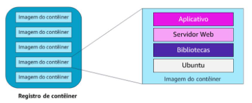
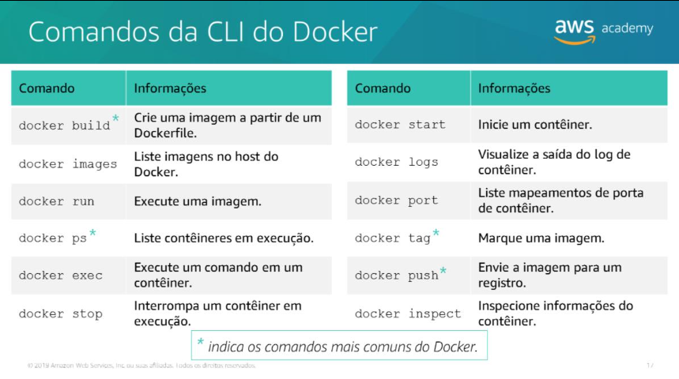

## Introdução a contêineres
> No mundo físico: um contêineré uma unidade padronizada de armazenamento.

> Em plataformas de computação, um contêineré uma unidade padronizada de software projetada para execução rápida e confiável em qualquer ambiente de computação que esteja executando a plataforma de conteinerização. 

- Os contêineres são um método de virtualização de sistema operacional que permite executar um aplicativo e suas dependências em processos com recursos isolados. Um contêiner é um pacote de software leve e independente que contém tudo o que um aplicativo de software precisa para ser executado, como código do aplicativo, tempo de execução, ferramentas do sistema, bibliotecas do sistema e configurações.

#### Contêineres versus virtualização de hardware

- Os contêineres tornaram-se populares devido ao crescimento do Docker como uma plataforma de virtualização. É uma plataforma leve de virtualização de contêineres que fornece ferramentas para criar, armazenar, gerenciar e executar contêineres.

- Para resumir alguns dos benefícios mais importantes dos contêineres do Docker:•O Docker é um ambiente de aplicativos de tempo de execução portável.•Você pode empacotar um aplicativo e suas dependências em um único artefato imutável chamado de imagem.•Depois de criar uma imagem de contêiner, ela pode ir para qualquer lugar em que o Docker tenha suporte.•Você pode executar versões diferentes do aplicativo com dependências diferentes simultaneamente.

- Os contêineres do Docker são criados a partir de um modelo somente leitura chamado deimagem. Um contêiner do Docker é uma instância de uma imagem. As imagens são criadas a partir de um Dockerfile, que são um arquivo de texto simplesque especifica todos os componentes que estão incluídos no contêiner. 

---

---

> Uma imagem de contêiner é um modelo somente leitura e imutável altamente portável. 

> Um contêineré uma instância de uma imagem. Você pode ativar um contêiner ou vários contêineres com base nessa imagem.

> Cada contêiner tem uma camada fina de leitura/gravação na parte superior da imagem existente quando ela é instanciada.

#### Microsserviços –Caso de uso para contêineres
- Um dos fatores mais fortes que motivam o crescimento de contêineres é o aumento das arquiteturas de microsserviços. Os microsserviços são uma abordagem arquitetônica e organizacional para o desenvolvimento de software projetado para acelerar os ciclos de implantação. A abordagem de microsserviços promove a inovação e a propriedade, além de aprimorar a capacidade de manutenção e a escalabilidade dos aplicativos de software.

- Agora, considere os mesmos três aplicativos em execução em uma arquitetura de microsserviços. Cada aplicativo é criado como um componente independente que é executado como um serviço e se comunica usando operações de API leves. Cada serviço executa uma única função que pode oferecer suporte a vários aplicativos. Como os serviços são executados de forma independente, eles podem ser atualizados, implantados e escalados para atender à demanda por funções específicas de um aplicativo. 

# Características dos Microsserviços

- Design descentralizado e evolutivo  
- Endpoints inteligentes, pipes simples  
- Produtos independentes, não projetos  
- Projetado para lidar com falhas  
- Descartável  
- Paridade de desenvolvimento e produção

#### Serviços de orquestração de contêineres da Amazon
- O gerencismento de centemas de conteiners.
- Essa situação é onde as plataformas de gerenciamento de contêineres entram. Eles processam a programação e a colocação de contêineres com base na infraestrutura de hardware subjacente e nas necessidades do aplicativo. As plataformas de gerenciamento de contêineres se integram a outros serviços, como serviços de redes, armazenamento persistente, segurança, monitoramento e registro em log.

> Amazon Elastic Container Service (Amazon ECS)

- O Amazon ECS é um serviço de orquestração de contêineres altamente escalável e com alta performance que oferece suporte a contêineres do Docker. O serviço permite que você execute e escale aplicativos conteinerizados na AWS. Você pode usar o Amazon ECS para programar o provisionamento de contêineres em um cluster gerenciado de instâncias do Amazon Elastic Compute Cloud (Amazon EC2).

> Fases:

1. **Registro de Imagens de Contêiner**
   - As imagens podem ser extraídas de:
     - Amazon Elastic Container Registry (ECR)  
     - Registro privado ou de terceiros  

2. **Definição do Aplicativo**
   - Personalize as imagens de contêiner com código e recursos necessários  
   - Crie arquivos de configuração para agrupar  
   - Defina contêineres como:
     - **Tarefas de execução curta**  
     - **Serviços de longa execução**  

3. **Tipos de Inicialização**
   - **Fargate** (serverless)
     - AWS gerencia infraestrutura, posicionamento, CPU e memória  
     - Foco total nas tarefas e arquitetura do aplicativo  
   - **EC2**
     - Mais controle sobre a infraestrutura  
     - Criação e gerenciamento de clusters EC2  
     - Definição de colocação de contêineres, políticas de isolamento e disponibilidade  

4. **Uso Híbrido**
   - É possível combinar Fargate e EC2 no mesmo aplicativo  
   - Exemplo:
     - Serviços previsíveis → EC2  
     - Serviços com alta variação de demanda → Fargate  

5. **Gerenciamento de Contêineres**
   - Amazon ECS garante:
     - Disponibilidade dos contêineres  
     - Escalabilidade automática do aplicativo  

> Kubernetes: é uma plataforma de gerenciamento de contêineres de código abertoque permiteimplantar e gerenciar aplicativosconteinerizados em grande escala.O Kubernetes gerencia clusters de instâncias do EC2 e executa contêineres nessas instâncias com processos de implantação, manutenção e escalabilidade. 

> O Amazon ECR é um registro de imagens do Docker baseado na nuvem totalmente gerenciadoque facilitao armazenamento, o gerenciamento e a implantação de imagens de contêiner do Docker. 

> Você pode acessar o Amazon ECR de forma programática na Interface da Linha de Comando da AWS (CLI da AWS) e usando as interfaces de programação de aplicativos (APIs).