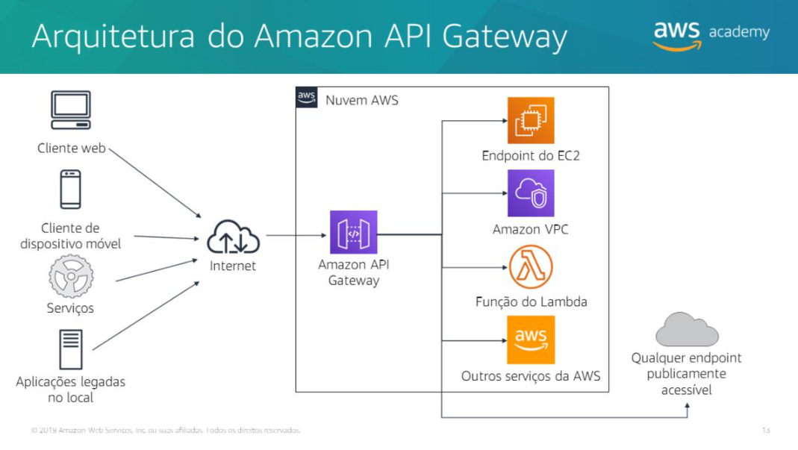
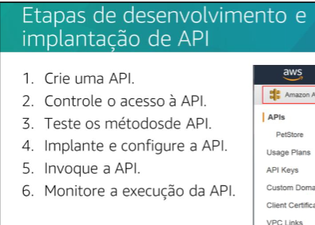

## Desenvolvimento de soluções com o Amazon API Gateway
### Interfaces de programação de aplicativos (APIs)
- Elas são a interface entre os clientes no front-end e os servidores ou componentes de software externos no back-end. Uma API é um conjunto de instruções que define como os desenvolvedores interagem com um aplicativo. Muitas vezes, uma API é projetada para ser usada com um kit de desenvolvimento de software (SDK), que é um conjunto de ferramentas que permite aos os desenvolvedores criar aplicativos downstream com base na API.

- Um aplicativo de imóveis recebe critérios de pesquisa do usuário (cidade, bairro, tipo de imóvel, preço) e faz chamadas a APIs **RESTful** para processar essas informações.
As APIs retornam os dados solicitados, que o aplicativo apresenta ao usuário.

> Obs: uma API RESTful permite que diferentes sistemas se comuniquem pela web de forma padronizada, usando URLs e métodos HTTP, tornando a integração simples e escalável.

### Amazon API Gateway
O **Amazon API Gateway** é um serviço gerenciado que permite **criar, publicar, manter, monitorar e proteger APIs** em qualquer escala, incluindo **RESTful e WebSocket**.
Ele atua como **porta de entrada** para aplicativos, conectando clientes a serviços de back-end (Lambda, EC2, aplicativos web, comunicação em tempo real), gerenciando tráfego, autorização, monitoramento e versões, cobrando apenas por chamadas recebidas e dados transferidos.

---

---

### Etapas para desenvolver APIs RESTful com o Amazon API Gateway
-  **funcionamento de uma API REST no Amazon API Gateway**:
* **Recursos**: entidades lógicas do aplicativo acessíveis via **caminhos de recurso** (ex.: `/pets` para animais de estimação).
* **Métodos**: combinam um **recurso** com uma **operação HTTP** (GET, POST, PUT, DELETE) para interagir com o recurso.

  * Exemplo:

    * `GET /pets` → retorna a lista de pets
    * `POST /pets` → adiciona um novo pet ao serviço de back-end.

> Endpoints de API

* Um **endpoint** é o **URL** onde a API é implantada (hostname da API).
* Tipos de endpoint: **otimizado para borda, regional ou privado**, dependendo da origem do tráfego.

> Métodos de API

* Um **método** define a interface entre o **cliente** e o **back-end**.
* **Solicitação do método**: HTTP request que indica como acessar o serviço.
* **Resposta do método**: HTTP response com código de status e dados retornados ao cliente.

> Modelos e mapeamentos

* **Modelos**: definem a **estrutura de dados** de solicitações ou respostas (em JSON) e podem validar formatos.
* **Modelos de mapeamento**: transformam dados entre **formato do cliente** e **formato do back-end**, garantindo compatibilidade entre front-end e back-end.

### Controle de acesso a uma API RESTful
> 1. **Permissões IAM**

* Controlam o acesso para:

  * Criar, implantar e gerenciar APIs (desenvolvedor).
  * Invocar APIs ou atualizar cache (chamador).

> 2. **Políticas de recurso**

* Documentos JSON anexados à API que definem **quem pode invocar a API**.
* Permitem restrições como **contas AWS específicas** ou **intervalos de IP/CIDR**.

> 3. **Autorizadores Lambda**

* Autenticação via **token bearer** (OAuth, SAML).
* Podem usar **parâmetros da solicitação** para identificar o chamador.

### Testar uma API RESTful
* Após criar uma API, você pode **testá-la diretamente no console do API Gateway**.
* Os **logs de entrada** mostram o fluxo da solicitação do método → solicitação de integração → back-end → resposta de integração → resposta do método.
* Permite **solucionar erros de mapeamento**.

### Implantar uma API RESTful
* Após criar a API, você deve **implantá-la** para que clientes possam chamá-la.
* Uma **implantação** é associada a um **estágio**, que funciona como um **snapshot da API** disponível para uso.
* É possível ter **múltiplos estágios** para diferentes versões: exemplo, `dev` para teste e `prod` para produção.
* Cada estágio permite **configurações específicas**, como cache, limitação de requisições e logs.

### Invocar uma API RESTful
* Após a **implantação**, você chama a API enviando requisições para a **URL do API Gateway**, que combina protocolo, hostname, estágio e caminho do recurso.
* A **URL base** (Invoke URL) é exibida no console do API Gateway.
* Para chamadas programáticas, você pode gerar **SDKs específicos de linguagem** (Java, Android, JavaScript, Objective-C, Swift, Ruby) para interagir com a API.

### Monitoramento de uma API RESTful
* O **API Gateway** envia métricas para o **CloudWatch** quase em tempo real, armazenando dados históricos por **2 semanas**.

