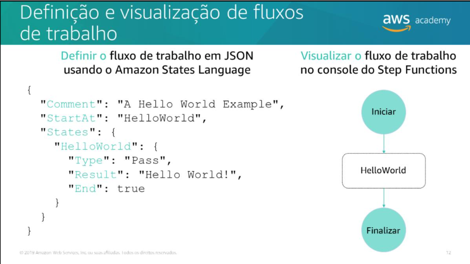
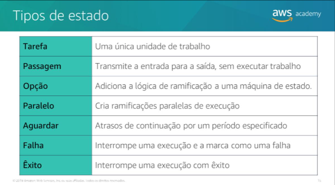
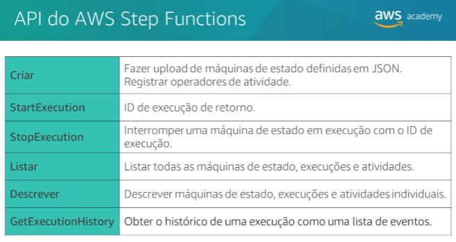

## Desenvolvimentode soluções com o AWS StepFunctions
### Coordenação de fluxo de trabalho em aplicativos distribuídos
- Na arquitetura de nuvem moderna, os aplicativos são dissociados em blocos de criação independentes e menores que são mais fáceis de desenvolver, implantar e manter. Com microsserviços, você pode criar aplicativos distribuídos a partir de componentes individuais, cada um deles executando uma função ou tarefa distinta. Uma arquitetura de microsserviços permite escalar e alterar componentes em seu aplicativo rapidamente. 

### Introdução ao AWS Step Functions
- O AWS Step Functions é um serviço web que permite coordenar os componentes de aplicativos e microsserviços distribuídos usando fluxos de trabalho visuais. O Step Functions oferece uma maneira confiável de coordenar componentes e percorrer as funções do aplicativo. O Step Functions oferece um console gráfico para que você possa visualizar os componentes do aplicativo como uma série de etapas. Ele aciona e rastreia automaticamente todas as etapas e também tenta executar novamente etapas que apresentaram falha para que seu aplicativo seja executado em ordem e conforme esperado. O Step Functions registra o estado de cada etapa para que você possa diagnosticar e depurar problemas rapidamente.

> Criar e atualizar aplicativos rapidamente

- O AWS Step Functions gerencia a lógica do aplicativo para você e implementa primitivas básicas, como execução sequencial e paralela, ramificação e tempos limite.

* O **AWS Step Functions** permite criar **fluxos de trabalho** como uma **máquina de estados**, composta por **estados** conectados por transições.
* Cada **estado** pode tomar decisões com base nos **dados de entrada**, executar ações e passar dados para o próximo estado.
* O trabalho é realizado por **tarefas**, que podem ser:

  * Funções **Lambda**,
  * **Atividades**,
  * Chamadas a **APIs de outros serviços**.
* Uma **execução** da máquina de estado transforma a entrada inicial em saídas que fluem entre os estados.
* O **console do Step Functions** permite visualizar a máquina de estado e monitorar a execução quase em tempo real.

---

---

### Tipos de estado
- Dependendo do tipo, os estados podem executar uma variedade de funções na máquina de estado.
---

---

### Caso de uso do AWS Step Functions
O AWS Step Functions pode ser usado para diversos casos: •Processamento de dados•Automatizar tarefas•Modernizar um aplicativo monolítico•Orquestração de aplicativos•Transcodificar arquivos de mídia

### API do AWS Step FunctionsAWS Academy
---

---

