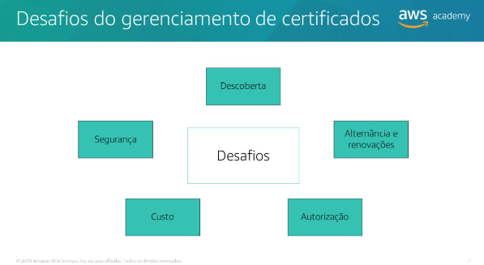
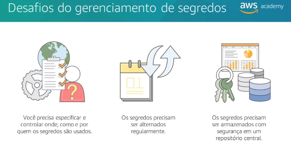
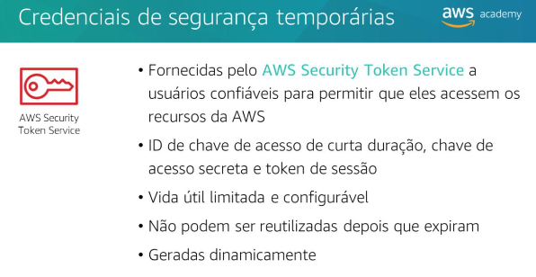
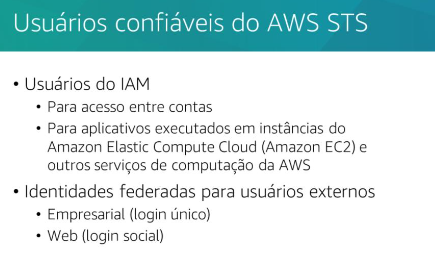
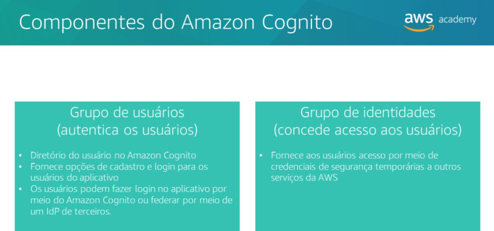

## Desenvolvimento de aplicativos seguros na AWS.
### Proteção de conexões de rede
- Secure Sockets Layer (SSL) e Transport Layer Security (TLS) são protocolos padrão do setor que usam certificados públicos e privados para estabelecer a identidade dos sites pela Internet e dos recursos nas redes privadas, respectivamente. Os protocolos SSL e TLS também criptografam as comunicações de rede entre os recursos conectados.

- Certificados SSL/TLS
O que são: Arquivos digitais que provam a identidade de um site ou serviço na internet e permitem comunicação segura.

---

---

- AWS Certificate Manager (ACM) – Resumo

* **O que é:** Serviço da AWS para **provisionar, gerenciar e implantar certificados SSL/TLS** (públicos e privados).
* **Principais funções:**

  * Solicitar e emitir certificados rapidamente.
  * Implantar certificados em recursos AWS integrados, como:

    * Load Balancers (Elastic Load Balancing)
    * Distribuições do CloudFront
    * APIs no API Gateway
  * Gerenciar renovações automaticamente.
  * Criar e gerenciar certificados privados para recursos internos.
* **Benefícios:**

  * Elimina processos manuais (compra, upload, renovação).
  * Centraliza o gerenciamento do ciclo de vida dos certificados.
  * Facilita conformidade com regulamentações sobre **criptografia de dados em trânsito**.
* **Custo:** Certificados públicos e privados **são gratuitos**; paga-se apenas pelos recursos AWS utilizados.

### Gerenciamento de segredos de aplicativos
- Os segredossão valores criptografados usados regularmente em aplicativos para conexão com bancos de dados, APIs e outros recursos de TI. Alguns exemplos de segredos são credenciais de banco de dados, senhas, chaves de API de terceiros e até um texto arbitrário.

---

---

- O AWS Secrets Manager ajuda você a proteger os segredos necessários paraacesso a aplicativos, serviços e recursos de TI. O serviço permite alternar, gerenciar e recuperar facilmente as credenciais de banco de dados, as chaves de APIs e outros segredos durante todo o ciclo de vida deles.

Como o AWS Secrets Manager funciona

Criação do segredo:

O administrador cria credenciais para um aplicativo (por exemplo, MyCustomApp) que precisa acessar um banco de dados (ex.: Personnel).

Define permissões detalhadas usando políticas IAM e baseadas em recursos.

Armazenamento seguro:

As credenciais são salvas como um segredo no Secrets Manager (ex.: MyCustomAppCreds).

Elas ficam criptografadas (protegidas) como um par chave-valor.

Recuperação pelo aplicativo:

Quando o aplicativo precisa acessar o banco, ele pede o segredo ao Secrets Manager.

Transmissão segura:

O Secrets Manager descriptografa o segredo e envia de volta para o aplicativo através de um canal seguro (HTTPS/TLS).

Uso do segredo:

O aplicativo lê as credenciais, monta a string de conexão e usa para acessar o banco de dados.

> O repositório de parâmetros oferece armazenamento hierárquico seguro para gerenciamento de dados de configuração e de segredos. Você pode armazenar dados, como senhas, strings de banco de dados e códigos de licença, como valores de parâmetro. 

### Autenticação com o AWS Security Token Service (AWS STS)
- A chave de acessoé uma combinação do ID de chave de acesso com a chave de acesso secreta. 

---

---

AWS STS – Conceitos principais

Autenticação:

Confirma quem você é (identidade do usuário).

Autorização:

Determina o que você pode fazer (permissões).

Provedor de identidade (IdP):

Sistema que gerencia informações de usuários e autentica sua identidade.

Agente de identidades:

Software que conecta o IdP ao AWS STS, obtendo credenciais temporárias para acessar a AWS.

SAML (Security Assertion Markup Language):

Padrão aberto para troca de informações de autenticação e autorização entre sistemas.

OIDC (OpenID Connect):

Padrão aberto usado por provedores de terceiros para autenticar usuários sem precisar criar contas locais.

### Autenticação com o Amazon Cognito
- O AmazonCognito é um serviço que fornece autenticação, autorização e gerenciamento de usuários para os aplicativos móveis e web.
- Criar identidades exclusivas para os usuários e autenticá-las com provedores de identidade.

---

---