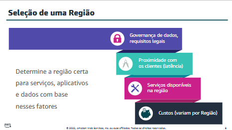
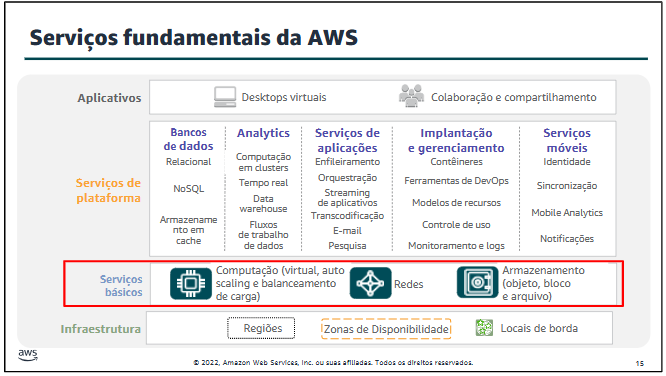
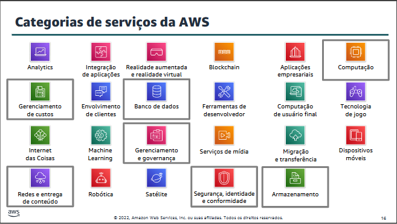

## Módulo 3: Visão geral da infraestrutura global da AWS - Princípios da nuvem na AWS Academy
> **Tópicos:**
- Infraestrutura global da AWS.
- Visão geral dos serviços e das categorias de serviços da AWS. 

> **Demonstração**
- Infraestrutura Global da AWS

> **Busca-se:**
- Identificar a diferença entre Regiões, Zonas de Disponibilidade e locais de borda da AWS.
- Identificar categorias de serviços e serviços da AWS.

### Infraestrutura global da AWS
- A Infraestrutura global da AWS foi projetada e criada para entregar um ambiente de computação em nuvem flexível, confiável, dimensionável, e seguro com alta qualidade global em desempenho de rede. 

#### **Regiões AWS**
- Uma Região AWS é uma área geográfica.
- A replicação de dados entre Regiões é controlada por você.
- A comunicação entre regiões usa a infraestrutura de rede backbone da AWS.
- Cada região fornece redundância total e conectividade com a rede.
- Uma Região normalmente consiste em duas ou mais Zonas de Disponibilidade.
- Para alcançar tolerância a falhas e estabilidade, as regiões são isoladas umas das outras.

---

---

#### **Zonas de Disponibilidade**
- Cada Região tem várias Zonas de Disponibilidade.
- Cada Zona de Disponibilidade é uma partição totalmente isolada da infraestrutura da AWS.
- As Zonas de Disponibilidade consistem em datacenters distintos.
- Elas são projetadas para isolamento de falhas.
- Elas são interconectadas a outras zonas de disponibilidade usando redes privadas de alta velocidade.
- Você escolhe suas zonas de disponibilidade.
- A AWS recomenda a replicação de dados e recursos entre Zonas de Disponibilidade para fins de resiliência.

#### **Data centers da AWS**
- Os data centers da AWS são projetados para segurança.
- Os data centers são onde os dados residem e o processamento de dados ocorre.
- Cada data center tem energia, redes e conectividade redundantes e está hospedado em uma instalação separada.

#### **Pontos de presença**
- A AWS fornece uma rede global de locais de pontos de presença.
- Consiste em locais de borda e um número muito menor de caches de borda regionais.
- Usada com o Amazon CloudFront.
- Uma Content Delivery Network (CDN - Rede de entrega de conteúdo) global que entrega conteúdo aos usuários finais com latência reduzida.
- Os pontos de presença de caches regionais usados para conteúdo com acesso pouco frequente.
- O Amazon CloudFront é uma rede de entrega de conteúdo (CDN) usada para distribuir conteúdo aos usuários finais para reduzir a latência. 
- O Amazon Route 53 é um serviço de sistema de nomes de domínio (DNS). As solicitações enviadas para qualquer um desses serviços serão roteadas automaticamente para o ponto de presença mais próximo para diminuir a latência.

#### **Recursos de infraestrutura da AWS**
- **Elasticidade e dimensionamento:** Infraestrutura elástica; adaptação dinâmica da capacidade.
- **Infraestrutura escalável:** Adapta-se para acomodar o crescimento.
- **Tolerância a falhas:** Continua funcionando corretamente na presença de uma falha; redundância integrada de componentes.
- **Alta disponibilidade:** Alto nível de desempenho operacional; tempo de inatividade mínimo; sem intervenção humana.

### Visão geral dos serviços e das categorias de serviços da AWS

---

---

#### Categoria de serviço de armazenamento
- O **Amazon Simple Storage Service (Amazon S3)** é um serviço de armazenamento de objetos que oferece dimensionamento, disponibilidade de dados, segurança e desempenho.
- **Outros:** Amazon Elastic Block Store (Amazon EBS), Amazon Elastic File System (Amazon EFS) e Amazon Simple Storage Service Glacier.

#### Categoria de serviço computacional
- **Amazon Elastic Compute Cloud (Amazon EC2):** oferece uma capacidade de computação redimensionável como máquinas virtuais na nuvem. 
- **Amazon EC2 Auto Scaling:** permite que você adicione ou remova automaticamente instâncias do EC2 de acordo com as condições que você definir.
- **Amazon Elastic Container Service (Amazon ECS):** é um serviço de orquestração de contêineres altamente escalável e de alto desempenho que oferece suporte a contêineres do Docker.
- **AWS Lambda:** permite executar código sem provisionar ou gerenciar servidores. Você paga apenas pelo tempo de computação consumido. Não haverá cobranças quando seu código não estiver em execução.

#### Categoria de serviço de banco de dados
- **Amazon Aurora:** é um banco de dados relacional compatível com MySQL e PostgreSQL. É até cinco vezes mais rápido que os bancos de dados MySQL padrão e três vezes mais rápido que os bancos de dados PostgreSQL padrão.
- **Amazon DynamoDB:** é um banco de dados de documentos e chave-valor que oferece performance inferior a 10 milissegundos em qualquer escala, com segurança incorporada, backup e restauração e armazenamento em cache na memória.

#### Categoria de serviço de rede e entrega de conteúdo
- **Amazon Virtual Private Cloud (Amazon VPC):** permite provisionar seções logicamente isoladas da Nuvem AWS.
- **Amazon Route 53:** é um serviço Web de Domain Name System (DNS) na nuvem dimensionável, projetado para oferecer uma maneira confiável de rotear usuários finais para aplicações da Internet. Ele converte nomes (como www.exemplo.com) em endereços IP numéricos (como 192.0.2.1) que os computadores usam para se conectarem entre si.

#### Categoria de serviços de segurança, identidade e conformidade
- **AWS Identity and Access Management (IAM):** permite que você gerencie o acesso aos serviços e recursos da AWS com segurança. Ao usar o IAM, você pode criar e gerenciar usuários e grupos da AWS. Você pode usar permissões do IAM para permitir e negar acesso de usuários e grupos aos recursos da AWS. 
- **AWS Organizations:** permite restringir quais serviços e ações são permitidos nas suas contas. 
- **Amazon Cognito:** permite adicionar cadastro, login e controle de acesso de usuários aos aplicativos Web e para dispositivos móveis.

#### Categoria de serviço de gerenciamento de custos da AWS
- AWS Relatório de Uso e Custo.
- AWS Budgets.
- AWS Cost Explorer.

#### Categoria de serviço de gerenciamento e governança
- Console de Gerenciamento da AWS.
- AWS Config.
- Amazon CloudWatch.
- AWS Auto Scaling.
- AWS Command Line Interface.
- AWS Trusted Advisor.
- Ferramenta do AWS Well-Architected.
- AWS CloudTrail.

*Foto de Marta Branco da Pexels*