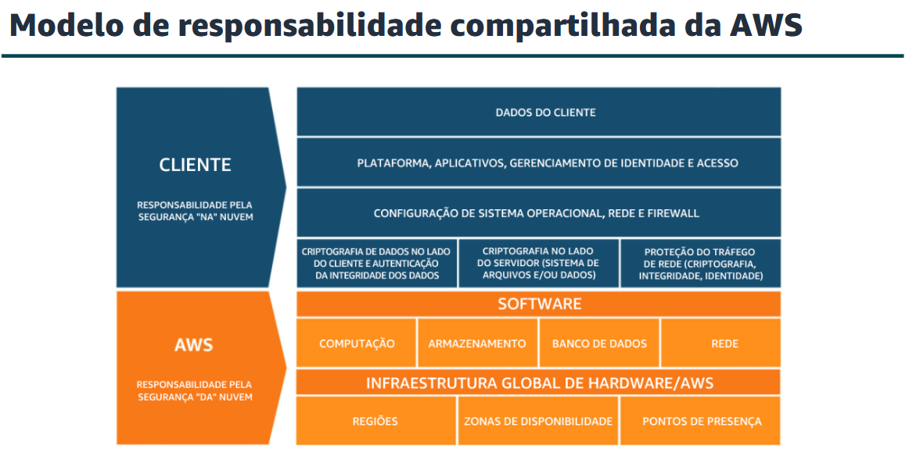
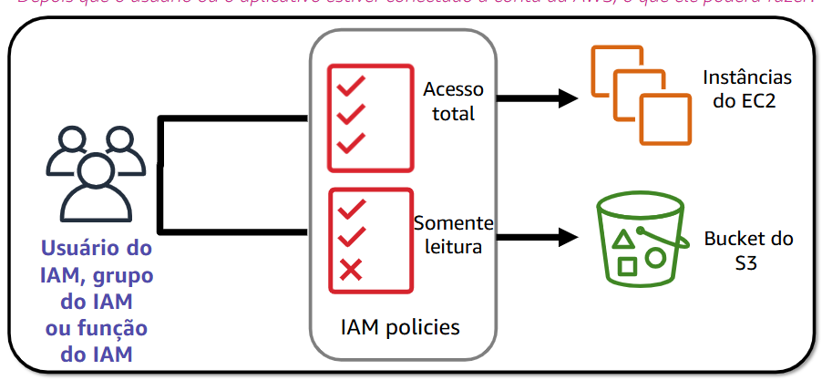

## Segurança na Nuvem AWS

A segurança é a maior prioridade na Amazon Web Services (AWS). A AWS oferece um ambiente de computação em nuvem escalável projetado para oferecer alta disponibilidade e confiabilidade, além de fornecer as ferramentas que permitem executar uma grande variedade de aplicativos.

Ajudar a proteger a confidencialidade, a integridade e a disponibilidade de seus sistemas e dados é essencial para a AWS, assim como manter a confiança e a convicção do cliente. Este módulo fornece uma introdução à abordagem da AWS à segurança, que inclui os controles no ambiente da AWS e alguns dos produtos e recursos da AWS que os clientes podem usar para cumprir os objetivos de segurança.

## Modelo de Responsabilidade Compartilhada da AWS

Este é o conceito mais importante da segurança AWS. Ele divide as tarefas em duas esferas:

### A. Responsabilidade da AWS (Segurança DA Nuvem)

A AWS cuida da infraestrutura global que sustenta os serviços:

* **Segurança Física:** Datacenters protegidos (vigilância 24/7, biometria, destruição de discos).
* **Hardware e Software:** Servidores, dispositivos de armazenamento e o software de virtualização (hipervisor).
* **Infraestrutura de Rede:** Roteadores, switches e monitoramento de rede.
* **Serviços Globais:** Regiões, Zonas de Disponibilidade (AZs) e Pontos de Presença.

### B. Responsabilidade do Cliente (Segurança NA Nuvem)

O cliente é responsável por tudo o que coloca ou configura na nuvem:

* **Dados do Cliente:** Criptografia e integridade.
* **Gerenciamento de Identidade (IAM):** Permissões, senhas e login de usuários.
* **Sistema Operacional:** Aplicação de patches e manutenção (em serviços como EC2).
* **Configuração de Rede/Firewall:** Grupos de segurança e regras de tráfego.

---

## Responsabilidade por Tipo de Serviço

A carga de trabalho do cliente muda dependendo do tipo de serviço contratado:

### IaaS (Infraestrutura como Serviço)

* **Características:** Maior flexibilidade e controle.
* **Exemplos:** Amazon EC2, Amazon EBS, Amazon VPC.
* **Responsabilidade do Cliente:** **Alta.** O cliente gere o S.O., as aplicações e toda a configuração de rede.

### PaaS (Plataforma como Serviço)

* **Características:** AWS reduz a carga operacional do cliente (gerencia S.O., patches e hardware).
* **Exemplos:** AWS Lambda, Amazon RDS, AWS Elastic Beanstalk.
* **Responsabilidade do Cliente:** Focada em gerenciar o código, os dados, a classificação de ativos e permissões de acesso.

### SaaS (Software como Serviço)

* **Características:** Software hospedado centralmente e acessado via Web/API.
* **Exemplos:** AWS Trusted Advisor, AWS Shield, Amazon Chime.
* **Responsabilidade do Cliente:** **Mínima.** O cliente apenas consome o serviço; a infraestrutura é totalmente gerida pela AWS.

---

##  AWS Identity and Access Management (IAM)

O IAM permite controlar o acesso a serviços de computação, armazenamento, banco de dados e aplicativos na Nuvem AWS. Ele é usado para lidar com **autenticação** e especificar/aplicar políticas de **autorização**.

### Principais Características do IAM:

* **Gerenciamento Centralizado:** Controle de execução, configuração e encerramento de recursos.
* **Direitos de Acesso Refinados:**
* **Quem** pode acessar o recurso.
* **Quais** recursos podem ser acessados.
* **O que** o usuário pode fazer (leitura, escrita, exclusão).
* **Como** os recursos podem ser acessados (Console, CLI ou SDK/API).
* **Gratuidade:** O IAM é um recurso de conta da AWS gratuito.

### Observações e imagens explicativas:
---

---

### Políticas e Entidades:

* **Políticas do IAM:** Criadas com **JSON** (JavaScript Object Notation), definem permissões baseadas no **princípio do privilégio mínimo** (conceder apenas o acesso necessário para a tarefa).
* **Entidades do IAM:**
* **Usuário:** Uma pessoa, aplicativo ou serviço para se autenticar.
* **Grupo:** Maneira simples de anexar as mesmas políticas a vários usuários simultaneamente.
* **Função (Role):** Usada para delegar acesso temporário a usuários ou aplicativos, sem a necessidade de compartilhar credenciais fixas.