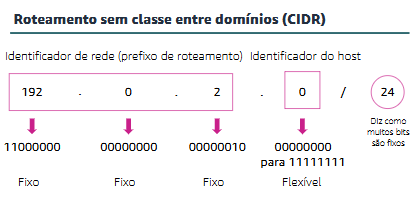
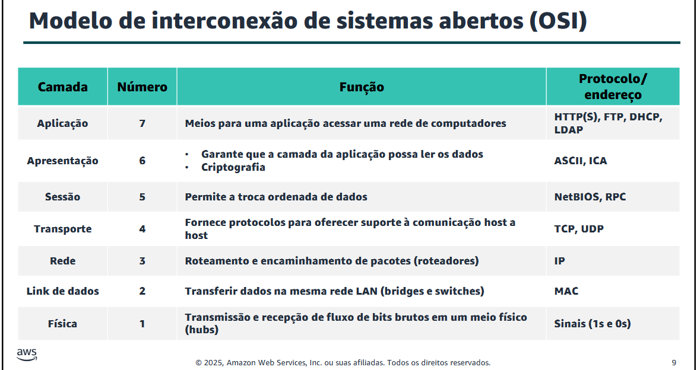
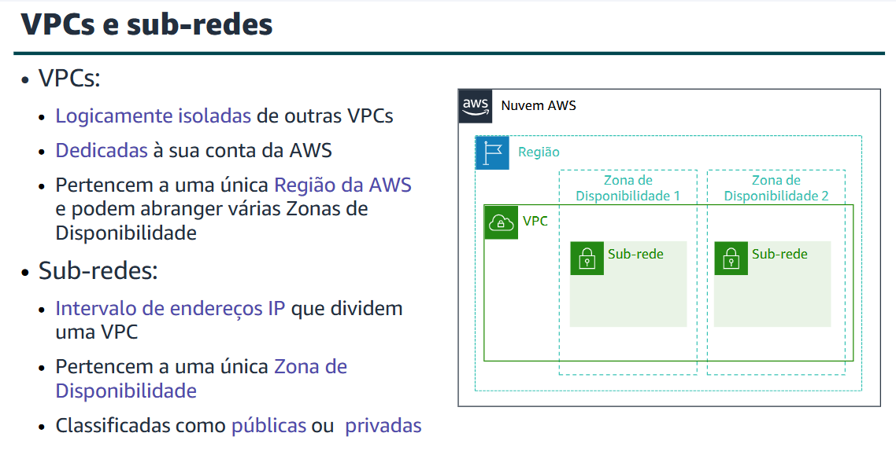
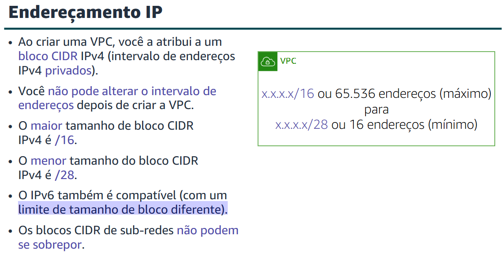
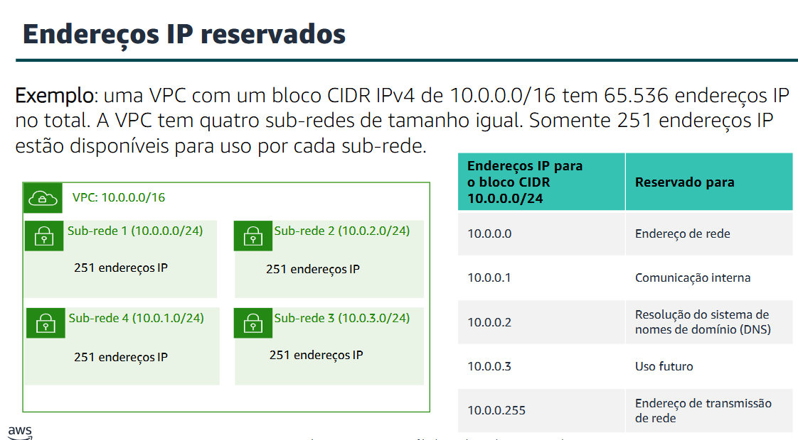
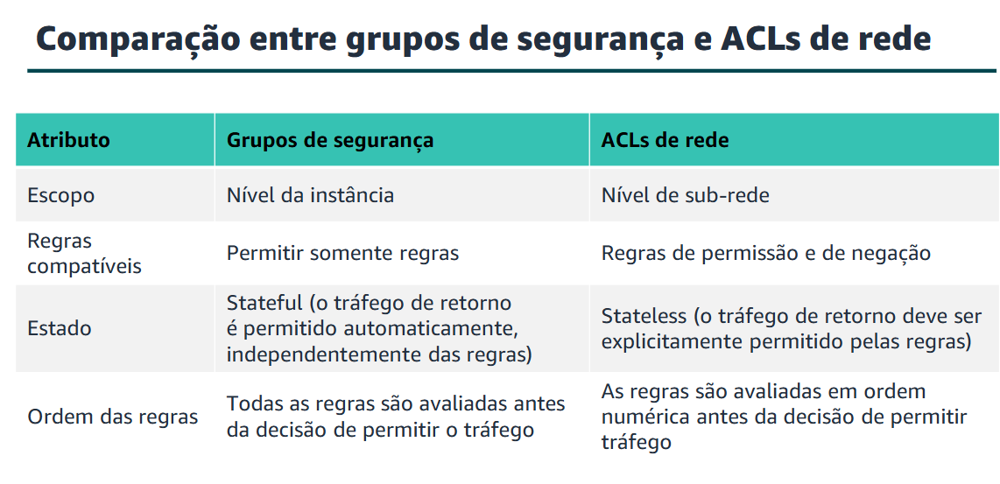
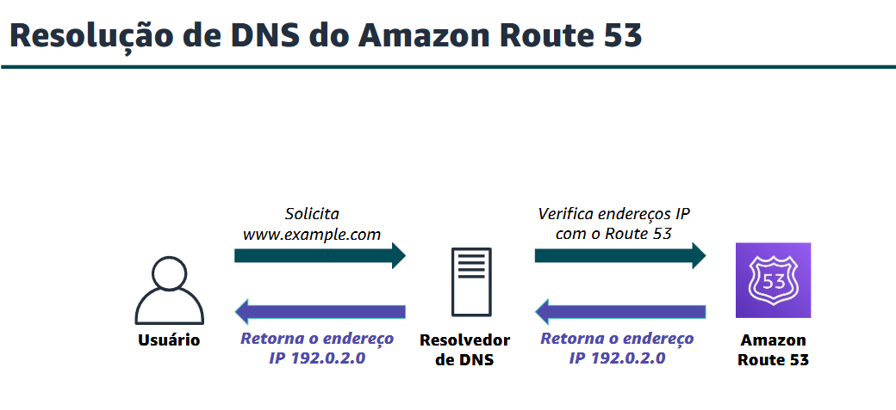

## Redes e entrega de conteúdo
+ Este módulo aborda os seguintes tópicos:
- Noções básicas de redes
- AmazonVirtual Private Cloud (AmazonVPC)
- Redes da VPC
- Segurança da VPC
- AmazonRoute 53
- AmazonCloudFront

> Projetar uma arquitetura básica de VPC

> Indicar as etapas para criar uma VPC

### Noções básicas de redes:
- **REDES**: Uma rede decomputadores são duas ou mais máquinas cliente conectadas para compartilhar recursos. Uma rede pode ser particionada logicamente em sub-redes. A rede requer um dispositivo de rede (como um roteador ou switch) para conectar todos os clientes e permitir a comunicação entre eles.

- **IP**: Cada máquina cliente em uma rede tem um endereço IP (Internet Protocol) exclusivo que o identifica. Um endereço IP é um rótulo numérico em formato decimal. As máquinas convertem esse número decimal em um formato binário

- IP: 192.0.2.0 - Separação por (.) - 8 bits - de 0 a 255 - 32 bits

- Um endereço IP de 32 bits é chamado de endereço IPv4. Endereços IPv6, com 128 bits, também estão disponíveis. Endereços IPv6 podem acomodar mais dispositivos do usuário.

- Um endereço IPv6 é composto de oito grupos de quatro letras e números separados por dois pontos (:).
---

---

### Amazon VPC
* Permite provisionar uma seção isolada logicamente da nuvem AWS onde você pode iniciar recursos da AWS em uma rede virtual definida por você.

* Fornece controle sobre seus recursos de rede virtual, incluindo:
- Seleção do intervalo de endereços IP
- Criação de sub-redes
- Configuração de tabelas de rotas e gateways de rede

* Permite personalizar a configuração de rede para sua VPC
* Permite usar várias camadas de segurança

---

---

> Tipos de endereços IP públicos
* Endereço IPv4 público: 
- Atribuído manualmente por meio de um endereço IP elástico
- Atribuído automaticamente por meio das configurações de endereço IP público de atribuição automática no nível da sub-rede

* Endereço IP elástico
- Associado a uma conta da AWS

* Uma interface de rede elástica é uma interface de rede virtualque você pode:
- Anexar a uma instância.
- Separar da instância e anexar a outra instância para redirecionar o tráfego de rede.

> Uma tabela de rotacontém um conjunto de regras (ou rotas) que você pode configurar para direcionar o tráfego de rede da sub-rede.

- Cada rota especifica um destino e um alvo. 
- Por padrão, toda tabela de rota contém uma rota localpara comunicação na VPC.
- Cada sub-rededeve estar associada a uma tabela de rota (no máximo uma).

### Redes VPC
- Possibilidae de conectar VPCs  por meio de Um gateway da Internet que é um componente da VPC escalável, redundante e altamente disponível que permite a comunicação entre instâncias na VPC e a Internet. Um gateway da Internet tem duas finalidades: fornecer um destino nas tabelas de rotas da VPC para tráfego roteável pela Internet e executar a conversão de endereços de rede para instâncias que receberam endereços IPv4 públicos.

- Uma conexão de emparelhamento de VPC é uma conexão de rede entre duas VPCsque permite rotear o tráfego entre elas de forma privada. 

- Com o AWS Transit Gateway, você só precisa criar e gerenciar uma única conexão do gateway central para cada VPC, data center local ou escritório remoto em toda a rede. O Transit Gateway atua como um hub que controla trafego.

### Segurança da VPC
- Um grupo de segurançaatua como um firewall virtual da instância e controla o tráfego de entrada e saída. Os grupos de segurança atuam no nível da instância, não no nível da sub-rede. Portanto, cada instância em uma sub-redena VPC pode ser atribuída a um conjunto diferente de grupos de segurança.

 
 - Os grupos de segurança têm regras que controlam o tráfego de entrada e de saída da instância.

> ACLs: Uma ACL da rede tem regras de entrada e de saída separadas, e cada regra pode permitir ou rejeitar tráfego.
---

---

### Amazon Route 53
- É um serviço da web do sistema de nomes de domínio (DNS) altamente disponível e dimensionável.
- É usado para rotear usuários finais para aplicações da Internet ao traduzir nomes (como www.exemplo.com) em endereços IP numéricos (como 192.0.2.1) que os computadores usam para se conectarem uns aos outros
- É totalmente compatível com IPv4 e IPv6
- Conecta solicitações de usuários à infraestrutura executada na AWS e também fora da AWS
- É usado para verificar a integridade de seus recursos
- Recursos de fluxo de tráfego
- Permite registrar nomes de domínio
---

---
- O AmazonRoute 53 oferece suporte a vários tipos de políticas de roteamento, que determinam como o AmazonRoute 53 responde às consultas. 
> Ele possui um suporte que em caso o site falhe, o usuário é redirecionado para um local que esteja funcionando. 

###  Amazon CloudFront
- Situação: Quando você navega em um site ou faz streaming de vídeo, sua solicitação é roteada por várias redes diferentes para acessar um servidor de origem. O servidor de origem (ou origem) armazena as versões originais e definitivas dos objetos (páginas da web, imagens e arquivos de mídia). O número de saltos de rede e a distância que a solicitação deve percorrer afetam significativamente o desempenho e a capacidade de resposta do site. Além disso, a latência de rede é diferente em várias localizações geográficas. Por esses motivos, uma rede de entrega de conteúdo pode ser a solução.

> Rede de entrega de conteúdo (CDN)
- É um sistema distribuído globalmente de servidores de armazenamento em cache
- Armazena cópias de arquivos comumente solicitados (conteúdo estático) em cache
- Fornece uma cópia local do conteúdo solicitado de um ponto de presença ou ponto de presença de cache próximo 
- Acelera a entrega de conteúdo dinâmico
- Melhora o desempenho e o scalingda aplicação

> O Amazon CloudFront é
- Um serviço de CDN rápido que entrega dados, vídeos, aplicativos e interfaces de programação de aplicativos (APIs) aos clientes globalmente com baixa latência e altas velocidades de transferência. Ele também oferece um ambiente amigável para desenvolvedores.