## Computação - Princípios da nuvem na AWS Academy
### Serviços computacionais da AWS
* **O Amazon Elastic Compute Cloud (Amazon EC2)** fornece máquinas virtuais redimensionáveis.
* **O Amazon Elastic Container Registry (Amazon ECR)** é usado para armazenar e recuperar imagens de Docker.
* **O Amazon Elastic Container Service (Amazon ECS)** é um serviço de orquestração de contêineres compatível com o Docker.
* **O VMware Cloud on AWS** permite provisionar uma nuvem híbrida sem hardware personalizado.
* **O AWS Elastic Beanstalk** oferece uma maneira simples de executar e gerenciar aplicativos web.
* **O AWS Lambda** é uma solução de computação sem servidor. Você paga apenas pelo tempo de computação usado.
* **AWS Fargate** oferece uma maneira de executar contêineres que reduzem a necessidade de gerenciar servidores ou clusters.

---
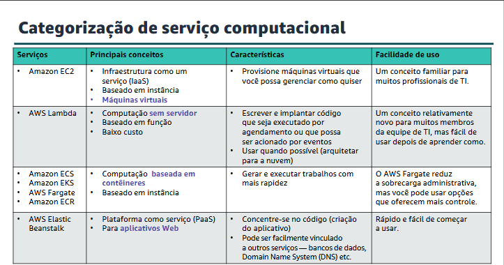

---

### Escolher o serviço computacional ideal
O serviço ou serviços de computação ideais que você usa dependerão do seu caso de uso. Alguns aspectos a serem considerados:

* Qual é o design do seu aplicativo?
* Quais são seus padrões de uso?
* Quais definições de configuração você deseja gerenciar?

---

### Amazon EC2
O Amazon Elastic Compute Cloud (Amazon EC2) fornece máquinas virtuais onde você pode hospedar os mesmos tipos de aplicações que você pode executar em um servidor on-premises tradicional. Ele disponibiliza capacidade computacional segura e redimensionável na nuvem.

As instâncias do EC2 podem oferecer suporte a uma variedade de cargas de trabalho. Entre os usos comuns de instâncias do EC2 estão:
* Servidores de aplicativos
* Servidores web
* Servidores de banco de dados

---
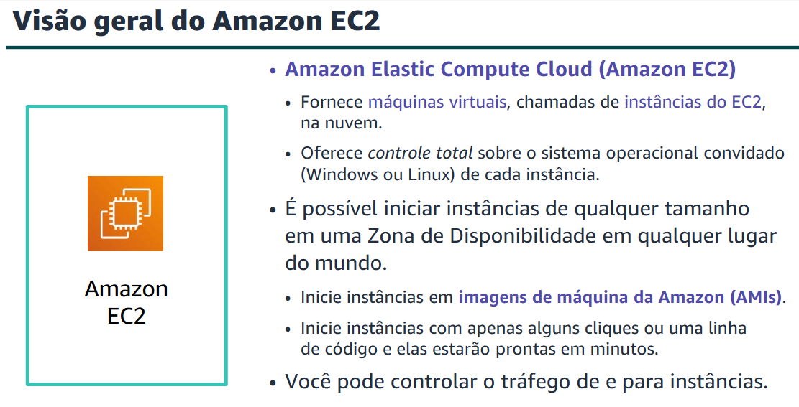

---

---

### Iniciar uma instância do Amazon EC2

O **Launch Instance Wizard** facilita a execução de uma instância. Escolhas feitas usando o Assistente para iniciar a instância:

1. AMI
2. Tipo de instância
3. Configurações de rede
4. Perfil do IAM
5. Dados do usuário
6. Opções de armazenamento
7. Tags
8. Grupo de segurança
9. Par de chaves

#### 1. Selecionar uma AMI

Uma imagem de máquina da Amazon (AMI) fornece informações necessárias para iniciar uma instância do EC2. Especifique uma AMI de origem ao iniciar uma instância.

* Contém um sistema operacional Windows ou Linux.
* Muitas vezes, ele também tem software pré-instalado.

#### 2. Selecionar um tipo de instância

Considere seu caso de uso. Como será usada a instância do EC2 que você criar? O tipo de instância que você escolher determinará:
* Memória (RAM)
* Capacidade de processamento (CPU)
* Espaço em disco e tipo de disco (armazenamento)
* Desempenho de rede
* Categorias de tipo de instância

*Os tipos de instância oferecem família, geração e tamanho.*

---
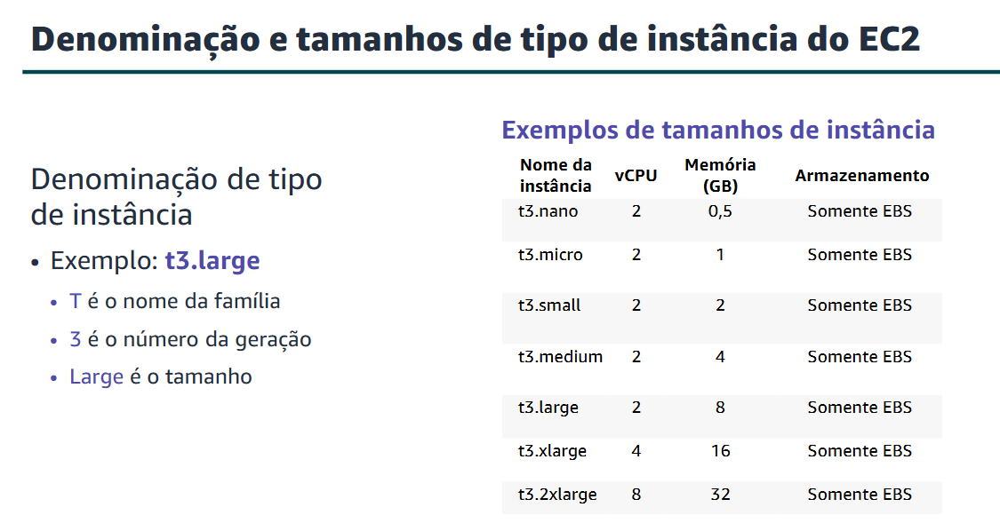
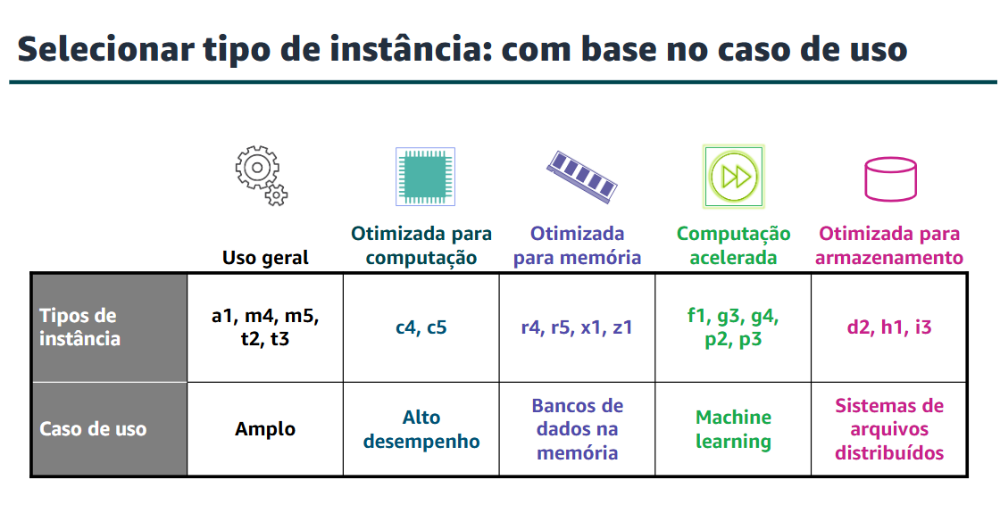

---

#### 3. Especificar configurações de rede

Onde a instância deve ser implantada?

* Identificar a VPC e, opcionalmente, a sub-rede.
* Um endereço IP público deve ser atribuído automaticamente? (Para torná-lo acessível à Internet).

#### 4. Anexar perfil do IAM (opcional)
---
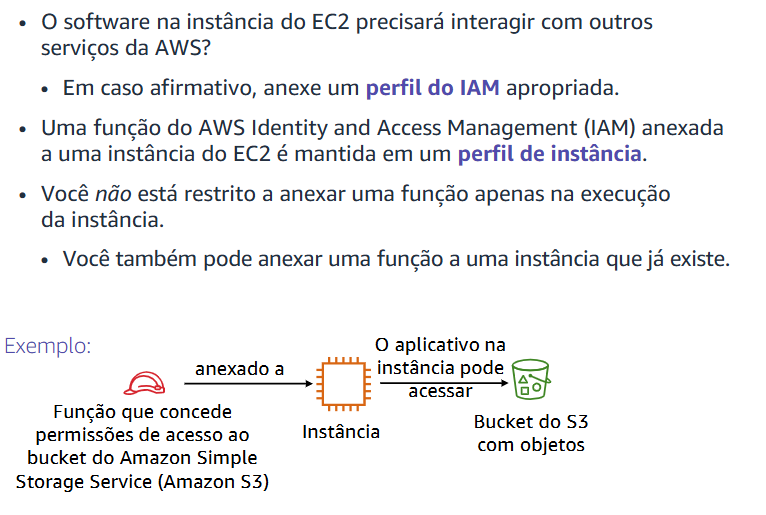

---
#### 5. Script de dados do usuário (opcional)
* Use scripts de dados do usuário para personalizar o ambiente de tempo de execução de sua instância.
* O script é executado na primeira vez em que a instância é iniciada.
* *Basicamente é um script que vai ser executado instalando algo necessário, um Docker da vida.*

#### 6. Especificar armazenamento
Ao iniciar uma instância do EC2, é possível configurar opções de armazenamento. Por exemplo, você pode configurar o tamanho do volume raiz em que o sistema operacional convidado está instalado. Você também pode anexar volumes de armazenamento adicionais ao executar a instância.

**Opções de armazenamento do Amazon EC2:**
* **Amazon Elastic Block Store (Amazon EBS):**
* Volumes de armazenamento em nível de bloco duráveis.
* Você pode interromper a instância e iniciá-la novamente; os dados ainda estarão lá.

* **Armazenamento de instâncias do Amazon EC2:**
* O armazenamento temporário é fornecido em discos anexados ao computador host em que a instância do EC2 está em execução.
* Se a instância for interrompida, os dados armazenados aqui serão excluídos.

#### 7. Adicionar tags
Tag é um rótulo que você atribui a um recurso da AWS. Cada tag consiste em uma chave e um valor opcional, ambos definidos por você. As tags permitem categorizar recursos da AWS, como instâncias do EC2, de diferentes maneiras. Por exemplo, você pode marcar instâncias por finalidade, proprietário ou ambiente.
#### 8. Configurações do grupo de segurança
---
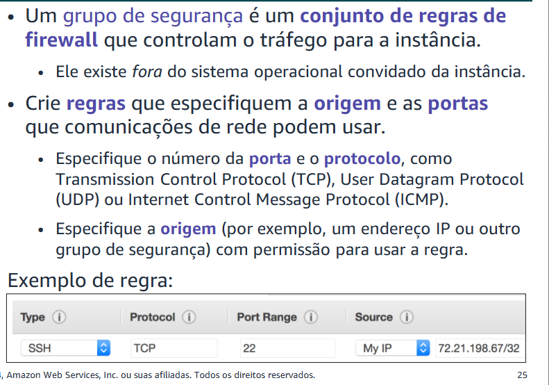

---
#### 9. Identificar ou criar o par de chaves
Na inicialização da instância, você especifica um par de chaves existente ou cria um novo par de chaves. Um par de chaves consiste em:
* Uma **chave pública** que a AWS armazena.
* Um arquivo de **chave privada** que você armazena.
* Ele permite conexões seguras com a instância.

---

### Observações: Executar Instâncias e Exibir Instâncias
**Metadados da instância** são dados sobre sua instância. Enquanto estiver conectado à instância, você poderá visualizá-la:
* Em um navegador: `http://169.254.169.254/latest/meta-data/`
Use o **Amazon CloudWatch** para monitorar instâncias do EC2:
* Fornece métricas quase em tempo real.
* Fornece gráficos na guia Monitoramento do console do Amazon EC2 que você pode visualizar.

### Otimização de custos do Amazon EC2:
---
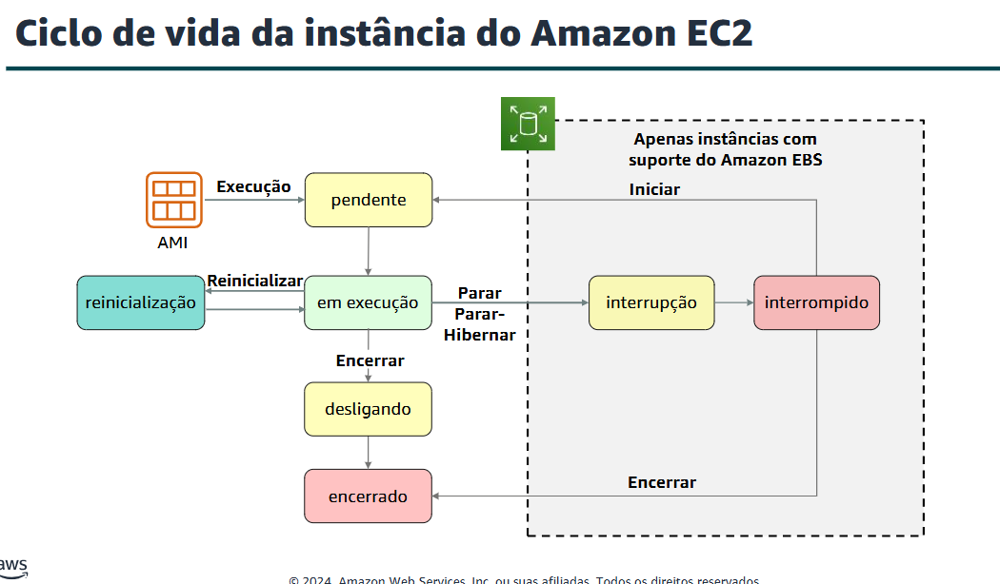
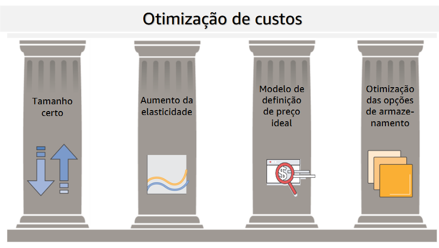
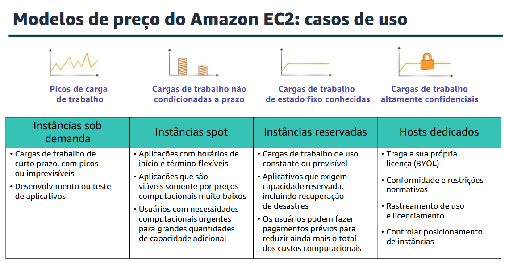
---

### Serviços de contêiner

Os contêineres são um método de virtualização de sistema operacional que permite executar um aplicativo e suas dependências em processos com recursos isolados. Os contêineres permitem empacotar facilmente o código, as configurações e as dependências de um aplicativo em componentes básicos fáceis de usar que oferecem consistência ambiental, eficiência operacional, produtividade de desenvolvedores e controle de versões.

Os contêineres mantêm tudo o que o software precisa para executar, como bibliotecas, ferramentas de sistema, código e tempo de execução.

**Benefícios:**

* Repetível.
* Ambientes autônomos.
* O software é executado da mesma forma em diferentes ambientes (Laptop, teste, produção do desenvolvedor).
* Lançamento e interrupção ou encerramento mais rápido do que máquinas virtuais.

#### Docker

O Docker é uma plataforma de software que empacota software (como aplicativos) em contêineres. O Docker é instalado em cada servidor que hospedará contêineres e fornece comandos simples que você pode usar para criar, iniciar ou interromper contêineres.

---
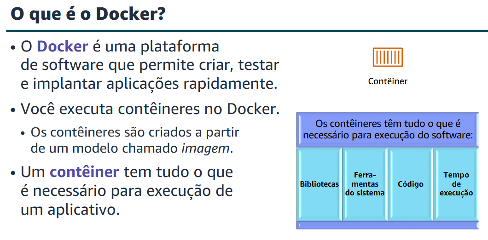

---

#### Amazon Elastic Container Service (Amazon ECS)

O Amazon Elastic Container Service (Amazon ECS) é um serviço de gerenciamento de contêineres altamente escalável e de alto desempenho que dá suporte a contêineres do Docker. O Amazon ECS permite que você execute facilmente aplicativos em um cluster gerenciado de instâncias do Amazon EC2.

**Os recursos essenciais do Amazon ECS incluem a capacidade de:**

* Executar até dezenas de milhares de contêineres do Docker em segundos.
* Monitorar a implantação de contêineres.
* Gerenciar o estado do cluster que executa os contêineres.
* Programar contêineres usando um programador integrado ou um programador de terceiros.

> **Cluster:** agrupamento lógico de recursos de computação (como instâncias EC2, contêineres ECS ou EKS) configurados para funcionar juntos.

> **O que é o Kubernetes?** O Kubernetes é um software de código aberto para orquestração de contêineres.
---
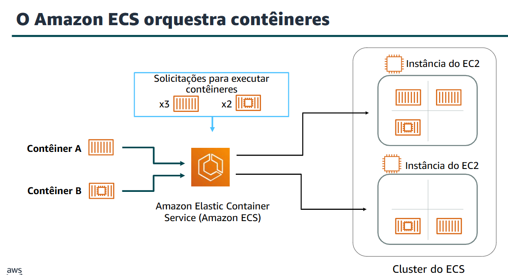

---

#### Amazon Elastic Kubernetes Service (Amazon EKS)

Permite executar o Kubernetes na AWS.

* Conformidade certificada com o Kubernetes (dá suporte à migração fácil).
* Oferece suporte a contêineres Linux e Windows.
* Compatível com as ferramentas de comunidade do Kubernetes e dá suporte a complementos populares do Kubernetes.

**Por que usar o Amazon EKS:**

* Gerenciar clusters de instâncias de computação do Amazon EC2.
* Execute contêineres orquestrados pelo Kubernetes nessas instâncias.

---

### Introdução ao AWS Lambda

O AWS Lambda é um produto de computação sem servidor orientado a eventos. O Lambda permite executar código sem provisionar ou gerenciar servidores.

* Você cria uma **função Lambda**, que é o recurso da AWS que contém o código que você carregou. Em seguida, você define a função Lambda a ser acionada, seja de forma programada ou em resposta a um evento. Seu código só é executado quando é acionado.
* Oferece suporte a várias linguagens de programação.
* Administração totalmente automatizada.

**Criando uma função:**
Ao usar o Console de Gerenciamento da AWS para criar uma função Lambda, o primeiro passo é atribuir um nome a ela. Em seguida, especifique:

1. O ambiente de tempo de execução que a função usará (por exemplo, uma versão do Python ou Node.js).
2. Uma função de execução (para conceder permissão ao IAM à função para que ela possa interagir com outros serviços da AWS, conforme necessário).
3. Em seguida, depois de clicar em *Create Function*, configure a função.

---
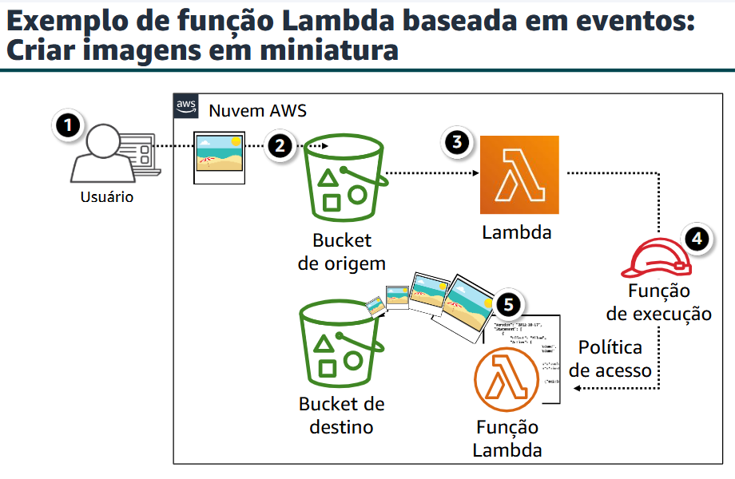

---

### AWS Elastic Beanstalk

O AWS Elastic Beanstalk é outra opção de serviço computacional da AWS. É uma plataforma como um serviço (ou PaaS) que facilita a rápida implantação, escalabilidade e gerenciamento de suas aplicações e serviços web.

Você permanece no controle. Toda a plataforma já está criada e você só precisa fazer upload do código. Escolha seu tipo de instância, seu banco de dados, defina e ajuste a auto scaling, atualize seu aplicativo, acesse os arquivos de log do servidor e habilite HTTPS no balanceador de carga.

* Comece a usar de forma rápida e simples.
* Produtividade do desenvolvedor.
* Dificuldade de superar.
* Controle total dos recursos.