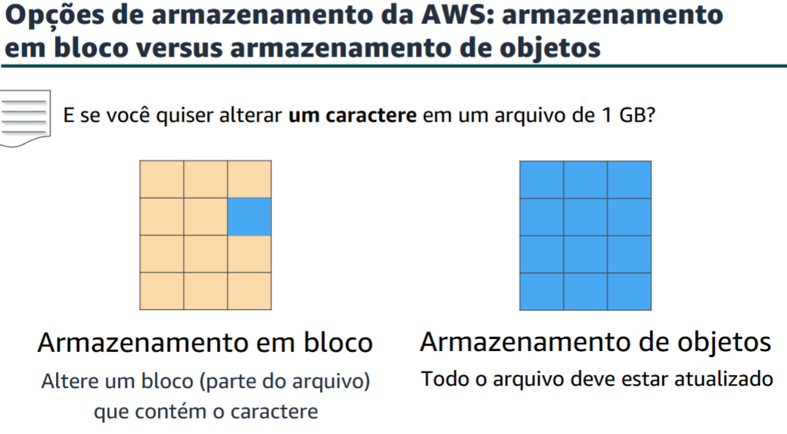
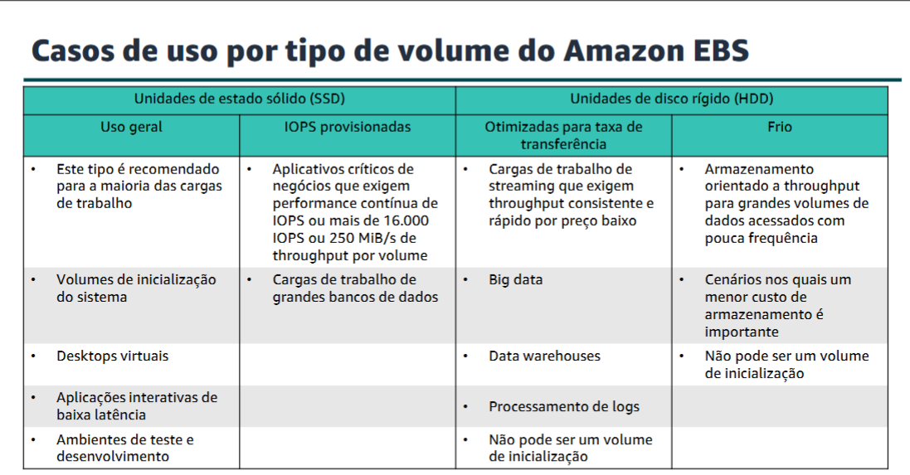
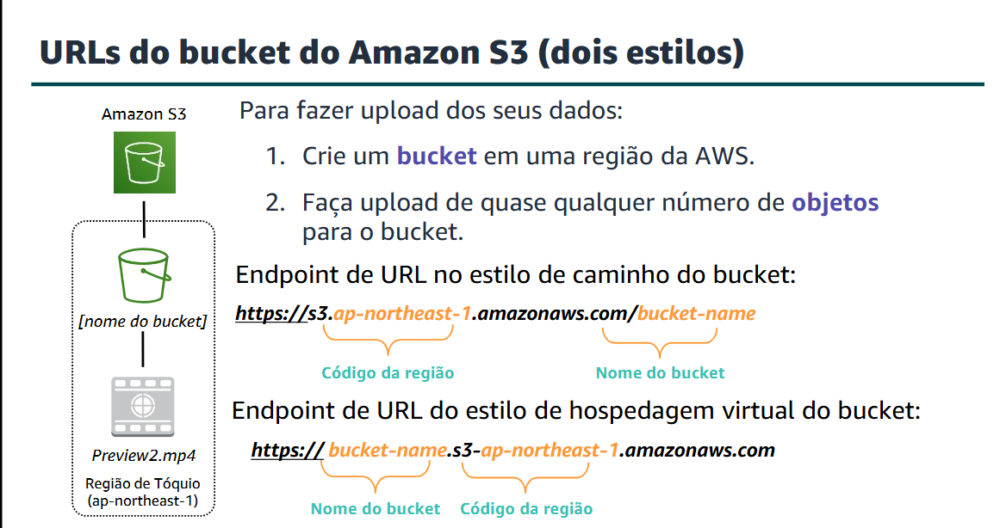
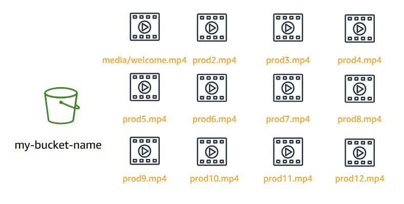
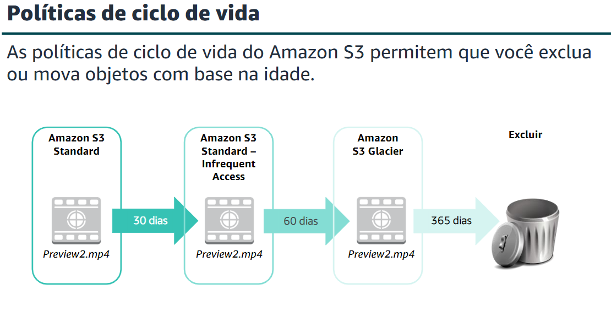
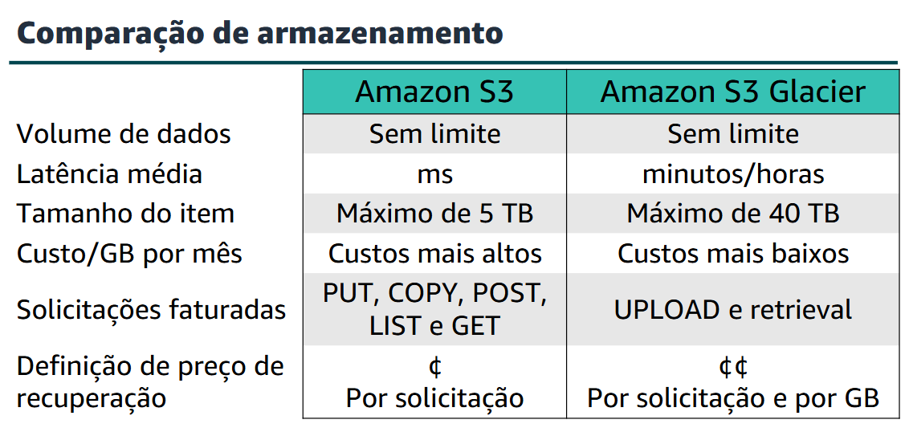

## Armazenamento
O armazenamento é outra categoria de serviço importante da AWS. Algumas categorias amplas de armazenamento incluem: armazenamento de instâncias (armazenamento temporário), Amazon EBS, Amazon EFS, Amazon S3 e Amazon S3 Glacier.

* **Armazenamento de instância**, ou armazenamento temporário, é armazenamento temporário adicionado à instância do Amazon EC2.
* **O Amazon EBS** é um armazenamento montável e persistente, que pode ser montado como um dispositivo na instância do Amazon EC2. O Amazon EBS só pode ser montado em uma instância do Amazon EC2 dentro da mesma Zona de Disponibilidade. Somente uma instância do Amazon EC2 por vez pode montar um volume do Amazon EBS.
* **O Amazon EFS** é um sistema de arquivo compartilhado em que várias instâncias do Amazon EC2 podem montar ao mesmo tempo.
* **O Amazon S3** é um armazenamento persistente em que cada arquivo se torna um objeto e está disponível por meio de um Uniform Resource Locator (URL) que pode ser acessado de qualquer lugar.

---
### *Amazon Elastic Block Store (Amazon EBS)*

* O Amazon EBS disponibiliza volumes de armazenamento persistente em blocos para uso com instâncias do Amazon EC2. Armazenamento persistente é qualquer dispositivo de armazenamento de dados que retém dados após a alimentação desse dispositivo ser desligada.

---

---
* O Amazon EBS permite criar volumes de armazenamento individuais e anexá-los a uma instância do Amazon EC2. O Amazon EBS oferece armazenamento em nível de bloco, onde seus volumes são replicados automaticamente dentro de sua zona de disponibilidade. O Amazon EBS foi projetado para fornecer armazenamento em nível de blocos durável e desanexável (que é como um disco rígido externo) para suas instâncias do Amazon EC2. Como eles estão diretamente anexados às instâncias, podem proporcionar uma latência baixa entre onde os dados estão armazenados e onde eles serão usados na instância.
* **Recursos do Amazon EBS:** Snapshots, Criptografia, Elasticidade.
* **Snapshots:** Recuperação de arquivos salvando o volume.
* **Recomendado:** Pela criptografia e acesso rápido.

---
### Amazon Simple Storage Service (Amazon S3)

* O Amazon S3 é um armazenamento em nível de objeto, o que significa que, se você quiser alterar uma parte de um arquivo, deverá fazer a alteração e carregar novamente o arquivo completo modificado. O Amazon S3 armazena dados como objetos dentro de recursos denominados buckets.
* O Amazon S3 é uma solução gerenciada de armazenamento na nuvem, projetada para ser dimensionada continuamente e fornecer 11 noves de durabilidade. É possível armazenar praticamente quantos objetos você quiser, bem como gravar, ler e excluir objetos em seu bucket.
* Os objetos podem ser praticamente qualquer arquivo de dados, como imagens, vídeos ou logs de servidor.
* Criptografia opcional.

> **Classes:** * **S3 Standard:** Dados frequentes e imediatos (sites, apps ativos).

* **S3 Intelligent-Tiering:** Automático; move dados sozinho para poupar dinheiro conforme o uso.
* **S3 Standard-IA:** Dados infrequentes mas que precisam de acesso rápido quando solicitados.
* **S3 One Zone-IA:** Mais barato, mas guarda tudo numa única zona (menos seguro contra desastres).
* **S3 Glacier:** Arquivo de baixo custo; recupera dados em minutos ou horas.
* **S3 Glacier Deep Archive:** O mais barato; para dados guardados por anos; recuperação em 12 horas.

* Primeiro, o Amazon S3 armazena dados dentro de buckets. Os buckets são essencialmente o prefixo de um conjunto de arquivos e devem ser nomeados exclusivamente em todo o Amazon S3. Os buckets são contêineres lógicos para objetos. Você pode ter um ou mais buckets na sua conta. Para cada bucket, você pode controlar o acesso, ou seja, quem pode criar, excluir e listar objetos no bucket.
* **Obs:** nome do bucket deve ser compatível com o DNS.
* Quando você cria um bucket no Amazon S3, ele é associado a uma Região específica da AWS. Ao armazenar dados no bucket, eles são armazenados de forma redundante em várias instalações da AWS dentro da região selecionada.

> **Cenários:**
> Backup e armazenamento • Hospedagem de aplicações • Hospedagem de mídia • Entrega de software

* **Solicitações:** considere o número e o tipo das solicitações. As solicitações GET geram cobranças em taxas diferentes das outras solicitações, como solicitações PUT e COPY.

* **GET:** recupera um objeto do Amazon S3. Você deve ter acesso de LEITURA para usar essa operação.
* **PUT:** adiciona um objeto a um bucket. Você deve ter permissões de GRAVAÇÃO em um bucket para adicionar um objeto a ele.
* **COPY:** cria uma cópia de um objeto que já está armazenado no Amazon S3. Uma operação COPY é o mesmo que executar um GET e, em seguida, um PUT.
---

---

### Amazon Elastic File System (Amazon EFS)

* O Amazon EFS implementa o armazenamento para instâncias do EC2 que várias máquinas virtuais podem acessar ao mesmo tempo. Ele é implementado como um sistema compartilhado de arquivos que usa o protocolo Network File System (NFS).
* O Amazon Elastic File System (Amazon EFS) fornece armazenamento de arquivos simples, dimensionáveis e elásticos para uso com serviços da AWS. Ele oferece uma interface simples, que permite criar e configurar sistemas de arquivos com rapidez e facilidade.
* Ele foi projetado para que suas aplicações tenham o armazenamento de que precisam, no momento em que precisam.
* Você pode acessar o sistema de arquivos do Amazon EFS simultaneamente por meio de instâncias do Amazon EC2 na sua VPC, para que as aplicações que vão além de uma única conexão possam acessar um sistema de arquivos.

> **Alguns Recursos do EFS:**
> Armazenamento compartilhado / Armazenamento de arquivos na Nuvem AWS

> **Implementação do Amazon EFS:**
> 1. Crie seus recursos do Amazon EC2 e execute sua instância do Amazon EC2.
> 2. Crie um sistema de arquivos do Amazon EFS.
> 3. Crie seus destinos de montagem nas sub-redes apropriadas.
> 4. Conecte suas instâncias do Amazon EC2 aos destinos de montagem.
> 5. Verifique os recursos e a proteção da sua conta da AWS.
> 
> 

* No Amazon EFS, o principal recurso é o sistema de arquivos. Cada sistema de arquivos tem propriedades como: ID, Token de criação, Horário de criação, Tamanho do sistema de arquivos em bytes, Número de destinos de montagem criados para o sistema de arquivos e Estado do sistema de arquivo.
* **Destino de montagem:** Para acessar o sistema de arquivos, é necessário criar destinos de montagem em sua VPC. Cada destino de montagem tem as seguintes propriedades: O ID do destino de montagem, O ID da sub-rede na qual ele foi criado, O ID do sistema de arquivos no qual ele foi criado, Um endereço IP onde o sistema de arquivos pode ser montado e O estado do destino de montagem.
* **Tags:** para ajudar a organizar seus sistemas de arquivos, você pode atribuir seus próprios metadados a cada um dos sistemas de arquivos que criar. Cada tag é um par de chave/valor.

---

### Amazon S3 Glacier
* O Amazon S3 Glacier é um serviço de arquivamento de dados projetado para oferecer segurança, durabilidade e um custo extremamente baixo.
* Fornece três opções de acesso a arquivos: expresso, padrão e em massa. Os tempos de recuperação variam de alguns minutos a várias horas.
* Há três termos principais do Amazon S3 Glacier com os quais você deve estar familiarizado:

* **Arquivo:** qualquer objeto (como foto, vídeo, arquivo ou documento) armazenado no Amazon S3 Glacier. É a unidade básica de armazenamento no Amazon S3 Glacier. Cada arquivo tem seu próprio ID exclusivo e também pode ter uma descrição.
* **Cofre:** um contêiner para armazenar arquivos. Ao criar um cofre, você especifica o nome do cofre e a Região onde deseja localizar o cofre.
* **Política de acesso ao cofre:** determine quem pode e não pode acessar os dados armazenados no cofre e quais operações os usuários podem e não podem executar. Uma política de permissões de acesso ao cofre pode ser criada para cada cofre para gerenciar permissões de acesso para um cofre específico.

> **Casos de uso do Amazon S3 Glacier:**
> Arquivamento de ativos de mídia • Arquivamento de informações de saúde • Arquivamento para fins normativos e de conformidade • Arquivamento de dados científicos • Preservação digital • Substituição da fita magnética

* Criptografia no lado do servidor.
* **Segurança:** Você pode habilitar e controlar o acesso aos seus dados no Amazon S3 Glacier usando IAM. Você configura uma política do IAM que especifica o acesso do usuário.

---

---