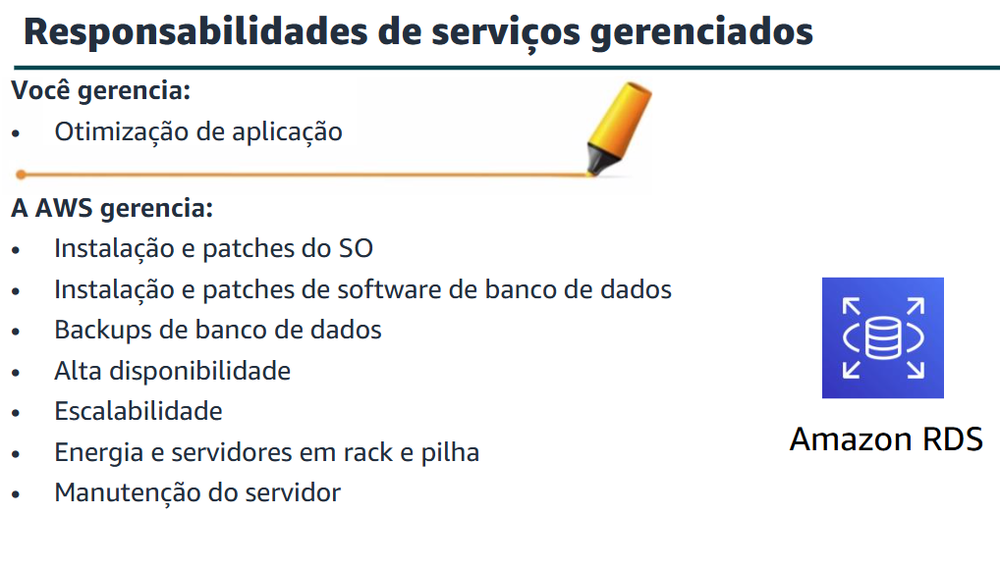
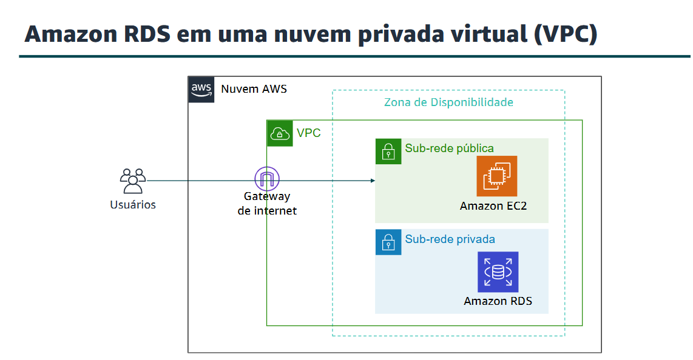
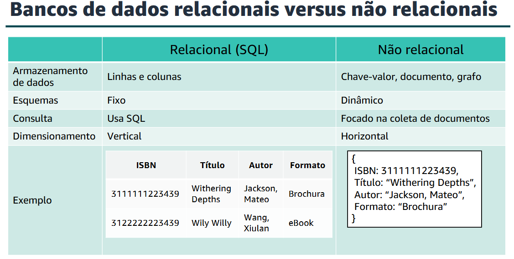
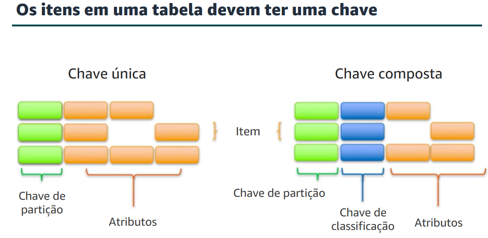

## Bancos de dados

### **Amazon Relational Database Service (Amazon RDS)**

* **Diferenças de uso (Serviços não gerenciados versus serviços gerenciados):**
* **Não gerenciado (Usuário puro):** Você gerencia o scaling, a tolerância a falhas e a disponibilidade.
* **Gerenciados (Serviço puro):** O scaling, a tolerância a falhas e a disponibilidade geralmente são incorporados ao serviço.
* O desafio maior é esse gerenciamento de tudo voltado ao banco de dados, quando somente o usuário trabalha sem o serviço.


**Conceito:** O Amazon RDS é um serviço gerenciado que configura e opera um banco de dados relacional na nuvem. O Amazon RDS oferece capacidade econômica e redimensionável enquanto automatiza tarefas administrativas demoradas.

* Ao configurar seu banco de dados no Amazon RDS ou no Amazon Aurora, você reduzirá suas responsabilidades administrativas. Ao migrar para a nuvem, você pode escalar automaticamente seu banco de dados, habilitar alta disponibilidade, gerenciar backups e aplicar patches. Assim, você pode se concentrar no que realmente importa: otimizar seu aplicativo.
---




---

A base do Amazon RDS é a instância de banco de dados. Uma instância de banco de dados é um ambiente de banco de dados isolado que pode conter vários bancos de dados criados pelo usuário. Ele pode ser acessado usando as mesmas ferramentas e aplicativos que você usa com uma instância de banco de dados autônoma. Os recursos de uma instância de banco de dados são determinados por sua classe, e o tipo de armazenamento é determinado pelo tipo de discos.

Quando você opta por criar uma instância de banco de dados, precisa primeiro especificar o mecanismo de banco de dados que deve ser executado. No momento, o Amazon RDS oferece suporte a seis bancos de dados: **MySQL, Amazon Aurora, Microsoft SQL Server, PostgreSQL, MariaDB e Oracle.**

Depois que uma implantação Multi-AZ é configurada, o Amazon RDS gera automaticamente uma cópia em espera da instância de banco de dados em outra zona de disponibilidade dentro da mesma VPC.

* Se uma falhar, tem-se outra para substituir.
* Réplicas de leitura do Amazon RDS.
* O Amazon RDS funciona bem com aplicativos web e móveis que precisam de um banco de dados com alto throughput, dimensionamento de armazenamento massivo e alta disponibilidade.

> **Use o Amazon RDS quando sua aplicação exigir:**
> * Transações ou consultas complexas.
> 
> 

> **Não use o Amazon RDS quando sua aplicação exigir:**
> * Solicitações e consultas GET ou PUT simples que um banco de dados NoSQL pode processar / fragmentação de dados.
> 
> 

**Transferência de dados:**

* Não há cobrança pela transferência de dados de entrada.
* Faixas de cobrança para transferência de dados de saída.

---

### **Amazon DynamoDB**

* O DynamoDB é um serviço de banco de dados NoSQL rápido e flexível para todos os aplicativos que precisam de latência estável abaixo de 10 milissegundos em qualquer escala.
* **Contém:**
* Tabelas de banco de dados NoSQL
* Armazenamento praticamente ilimitado
* Os itens podem ter atributos diferentes
* Consultas de baixa latência
* Vazão de leitura/gravação escalável

---




---

Os principais componentes do DynamoDB são tabelas, itens e atributos:

* **Uma tabela** é uma coleção de dados.
* **Itens** são um grupo de atributos que é identificável exclusivamente entre todos os outros itens.
* **Um atributo** é um elemento de dados fundamental, algo que não precisa ser dividido ainda mais.

O DynamoDB é compatível com dois tipos diferentes de chaves primárias: A **chave de partição** é uma chave primária simples, que é composta por um atributo chamado de chave de classificação. A chave de partição e a chave de classificação também são conhecidas como **chave primária composta**, que é composta por dois atributos.

**obs:** À medida que os dados crescem, tabela particionada por chave QUERY by Key para encontrar itens eficientemente SCAN para encontrar itens por qualquer atributo.

* **Demonstração:**

```sql
Criar tabela: create table > name > id > create.

```

---

### **Amazon Redshift**

O Amazon Redshift é um data warehouse rápido e gerenciado que torna simples e econômica a análise de todos os seus dados usando ferramentas SQL padrão e ferramentas de business intelligence (BI) que você já tem.

É simples automatizar a maioria das tarefas administrativas comuns para gerenciar, monitorar e expandir seu cluster do Amazon Redshift, o que permite que você se concentre em seus dados e negócios.

---

### **Amazon Aurora**

O Amazon Aurora é um banco de dados relacional compatível com MySQL e PostgreSQL criado para a nuvem. Ele combina o desempenho e a disponibilidade de bancos de dados comerciais avançados com a simplicidade e a economia de bancos de dados de código aberto.

O uso do Amazon Aurora pode reduzir os custos do banco de dados e aumentar a confiabilidade e a disponibilidade do banco de dados. Como um serviço totalmente gerenciado, o Aurora foi projetado para automatizar tarefas demoradas, como provisionamento, aplicação de patches, backup, recuperação, detecção de falhas e reparo.