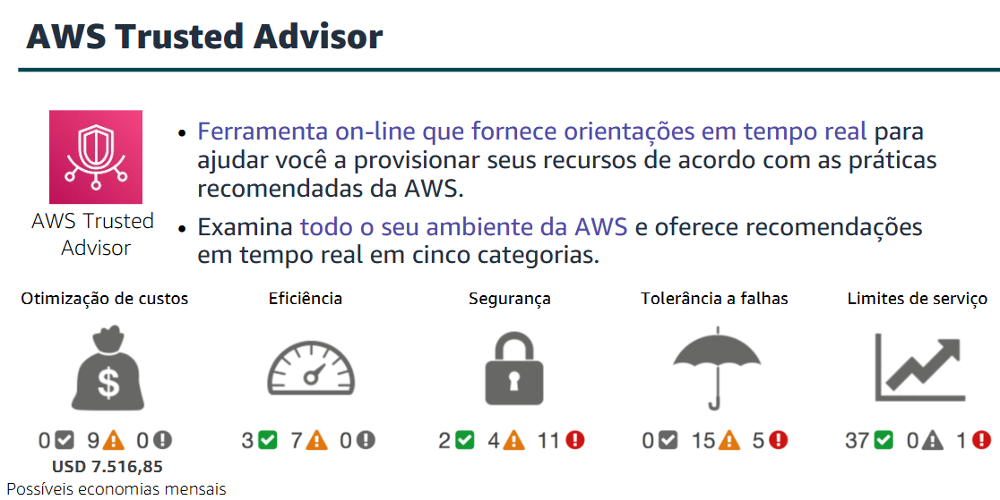

## Arquitetura de nuvem
### AWS Well-Architected Framework

* **Arquitetura: projeto e criação:**
* Arquitetura é a arte e a ciência de projetar e criar grandes estruturas. Sistemas grandes precisam de arquitetos para gerenciar seu tamanho e complexidade.

**Arquitetos de nuvem:**

* Envolva-se com os responsáveis pela tomada de decisões para identificar o objetivo comercial e os recursos que precisam ser aprimorados.
* Garanta o alinhamento entre os resultados de tecnologia de uma solução e os objetivos empresariais.
* Trabalhe com equipes de entrega que estejam implementando a solução para garantir que os recursos de tecnologia sejam apropriados.

O AWS Well-Architected Framework é um guia projetado para ajudá-lo a criar a infraestrutura mais segura, de alto desempenho, resiliente e eficiente possível para suas aplicações e cargas de trabalho de nuvem.

> Baseado em seis pilares: excelência operacional, segurança, confiabilidade, eficiência de desempenho, otimização de custos e sustentabilidade.
> Cada pilar inclui seu próprio conjunto de princípios de design e áreas de práticas recomendadas.

#### Pilar de excelência operacional

* **Foco:** Executar e monitorar sistemas para agregar valor comercial e melhorar continuamente os processos e procedimentos de suporte.
* **Principais tópicos:**
* Automatização de alterações
* Resposta a eventos
* Definir padrões para gerenciar as operações diárias

* **Princípios:**
* Executar operações como código
* Fazer alterações frequentes, pequenas e reversíveis
* Refinar os procedimentos operacionais com frequência
* Prever falhas
* Aprender com eventos e falhas operacionais

> Organização; Preparação; Execução; Evolução.

#### Pilar de segurança

* **Foco:** Proteger informações, sistemas e ativos, e ao mesmo tempo agregar valor comercial por meio de avaliações de risco e estratégias de mitigação.
* **Principais tópicos:**
* Proteger a confidencialidade e integridade dos dados
* Identificar e gerenciar quem pode fazer o quê
* Proteger sistemas
* Estabelecer controles para detectar eventos de segurança

* **Princípios:**
* Implementar uma base de identidade sólida
* Ativar a rastreabilidade
* Aplicar segurança em todas as camadas
* Automatizar as práticas recomendadas de segurança
* Proteger dados em trânsito e ociosos
* Manter as pessoas longe dos dados
* Preparar-se para eventos de segurança

> Segurança; Detecção; Identity and Access Management; Proteção de infraestrutura; Proteção de dados; Resposta a incidentes.

#### Pilar de confiabilidade

* **Foco:** Garanta que uma carga de trabalho execute sua função pretendida corretamente e de modo consistente quando esperado.
* **Principais tópicos:**
* Projeto de sistemas distribuídos
* Planejamento de recuperação
* Tratamento de alterações

* **Princípios:**
* Recuperar-se automaticamente de falhas
* Testar os procedimentos de recuperação
* Dimensionar horizontalmente para aumentar a disponibilidade agregada da carga de trabalho
* Parar de tentar adivinhar a capacidade
* Gerenciar alterações na automação

> Fundamentos; Arquitetura de carga de trabalho; Gerenciamento de alterações; Gerenciamento de falhas.

#### Pilar Eficiência de desempenho

* **Foco:** Use os recursos de computação e TI de forma eficiente para atender aos requisitos do sistema e manter essa eficiência à medida que as mudanças na demanda e as tecnologias evoluem.
* **Principais tópicos:**
* Seleção dos tipos e tamanhos certos de recursos com base nos requisitos de carga de trabalho
* Monitoramento e desempenho
* Tomar decisões embasadas para manter a eficiência à medida que as necessidades empresariais evoluem

* **Princípios:**
* Democratizar tecnologias avançadas
* Ter alcance global em minutos
* Usar arquiteturas serverless
* Experimentar com mais frequência
* Considerar a afinidade mecânica

> Seleção; Revisão; Monitoramento; Vantagens e Desvantagens.

#### Pilar Otimização de custos

* **Foco:** Evite solicitações desnecessárias.
* **Principais tópicos:**
* Compreender e controlar onde o dinheiro está sendo gasto
* Selecionar o número mais apropriado e correto de tipos de recursos
* Analisar gastos ao longo do tempo
* Scaling para atender às necessidades empresariais sem gastos excessivos

* **Princípios:**
* Implemente gerenciamento financeiro da nuvem
* Adote um modelo de consumo
* Meça a eficiência geral
* Pare de gastar dinheiro em trabalho pesado indiferenciado
* Analise e atribua despesas

> Prática de gerenciamento financeiro na nuvem; Conscientização sobre despesas e uso; Recursos de baixo custo; Gerenciar recursos de oferta e demanda; Otimizar ao longo do tempo.

### Confiabilidade e disponibilidade

*"Falhas acontecem o tempo todo."* — Werner Vogels, CTO da Amazon.com

> **Confiabilidade**
> Confiabilidade é a medida da capacidade do sistema de fornecer a funcionalidade quando o usuário quiser. Como “tudo falha, o tempo todo”, você deve pensar na confiabilidade em termos estatísticos. Confiabilidade é a probabilidade de que todo o sistema funcione como pretendido por um período especificado.

> **Disponibilidade**
> Formalmente, disponibilidade é a porcentagem de tempo em que um sistema opera normalmente ou executa corretamente as operações esperadas dele (ou o tempo normal de operação ao longo do tempo total). A disponibilidade diminui sempre que o aplicativo não funciona normalmente, incluindo interrupções programadas e não programadas.

### AWS Trusted Advisor

* O AWS Trusted Advisor é uma ferramenta on-line que fornece orientações em tempo real para ajudar a provisionar recursos de acordo com as práticas recomendadas da AWS.

---

---