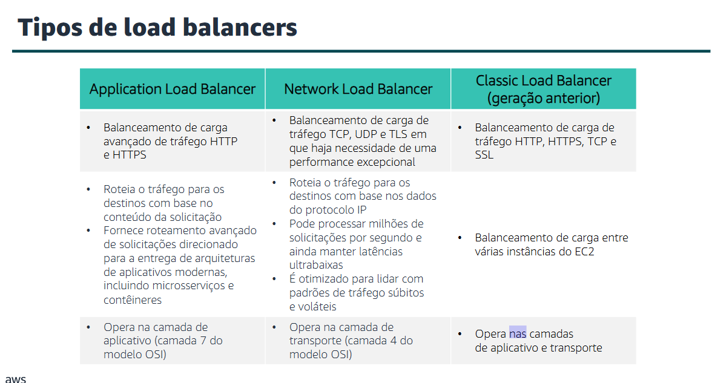
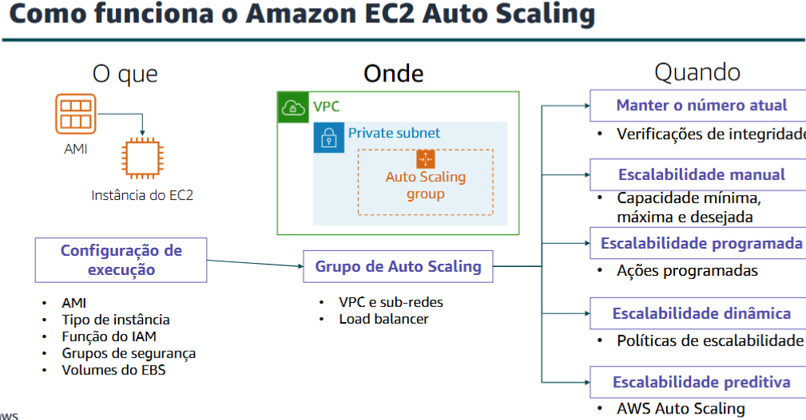

## Auto Scaling e monitoramento
- Atendimento ao usuário/cliente. 

### Elastic Load Balancing
- O Elastic Load Balancing é um serviço da AWS que distribui o tráfego de entrada de aplicativos ou rede entre vários destinos, como instâncias do Amazon Elastic Compute Cloud (Amazon EC2), contêineres, endereços de protocolo de Internet (IP) e funções Lambda, em uma única zona de disponibilidade ou em várias zonas de disponibilidade. O Elastic Load Balancing escala o load balancer à medida que o tráfego para o aplicativo muda ao longo do tempo. Ele pode escalar automaticamente para a maioria das cargas de trabalho. 

- Atender a alta demanda. 

---

---

> **Como o Elastic Load Balancing funciona:** > Um load balancer aceita o tráfego de entrada de clientes e roteia solicitações para seus destinos registrados (como instâncias do EC2) em uma ou mais zonas de disponibilidade. Você configura o load balancer para aceitar tráfego de entrada especificando um ou mais listeners. Um listener é um processo que verifica se há solicitações de conexão. Ele é configurado com um protocolo e um número de porta para as conexões de clientes com o load balancer. Da mesma forma, ele é configurado com um protocolo e um número de porta para conexões do load balancer com os destinos.

- Detecção de falhas.
- Registro de instancias com o load.

**Uso:**
* VPC
* Apps tolerantes a falhas
* Invocar funções do Lambda por HTTP(S).

**Métricas:**
* **Métricas do Amazon CloudWatch:** usadas para verificar se o sistema está funcionando conforme o esperado e cria um alarme para iniciar uma ação se uma métrica sair de um intervalo aceitável.
* **Logs de acesso:** capture informações detalhadas sobre solicitações enviadas ao load balancer.
* **Logs do AWS CloudTrail:** Capture quem, o que, quando e onde das interações de API nos serviços da AWS.

### Amazon Cloud Watch
- Como você sabe quando deve executar mais instâncias do Amazon EC2? Quanto da infraestrutura está realmente sendo usada?

O Amazon CloudWatch é um serviço de monitoramento e observabilidade criado para engenheiros de DevOps, desenvolvedores, Site Reliability Engineers (SREs – Engenheiros de confiabilidade de sites) e gerentes de TI. O CloudWatch monitora os recursos e as aplicações da AWS executados em tempo real na AWS. Você pode usar o CloudWatch para coletar e monitorar métricas, que são variáveis mensuráveis de seus recursos e aplicativos.

- Criação de alarmes e notificação. Ex: a taxa de transferência de tabelas do Amazon DynamoDB. 

**Alarmes do CloudWatch**
Criar alarmes com base no:
* Limite estático
* Detecção de anomalias
* Expressão matemática de métricas

**Especificações:** * **Namespace:** Categoria onde está a métrica no CloudWatch (ex: AWS/EC2).
* **Metric:** Valor que será monitorado (ex: utilização de CPU).
* **Estatística:** Forma de cálculo da métrica (média, soma, mínimo, máximo, contagem ou percentil).
* **Period:** Intervalo de tempo usado para avaliar e gerar cada ponto de dado.
* **Condições:** Regra que compara a métrica com um valor limite (maior, menor, igual, etc.).
* **Informações adicionais de configuração:** Quantos pontos devem violar o limite e como tratar dados ausentes.
* **Ações:** O que acontece quando o alarme dispara (notificação SNS ou ação de Auto Scaling/EC2).

### Amazon EC2 Auto Scaling
- **Escalabilidade** é a capacidade de aumentar ou diminuir a capacidade de computação do seu aplicativo.

- **Amazon EC2 Auto Scaling** é um serviço da AWS ajuda a manter a disponibilidade de aplicativos e permite aumentar ou reduzir instâncias do EC2 de maneira automática, de acordo com condições definidas por você. Você pode usar os recursos de gerenciamento de frota do EC2 Auto Scaling para manter a integridade e a disponibilidade da sua frota.

- oferece várias maneiras de ajustar a escalabilidade

> Um **grupo de Auto Scaling** é um conjunto de instâncias do EC2 que são tratadas como um agrupamento lógico para fins de escalabilidade automática e gerenciamento

> **Expansão versus redução:** Com o Amazon EC2 Auto Scaling, a execução de instâncias é chamada de aumento e o encerramento de instâncias é chamado de redução

> **Como funciona o Amazon EC2 Auto Scaling:**

---

---

- **Implementação de escalabilidade dinamica:** Uma configuração comum para implementar a escalabilidade dinâmica é criar um alarme do CloudWatch baseado nas informações de performance das instâncias do EC2 ou do load balancer. Quando um limite de performance é violado, um alarme do CloudWatch aciona um evento de escalabilidade automática que pode ser expandido ou escalado em instâncias do EC2 no grupo de Auto Scaling.

#### AWS Auto Scaling
- O AWS Auto Scaling é um serviço separado que monitora seus aplicativos. Ele ajusta automaticamente a capacidade para manter uma performance estável e previsível pelo menor custo possível. O serviço fornece uma interface de usuário simples e eficiente que permite criar planos de escalabilidade para recursos: 
    * Instâncias do Amazon EC2 e frotas spot
    * Tarefas do Amazon Elastic Container Service (Amazon ECS) 
    * Índices e tabelas do Amazon DynamoDB
    * Réplicas do Amazon Aurora

> O **AWS CloudTrail** registra e monitora todas as ações e chamadas de API realizadas em sua conta AWS. Ele ajuda na auditoria, segurança, rastreamento de atividades e solução de problemas.