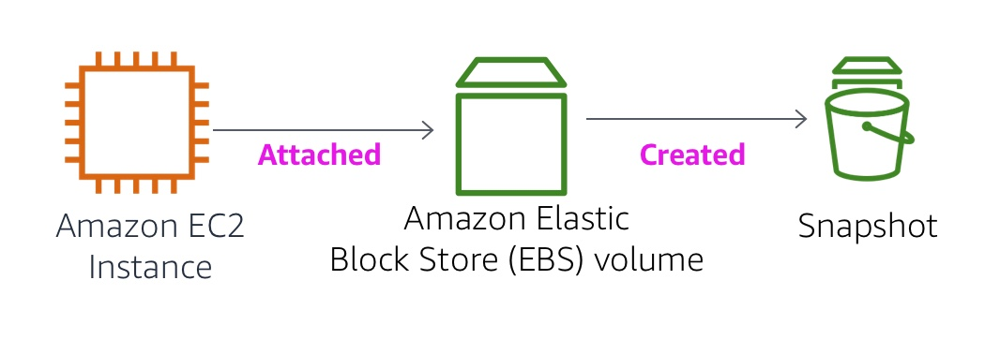

Laboratório 4: Trabalhando com EBS
Visão geral do laboratório
diagrama arquitetônico

Este laboratório se concentra no Amazon Elastic Block Store (Amazon EBS), um mecanismo de armazenamento fundamental para instâncias do Amazon EC2. Neste laboratório, você aprenderá como criar um volume do Amazon EBS, anexá-lo a uma instância, aplicar um sistema de arquivos ao volume e, em seguida, criar um backup instantâneo.

 

Tópicos abordados
Ao final deste laboratório, você será capaz de:

Criar um volume do Amazon EBS

Anexe e monte seu volume a uma instância EC2.

Crie um instantâneo do seu volume

Crie um novo volume a partir do seu snapshot.

Anexe e monte o novo volume à sua instância EC2.

 

Duração
Este experimento levará aproximadamente 30 minutos para ser concluído.

 

restrições de serviço da AWS
Neste ambiente de laboratório, o acesso aos serviços e ações da AWS pode estar restrito àqueles necessários para concluir as instruções do laboratório. Você poderá encontrar erros se tentar acessar outros serviços ou executar ações além das descritas neste laboratório.

 

O que é o Amazon Elastic Block Store?
O Amazon Elastic Block Store (Amazon EBS) oferece armazenamento persistente para instâncias do Amazon EC2. Os volumes do Amazon EBS são conectados à rede e persistem independentemente do ciclo de vida da instância. São volumes altamente disponíveis e confiáveis ​​que podem ser usados ​​como partição de inicialização de uma instância do Amazon EC2 ou anexados a uma instância do Amazon EC2 em execução como um dispositivo de bloco padrão.

Quando usadas como partição de inicialização, as instâncias do Amazon EC2 podem ser interrompidas e reiniciadas posteriormente, permitindo que você pague apenas pelos recursos de armazenamento utilizados, mantendo o estado da sua instância. Os volumes do Amazon EBS oferecem durabilidade muito superior aos armazenamentos locais das instâncias do Amazon EC2, pois são replicados automaticamente no backend (em uma única Zona de Disponibilidade).

Para quem busca ainda mais durabilidade, o Amazon EBS oferece a possibilidade de criar snapshots consistentes de seus volumes em um determinado ponto no tempo, que são armazenados no Amazon Simple Storage Service (Amazon S3) e replicados automaticamente em várias Zonas de Disponibilidade. Esses snapshots podem ser usados ​​como ponto de partida para novos volumes do Amazon EBS e protegem seus dados para garantir durabilidade a longo prazo. Você também pode compartilhar facilmente esses snapshots com colegas de trabalho e outros desenvolvedores da AWS.

Este guia de laboratório explica os conceitos básicos do Amazon EBS passo a passo. No entanto, ele oferece apenas uma visão geral dos conceitos do Amazon EBS. Para obter mais informações, consulte a documentação do Amazon EBS .

 

Recursos de volume do Amazon EBS
Os volumes do Amazon EBS oferecem os seguintes recursos:

Armazenamento persistente: o tempo de vida do volume é independente de qualquer instância específica do Amazon EC2.

Uso geral: os volumes do Amazon EBS são dispositivos de bloco brutos e não formatados que podem ser usados ​​em qualquer sistema operacional.

Alto desempenho: os volumes do Amazon EBS são iguais ou melhores que as unidades locais do Amazon EC2.

Alta confiabilidade: os volumes do Amazon EBS possuem redundância integrada dentro de uma Zona de Disponibilidade.

Projetado para resiliência: a taxa anual de falhas (AFR) do Amazon EBS está entre 0,1% e 1%.

Tamanho variável: Os volumes variam de 1 GB a 16 TB.

Fácil de usar: os volumes do Amazon EBS podem ser criados, anexados, copiados, restaurados e excluídos com facilidade.

 

Acessando o Console de Gerenciamento da AWS
Na parte superior destas instruções, escolha Iniciar Laboratório .

A sessão de laboratório começa.

Um cronômetro é exibido na parte superior da página, mostrando o tempo restante da sessão.

 Dica: Para atualizar a duração da sessão a qualquer momento, escolha Reinicie o laboratório antes que o cronômetro chegue a 0:00.

Antes de prosseguir, aguarde até que o ícone circular à direita do AWS apareça.O link no canto superior esquerdo fica verde.

 

Para se conectar ao Console de Gerenciamento da AWS, selecione o link da AWS no canto superior esquerdo.

Uma nova aba do navegador será aberta e você será conectado ao console.

 Dica: Se uma nova aba do navegador não abrir, geralmente aparece um banner ou ícone na parte superior do navegador informando que ele está bloqueando a abertura de janelas pop-up. Selecione o banner ou ícone e, em seguida, escolha " Permitir pop-ups" .

 

Configure a guia do Console de Gerenciamento da AWS para que ela seja exibida ao lado destas instruções. O ideal é que você consiga visualizar ambas as guias do navegador simultaneamente, para facilitar o acompanhamento das etapas do laboratório.

 

Como obter reconhecimento pelo seu trabalho
Ao final deste laboratório, você receberá instruções para enviá-lo e receber uma nota com base no seu progresso.

 Dica: O script que verifica seu código só atribuirá pontos se você nomear os recursos e definir as configurações conforme especificado. Em particular, os valores nestas instruções que aparecem em ` This Format<nome_do_arquivo>` devem ser inseridos exatamente como documentados (diferenciando maiúsculas de minúsculas).

 

Tarefa 1: Criar um novo volume EBS
Nesta tarefa, você criará e anexará um volume do Amazon EBS a uma nova instância do Amazon EC2.

No Console de Gerenciamento da AWS, na caixa de pesquisa ao lado deEm Serviços , pesquise e selecione EC2 .

 

No painel de navegação à esquerda, selecione Instâncias .

Uma instância do Amazon EC2 chamada Lab já foi iniciada para o seu laboratório.

 

Observe a Zona de Disponibilidade da instância. Ela será semelhante a us-east-1a .

 

No painel de navegação à esquerda, selecione Volumes .

Você verá um volume existente que está sendo usado pela instância do Amazon EC2. Este volume tem um tamanho de 8 GiB, o que facilita a distinção do volume que você criará em seguida, que terá 1 GiB de tamanho.

 

Selecione Criar volume e, em seguida, configure:

Tipo de volume: SSD de uso geral (gp2) 

Tamanho (GiB): . NOTA : A criação de volumes grandes pode ser limitada. 1

Zona de disponibilidade: Selecione a mesma zona de disponibilidade da sua instância EC2.

Selecione Adicionar etiqueta

No Editor de Tags, digite:

Chave: Name

Valor: My Volume

 

Selecione Criar Volume

Seu novo volume aparecerá na lista e passará do estado " Em criação " para o estado " Disponível" . Talvez seja necessário selecionar "Atualizar". para ver seu novo volume.

 

Tarefa 2: Anexar o volume a uma instância
Nesta tarefa, você irá conectar o novo volume EBS à instância do Amazon EC2.

Selecione Meu volume .

 

No menu Ações , escolha Anexar volume .

 

Escolha o campo Instância e, em seguida, selecione a instância Laboratório .

Observe que o nome do dispositivo está definido como /dev/sdf . Observe também a mensagem exibida: "Os kernels Linux mais recentes podem renomear seus dispositivos internamente para /dev/xvdf a /dev/xvdp , mesmo quando o nome do dispositivo inserido aqui (e mostrado nos detalhes) for /dev/sdf a /dev/sdp ."

 

Selecione "Anexar volume"

O estado do volume agora é "Em uso" .

 

Tarefa 3: Conecte-se à sua instância do Amazon EC2
Nesta tarefa, você se conectará à instância EC2 usando o EC2 Instance Connect, que fornece acesso a um terminal no navegador.

No Console de Gerenciamento da AWS, na caixa de pesquisa ao lado deEm Serviços , pesquise e selecione EC2 .

 

Selecione as instâncias .

 

Selecione a instância do Laboratório e, em seguida, escolha Conectar .

 

Na guia Conectar instância EC2 , selecione Conectar .

Uma sessão de terminal do EC2 Instance Connect é aberta e exibe um $prompt.

 

Tarefa 4: Criar e configurar seu sistema de arquivos
Nesta tarefa, você adicionará o novo volume a uma instância Linux como um sistema de arquivos ext3 no ponto de montagem /mnt/data-store.

Veja o armazenamento disponível na sua instância:

Execute o seguinte comando:

df -h
Você deverá ver uma saída semelhante a:

Sistema de arquivos Tamanho Usado Disponível Uso% Montado em
devtmpfs         4.0M 0   4.0M 0    % / dev     
tmpfs 475M      0   475M    0 % /dev/shm
tmpfs 190M   2,8M 188M    2 % /run
/ dev/       xvda1 8,0G 1,6G   6,5G   20 % /  
tmpfs 475M      0   475M    0 % /tmp
tmpfs 95M      0    95M    0 % /run/user/1000
A saída mostra que o volume de disco original de 8 GB /dev/xvda1 foi montado em /dev/xvda1 , o que indica que ele é o volume raiz. Ele hospeda o sistema operacional Linux da instância EC2./

O outro volume de 1 GB que você conectou à instância do laboratório não está listado porque você ainda não criou um sistema de arquivos nele nem montou o disco. Essas ações são necessárias para que o sistema operacional Linux possa usar o novo espaço de armazenamento. Você realizará essas ações a seguir.

 

Crie um sistema de arquivos ext3 no novo volume:

sudo mkfs -t ext3 /dev/sdf
A saída deverá indicar que um novo sistema de arquivos foi criado no volume anexado.

 

Crie um diretório para montar o novo volume de armazenamento:

sudo  mkdir /mnt/data-store
 

Instale o novo volume:

sudo mount /dev/sdf /mnt/data-store
Para configurar a instância Linux para montar este volume sempre que a instância for iniciada, você precisará adicionar uma linha ao arquivo /etc/fstab . Execute o comando abaixo para fazer isso:

echo  "/dev/sdf /mnt/data-store ext3 defaults,noatime 1 2" | sudo  tee  -a /etc/fstab
 

Consulte o arquivo de configuração para ver a configuração na última linha:

cat /etc/fstab
 

Veja novamente o espaço de armazenamento disponível:

df -h
O resultado será semelhante ao mostrado abaixo.

Sistema de arquivos Tamanho Usado Disponível Uso% Montado em
devtmpfs 484M 0 484M 0% /dev
tmpfs 492M 0 492M 0% /dev/shm
tmpfs 492M 460K 491M 1% /executar
tmpfs 492M 0 492M 0% /sys/fs/cgroup
/dev/xvda1 8,0G 1,5G 6,6G 19% /
tmpfs 99M 0 99M 0% /run/user/0
tmpfs 99M 0 99M 0% /run/user/1000
/dev/xvdf 976M 1,3M 924M 1% /mnt/data-store
Observe a última linha. A saída agora lista /dev/xvdf , que é o novo volume montado.

 

No volume montado, crie um arquivo e adicione algum texto a ele.

sudo  sh  -c  "echo algum texto foi escrito > /mnt/data-store/file.txt"
 

Verifique se o texto foi escrito no volume correto.

cat /mnt/data-store/file.txt
		Deixe a sessão do EC2 Instance Connect em execução. Você retornará a ela mais tarde neste laboratório.

 

Tarefa 5: Criar um snapshot do Amazon EBS
Nesta tarefa, você criará um instantâneo do seu volume EBS.

Você pode criar qualquer número de snapshots consistentes e pontuais a partir de volumes do Amazon EBS a qualquer momento. Os snapshots do Amazon EBS são armazenados no Amazon S3 com alta durabilidade. Novos volumes do Amazon EBS podem ser criados a partir de snapshots para clonagem ou restauração de backups. Os snapshots do Amazon EBS também podem ser facilmente compartilhados entre usuários da AWS ou copiados entre regiões da AWS.

No console do EC2 , escolha Volumes e selecione Meu volume .

 

No menu Ações , selecione   Criar instantâneo .

 

Selecione Adicionar etiqueta e, em seguida, configure:

Chave: Name

Valor: My Snapshot

Selecione Criar instantâneo

 

No painel de navegação à esquerda, selecione Instantâneos .

Seu instantâneo será exibido. O status inicialmente será "Pendente" , o que significa que o instantâneo está sendo criado. Em seguida, mudará para o status " Concluído" .

Observação: Somente os blocos de armazenamento utilizados são copiados para os snapshots; portanto, os blocos vazios não ocupam espaço de armazenamento nos snapshots.

 

Na sua sessão do EC2 Instance Connect, exclua o arquivo que você criou no seu volume.

sudo  rm /mnt/data-store/file.txt
 

Verifique se o arquivo foi excluído.

ls /mnt/data-store/
Seu arquivo foi excluído.

 

Tarefa 6: Restaurar o snapshot do Amazon EBS
Caso deseje recuperar dados armazenados em um snapshot, você pode restaurá -lo para um novo volume EBS.

 

Criar um volume usando seu instantâneo
No console do EC2 , selecione Minha foto .

 

No menu Ações , selecione Criar volume a partir do instantâneo .

 

Em Zona de Disponibilidade , selecione a mesma zona de disponibilidade que você usou anteriormente.

 

Selecione Adicionar etiqueta e, em seguida, configure:

Chave: Name

Valor: Restored Volume

Selecione Criar volume

Nota : Ao restaurar um snapshot para um novo volume, você também pode modificar a configuração, como alterar o tipo de volume, o tamanho ou a Zona de Disponibilidade.

 

Anexe o volume restaurado à sua instância EC2.
No painel de navegação à esquerda, selecione Volumes .

 

Selecione Volume restaurado .

 

No menu Ações , selecione Anexar volume .

 

Escolha o campo Instância e, em seguida, selecione a instância do Laboratório que aparecer.

Observe que o campo Dispositivo está definido como /dev/sdg . Você usará esse identificador de dispositivo em uma tarefa posterior.

 

Selecione "Anexar volume"

O estado do volume está agora em uso .

 

Monte o volume restaurado
Crie um diretório para montar o novo volume de armazenamento:

sudo  mkdir /mnt/data-store2
 

Instale o novo volume:

sudo mount /dev/sdg /mnt/data-store2
 

Verifique se o volume que você montou contém o arquivo que você criou anteriormente.

ls /mnt/data-store2/
Você deverá ver o arquivo file.txt