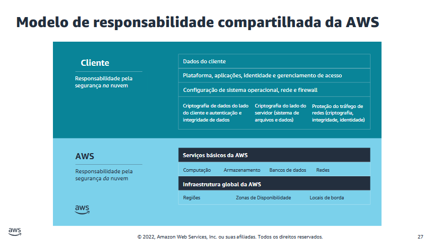
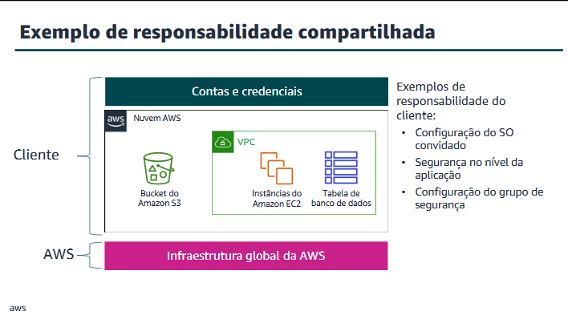
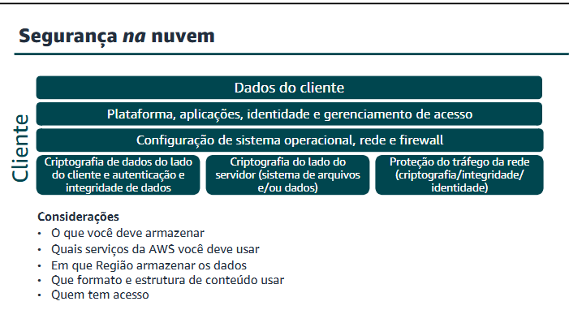

# Introdução à segurança na AWS - Princípios de segurança na nuvem na AWS Academy
* Cenário de negócios bancários

## Segurança na nuvem AWS
### Benefícios da nuvem

* Trocar despesas fixas por despesas variáveis.
* Beneficiar-se da enorme economia de escala.
* Parar de adivinhar suas necessidades de capacidade.
* Aumentar a velocidade e a agilidade.
* Parar de gastar dinheiro para executar e manter data centers.
* Ter alcance global em minutos.

- Elasticidade: ajuste comforme a demanda

---

### A Tríade CIA
A segurança é a prática de proteger sua propriedade intelectual contra acesso, uso ou modificação não autorizados. O objetivo original do desenvolvimento da tríade confidencialidade, integridade e disponibilidade, ou CIA, era destacar os aspectos importantes da segurança das informações em uma organização.

* **Confidencialidade:** Se refere à limitação do acesso e a divulgação das informações a usuários autorizados e a impedir o acesso de pessoas não autorizadas.
* **Integridade:** Envolve manter a consistência, a precisão e a confiabilidade dos dados durante o ciclo de vida deles. A integridade pode significar a garantia de que a pessoa ou a entidade em questão inseriu as informações corretas. No entanto, a integridade de um sistema de informações pode significar apenas a preservação dos dados sem corrupção de qualquer coisa que tenha sido transmitida ou inserida no sistema.
* **Disponibilidade:** Se refere à prontidão dos recursos de informações. Um sistema de informações que não está disponível quando você precisa é quase tão inútil quanto não ter um sistema de informações.
- *auto scaling* é um método que permite que uma aplicação ajuste automaticamente seus recursos de computação para atender à demanda. Alta disponibilidade.
---

### Segurança na nuvem AWS: Objetivos

* Controlabilidade
* Auditabilidade
* Visibilidade
* Agilidade
* Automação

#### Segurança na nuvem AWS: Controlabilidade

* É possível gerenciar os usuários de forma eficaz?
* Como posso fornecer credenciais temporárias?
* Posso usar minhas próprias chaves?

> A AWS oferece métodos e ferramentas para gerenciar o controle de acesso de usuários, grupos e funções, fornece credenciais temporárias de segurança e controla as chaves de criptografia.

> O serviço **AWS Identity and Access Management (IAM)** ajuda você a controlar o acesso aos recursos da AWS para os seus usuários com segurança. Use o IAM para controlar quem pode usar seus recursos da AWS (autenticação), quais recursos eles podem usar e de que maneiras (autorização). É possível definir permissões granulares para entidades, como usuários, grupos ou funções. Isso permite que as entidades administrem e usem os recursos em sua conta AWS sem precisar compartilhar a senha ou a chave de acesso.

#### Segurança na nuvem AWS: Auditabilidade

* Os serviços da AWS, como o **AWS CloudTrail**, podem ajudar você a responder a perguntas como:
* Quais ações um usuário específico executou durante um determinado período?
* Para um determinado recurso, qual usuário executou ações em um período específico?
* Qual é endereço IP de origem de uma atividade específica?

#### Segurança na nuvem AWS: Visibilidade
- O que está no meu ambiente? o que mudou?

* A AWS oferece ferramentas para acompanhar e monitorar os seus recursos da AWS, para que você tenha visibilidade instantânea do inventário e da atividade dos usuários e das aplicações.
* Por exemplo, o **AWS Config** permite descobrir os recursos da AWS existentes, exportar um inventário completo dos recursos da AWS com todos os detalhes da configuração e determinar como um recurso foi configurado em determinado momento.

#### Segurança na nuvem AWS: Agilidade e Automação

* O aumento da agilidade e da habilidade de executar ações mais rapidamente, em maior escala e a um custo mais baixo, não invalida os princípios bem estabelecidos da segurança das informações.
* As ferramentas da AWS são criadas com uma finalidade específica e personalizadas para as necessidades de seu ambiente, tamanho e requisitos globais exclusivos. Ao criar ferramentas de segurança do zero, a AWS pode automatizar muitas das tarefas de rotina em que os especialistas em segurança gastam seu tempo. Isso significa que os especialistas em segurança da AWS podem dedicar mais tempo em medidas para aumentar a segurança do seu ambiente da nuvem AWS.
* Os clientes também podem automatizar a engenharia de segurança e as funções de operações usando um conjunto abrangente de APIs e de ferramentas.

- AWS cloudFormation

---

### Princípios do design de segurança

**1. Aplicar o princípio de menor privilégio**

* Conceder acesso conforme necessário
* Aplicar a separação de tarefas
* Evitar credenciais de longo prazo

**2. Ativar a rastreabilidade**

* Monitorar ações e alterações
* Usar logs e métricas
* Auditar (observação criteriosa) seus recursos na nuvem

**3. Proteger todas as camadas**

* Usar uma abordagem de defesa detalhada
* Usar diferentes serviços da AWS

**4. Automatizar a segurança**

* Automatizar tarefas de rotina de segurança com APIs
* Implementar a infraestrutura como código

**5. Proteger dados em trânsito e em repouso**

* Usar controles de criptografia e acesso
* Classificar os dados com tags
* Usar conexões VPN e TLS

**6. Preparar-se para eventos de segurança**

* Mitigar o impacto dos incidentes de segurança
* Criar processos para isolar incidentes e restaurar operações

**7. Minimizar a superfície de ataque**

* Estar pronto para dimensionar e absorver o ataque
* Proteger recursos expostos.

---

### Modelo de responsabilidade compartilhada
---

---

**Para acessibilidade:** Modelo de responsabilidade compartilhada que lista as responsabilidades do cliente e da AWS.

* **O cliente é responsável pela segurança NA nuvem:**
* Isso inclui os dados do cliente.
* Plataforma, aplicações, identidade e gerenciamento de acesso.
* Configuração de sistema operacional, rede e firewall.
* Criptografia de dados do lado do cliente e autenticação e integridade de dados.
* Criptografia do lado do servidor do sistema de arquivos e dos dados.
* Proteção do tráfego da rede, para incluir criptografia, integridade e identidade.

* **A AWS é responsável pela segurança DA nuvem:**
* Isso inclui os serviços básicos de computação, de armazenamento, de bancos de dados e de rede da AWS.
* A infraestrutura global da AWS inclui Regiões, Zonas de Disponibilidade e locais de borda.

---

### O que é MSO?

No modelo **MSO (Managed Security Organization)**, existe uma equipe central responsável por garantir segurança, padronização e conformidade nas contas e aplicações da AWS.

Enquanto isso:

* **Proprietários da carga de trabalho** (desenvolvedores, administradores, etc.):
*  Cuidam da implantação, desenvolvimento e manutenção das aplicações.

* **MSO:**
*  Cuida da segurança, governança e controle da infraestrutura.

**O que a MSO normalmente faz:**

* Provisionamento de contas
* Supervisão de segurança
* Configuração de rede (Amazon VPC)
* Configuração de acesso (IAM)
* Modelos padronizados (CloudFormation)
* Gerenciamento de imagens (AMIs)
* VPC de serviços compartilhados