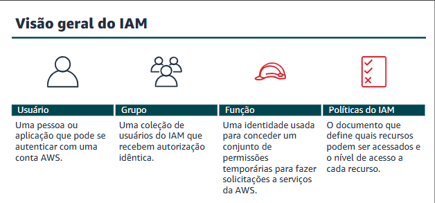
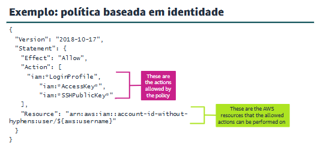
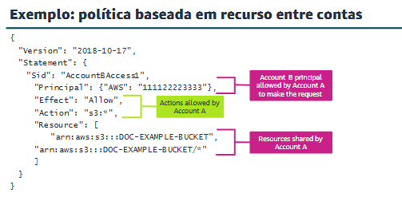
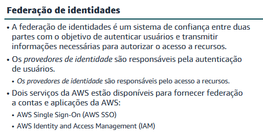

## Proteção do acesso aos recursos da nuvem
- Vamos discutir como os conceitos neste módulo se aplicam ao cenário de negócios bancários.
> AWS Identity and Access Management (IAM)

### Fundamentos do IAM
- O IAM é um serviço da web que ajuda a controlar com segurança o acesso aos recursos da AWS. Use o IAM para controlar quem está autenticado (conectado) e autorizado (tem permissões) para usar recursos.

- O IAM é integrado à maioria dos serviços da AWS

- Em todo ambiente da aws.

- É possível usar o IAM para conceder aos usuários, aos grupos e às aplicações acesso granular ao console e às interfaces de programação de aplicativos (APIs) de serviços da AWS usando os sistemas de identidade existentes. 

- O IAM também é compatível com a autenticação multifator (MFA). Se a MFA estiver ativada e um usuário do IAM tentar iniciar sessão, o usuário será solicitado a fornecer um código de autenticação. 

- Fornece informações de identidade para garantia.

> O que o IAM fornece

- **Autenticação**
- **Quem** está solicitando acesso à conta AWS e aos recursos nela?
- É importante estabelecer a identidade do solicitante por meio de credenciais.
- O solicitante pode ser uma pessoa ou uma aplicação. O IAM as chama de entidades principais.

- **Autorização**
- Após a autenticação do solicitante, **o que** ele deve ter permissão para fazer?
- O IAM verifica as políticas relevantes para a solicitação a fim de determinar se a solicitação deve ser permitida ou negada

---

---
> Terminologia do IAM:
- *Entidade do IAM*: usada pela AWS para autenticação (usuários e funções)

- *Identidade do IAM*: usada para identificar e agrupar 
   É possível anexar uma política a uma identidade do IAM (usuário, grupo ou perfil).

- *Recurso do IAM*: o usuário, o grupo, o perfil, a política e os objetos do provedor de identidade armazenados no IAM. 
   Você pode adicionar, editar e remover recursos do IAM.

- *Entidade principal*: uma pessoa ou uma aplicação que usa o usuário-raiz da conta AWS, um usuário do IAM ou um perfil do IAM para iniciar sessão e fazer solicitações à AWS.

> Solicitações no IAM
- Uma solicitação é feita a qualquer momento em que uma entidade principal tenta usar o console de gerenciamento da AWS, a interface de programação de aplicativo (API) ou a AWS Command Line Interface (AWS CLI).

- **A solicitação contém as seguintes informações**:
- *Ações ou operações*: as ações ou as operações que a entidade principal quer executar
- *Recursos*: o objeto em que as ações ou as operações são executadas
- *Entidade principal*: a pessoa ou a aplicação que envia uma solicitação usando um usuário ou um perfil
- *Dados do ambiente*: o endereço IP, o agente do usuário, o status ativado do Secure Sockets Layer (SSL) ou a hora do dia
- *Dados do recurso*: dados relacionados ao recurso que está sendo solicitado

> Endpoints de serviço
- Para se conectar a um serviço da AWS, use o URL do ponto de entrada desse serviço, conhecido como endpoint. Regionais. Alternativos para solicitações.
---

### Autenticação com o IAM
> Perfis do IAM:
- Um perfildo IAM é uma identidade do IAM que fornece a habilidade de definir um conjunto específico de permissões para acessar os recursos necessários para um usuário ou serviço. Um perfil do IAM é semelhante a um usuário do IAM por que você pode anexar políticas de permissão a ele. No entanto, não é possível anexar as permissões a um usuário ou grupo do IAM. Em vez disso, as permissões são anexadas a um perfil, e o usuário ou o serviço assumeo perfil.

- Ele fornece credenciais temporárias de segurança.
- O AWS Security Token Service (AWS STS) emite credenciais temporárias de segurança.

- Uma pessoa, uma aplicação ou um serviço da AWS pode assumir um perfil.

> Casos de uso comuns
- Aplicações executadas no Amazon Elastic Compute Cloud (Amazon EC2)
- Acesso entre contas de um usuário do IAM
- Aplicações para dispositivos móveis

> Credenciais do IAM para autenticação:
- Dois tipos principais de credenciais são usados para autenticação. O tipo de credencial que você usa depende de como a AWS é acessada:

- Para autenticação no console, inicie sessão com seu nome de usuário e senha.

- Para autenticação de forma programática por meio da AWS CLI, de SDKs e de APIs, forneça uma chave de acesso da AWS.

> Autenticação multifator (MFA):
- A autenticação multifator (MFA) é uma prática recomendada que adiciona uma camada extra de proteção sobre o nome de usuário e a senha. 
- Usuários solicitados a fornecer um código de autenticação. Pode ser um dispositivo virtual ou baseado em hardware. 

- Ative para Usuários do console de gerenciamento da AWS. Usuários da API da AWS. 

> Cenário de autenticação:

A empresa tem duas contas separadas (Desenvolvimento e Produção) por segurança. O objetivo é permitir que os desenvolvedores da **Conta Dev** acessem e atualizem um bucket S3 na **Conta Prod** de forma **temporária** e segura, sem precisar criar novos usuários na conta de produção.

- Como funciona
Para que a aconteça, as duas contas precisam trabalhar em conjunto:

1. **A Conta de Produção:**
* O Admin da conta Prod cria uma **IAM Role** (perfil) chamada `UpdateApp`.
* Ele anexa uma **Política de Confiança (Trust Policy)**. Essa política é fundamental porque ela diz: *"Eu autorizo a Conta Dev (entidade principal) a assumir esta role"*.

2. **A Conta de Desenvolvimento (Quem precisa do acesso):**
* O Admin da conta Dev dá permissão aos seus desenvolvedores para chamar o serviço STS e assumir a role `UpdateApp` que está lá na conta de produção.

3. **A Solicitação:**
* O desenvolvedor tenta assumir a role (pelo Console da AWS, CLI ou API).

4. **A Validação (O papel do STS):**
* O **AWS STS (Security Token Service)** entra em cena. Ele verifica se as permissões e a relação de confiança estão corretas e, se estiver tudo certo, entrega **credenciais de segurança temporárias** ao desenvolvedor.

5. **O Acesso:**
* Usando essas credenciais temporárias, o desenvolvedor finalmente consegue atualizar o bucket S3 na conta de Produção.
---

### Autorização com o IAM
- Inicie concedendo as permissões mínimas de conta AWS necessárias para o cargo.Conceda acesso adicional, conforme necessário

> Políticas e permissões:
- O diagrama de membros do grupo do IAM que recebe acesso de políticas e permissões do IAM. Os membros do grupo do IAM recebem acesso total ao bucket 1 do S3. Os membros do grupo do IAM também recebem acesso somente leitura ao bucket 2 do S3.

- Por padrão, um usuário, grupo ou perfil autenticado do IAM não pode acessar nada em sua conta até você conceder a eles permissões.

> A AWS aceita seis tipos de política
* **Políticas baseadas em identidade**: Anexadas a usuários, grupos ou perfis (roles) do IAM. Seu objetivo é conceder permissões.
    A que uma identidade específica tem acesso?

* **Políticas baseadas em recurso**: Anexadas diretamente aos recursos (ex: Bucket S3). Elas concedem permissões para quem (entidade) pode acessar aquele recurso específico.
    Quem tem acesso a um recurso específico?

   
* Limites de permissões
* Política de controle de serviço (SCP) do AWS Organizations
* Listas de controle de acesso (ACLs)
* Políticas de sessão

> Políticas do IAM gerenciadas e em linha:
- As políticas do IAM são divididas em duas categorias, gerenciadas e em linha. As políticas gerenciadas são divididas adicionalmente em políticas gerenciadas pela AWS e políticas gerenciadas pelo cliente. 

* **Políticas Gerenciadas:** São independentes, possuem gerenciamento centralizado com versionamento e podem ser reutilizadas em vários usuários ou grupos (podem ser criadas pela AWS ou por você).
* **Políticas em Linha (Inline):** São "embutidas" exclusivamente em uma única identidade (relação 1:1), sem compartilhamento, ideais para garantir que uma permissão específica nunca seja aplicada acidentalmente a outra pessoa.

> Lógica de avaliação para políticas do IAM: 
- A AWS avalia todas as políticas aplicáveis e passa por essa lógica de avaliação:
- Por padrão, todas as solicitações são negadas. 
- Uma permissão explícita substitui a negação por padrão.
- Uma negação explícita substitui qualquer permissão explícita

### Exemplos de autorização com o IAM
---
- Neste exemplo, a política é escrita para permitir três ações a serem executadas em uma conta do AWS IAM específica. 

- Neste exemplo, a política escrita pela Conta A permite que uma entidade principal específica na Conta B execute qualquer ação do S3 em um bucket específico do S3 na Conta A. 

---

### Serviços adicionais de autenticação e gerenciamento de acesso
---

---
- O AWS Single Sign-On (AWS SSO), é possível criar ou conectar identidades uma vez na AWS e gerenciar de forma centralizada o acesso entre as contas AWS. O AWS SSO fornece uma experiência de administração unificada para definir, personalizar e atribuir permissões refinadas com base em cargos.

> Amazon Cognito: 
- O Amazon Cognito é um serviço que fornece autenticação, autorização e gerenciamento de usuários (cadastro, início de sessão e controle de acesso) para aplicativos web e móveis. O serviço fornece um armazenamento de identidades seguro que pode ajudar você a dimensionar de forma eficaz para milhões de usuários. O Amazon Cognito é compatível com o início de sessão direto por meio de nome de usuário e senha. 

- Fornece a habilidade de criar identidades exclusivas para os usuários e federá-las com provedores por meio dos pools de identidade do Amazon Cognito.

### Usar o AWS Organizations
- O AWS Organizations é um serviço de gerenciamento de contas que você pode usar para criar uma organização em que é possível consolidar várias contas e gerenciá-las de forma centralizada.