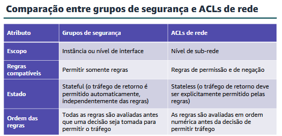

## Proteção da infraestrutura
#### Estrutura de um aplicativo web de três níveis

* **O que é:** Um modelo que divide o sistema em três partes independentes (Apresentação, Lógica e Dados), o oposto do modelo monolítico (onde fica tudo misturado em um único lugar).
* **1. Camada de Apresentação (Front-end):** Fica na linha de frente (sub-redes públicas) recebendo os acessos da internet e usando Load Balancers (ALB) para distribuir esse tráfego.
* **2. Camada da Lógica de Negócios (Back-end):** Fica protegida (sub-redes privadas) processando o "cérebro" da aplicação e usando Auto Scaling para criar ou destruir servidores conforme a demanda.
* **3. Camada de Armazenamento de Dados:** A base de dados isolada no fundo da rede, usando múltiplas Zonas de Disponibilidade (banco principal de um lado, réplica do outro) para garantir que nenhuma informação se perca se algo falhar.

---
#### Usar uma VPC
* **Amazon VPC:** É a sua rede virtual privada e isolada dentro da AWS, onde você tem controle total sobre IPs, tabelas de rotas e gateways.

* **Limites da VPC:** Uma VPC pertence a **uma única Região**, mas pode abranger **várias** Zonas de Disponibilidade (AZs).

* **Sub-redes (Subnets):** São as divisões menores (fatias de IPs) criadas dentro da sua VPC para organizar seus recursos.

* **Limites da Sub-rede:** Cada sub-rede fica presa a **uma única** Zona de Disponibilidade. (Ela *nunca* abrange mais de uma!).

* **Pública vs Privada:** Sub-redes públicas têm acesso direto à internet (ideal para servidores web), enquanto as privadas não têm (ideal para bancos de dados e back-end).

* **Segurança de Rede:** A VPC usa múltiplas camadas de proteção, principalmente **Grupos de Segurança (Security Groups)** e **ACLs de Rede (Network ACLs)**.

---
#### Configurar sub-redes públicas e privadas e protocolos de internet
Definição: Um Gateway na AWS é um componente de rede ou serviço gerenciado que atua como porta de entrada, conectando a infraestrutura da nuvem (VPCs) à internet, redes locais (on-premises) ou outras nuvens

> Gateway de internet:
- Fornece um alvo em suas tabelas de rotas da VPC para o tráfego roteável pela internet

- Executa a conversão de endereços de rede (NAT) para instâncias que receberam endereços IPv4 públicos

- É compatível com tráfego IPv4 e IPv6

- Não incorre em cobrança adicional em sua conta

> Gateway NAT:
- Oferece suporte a instâncias em sub-redes privadas para conexão com a internet ou outros serviços da AWS.

- Impede que a internet inicie uma conexão com essas instâncias.

- Na criação, exige especificar o seguinte:
  A sub-rede pública em que o gateway NAT deve residir
  Um endereço IP elástico para associação ao gateway NAT

- Após a criação, requer a atualização da tabela de rota de uma ou mais sub-redes privadas para direcionar o tráfego destinado à internet para o gateway NAT

> Sub-rede Privada

* **O que é:** Um bloco contíguo de IPs totalmente isolado do mundo externo.
* **Regra de Acesso:** Instâncias aqui dentro **não podem** ser acessadas diretamente de fora da sua VPC. Não há comunicação direta com a internet.
* **Caso de Uso:** É o lugar ideal para colocar tudo o que precisa de segurança máxima e não precisa falar com o cliente final, como **Bancos de Dados** e servidores de Back-end.

> Sub-rede Pública (A Vitrine)
* **O que é:** A área da sua rede desenhada para receber tráfego externo (Internet).
* **Os 2 Requisitos Obrigatórios:** Para uma sub-rede ser de fato "pública", ela precisa cumprir duas regras juntas:
1. A instância (ex: um servidor EC2) deve receber um **Endereço IP Público**.
2. A **Tabela de Rotas (Route Table)** da sub-rede precisa ter uma rota que permita esse tráfego de saída/entrada (na AWS, isso é feito apontando para um *Internet Gateway*).

* **Caso de Uso:** É onde você coloca os recursos que precisam dar a cara para a internet, como **Servidores Web (Front-end)** e Load Balancers.

> Endereçamento IP e Blocos CIDR

* **O que é:** Ao criar uma VPC, você precisa definir um bloco de IPs privados (chamado de intervalo CIDR). É como se você estivesse comprando um "loteamento" de endereços.
* **Regra de Alteração:** Você **não pode** alterar um bloco CIDR de uma VPC ou sub-rede depois que ele foi criado. Porém, você **pode adicionar** blocos CIDR extras à sua VPC se precisar de mais espaço.

* **Limites de Tamanho:**
* **Maior :** `/16`.
* **Menor :** `/28`.

* **Sobreposição (Overlap):** Se você criar várias sub-redes dentro de uma VPC, os intervalos CIDR delas **nunca podem se sobrepor**. Cada sub-rede precisa do seu próprio espaço exclusivo (não pode haver IPs duplicados na rede).

* **Proporção:** O bloco CIDR de uma sub-rede pode ser do tamanho exato da VPC (o que significa que a VPC terá apenas uma única sub-rede gigante) ou menor (para fatiar a VPC em várias sub-redes menores).

> Endereços IP reservados: 
- a AWS reserva cinco endereços IP nesse bloco.
- Uso futuro. Endereço de rede. Roteador local da VPC. Endereço de transmição de rede. 

> Endereço IP público 
- Um endereço IP público é um endereço IP usado para acessar a internet.

- Um endereço IP público poderá ser atribuído automaticamente, se você modificar as propriedades desse endereço atribuído automaticamente pela sub-rede.

- Os endereços IP públicos são dinâmicos. Se você interromper ou iniciar a instância, um novo IP público será atribuído. Para projetos de produção, use um endereço IP elástico em vez de um IP público atribuído que será desassociado se você interromper a instância.

> Endereço IP elástico
- É associado a uma conta AWS.
- É estático e não é alterado ao longo do tempo.
- Os endereços IP elásticos são alocados à sua conta e permanecem iguais. Use um endereço IP elástico ao trabalhar em um projeto de longo prazo. A configuração de endereços IP pode ser demorada.

> Interface de rede elástica
- A interface de rede elástica é uma interface de rede virtual que pode ser anexada ou separada de uma instância em uma VPC. Os atributos de uma interface de rede a seguem quando ela é reanexada a outra instância. Ao mover uma interface de rede de uma instância para outra, o tráfego de rede é redirecionado para a nova instância.

> Rotas e tabelas de rotas
- Uma tabela de rota contém um conjunto de regras (ou rotas) que podem ser configuradas para direcionar o tráfego de rede da sub-rede.
- Cada rota especifica um destino e um alvo.
- Por padrão, toda tabela de rota contém uma rota local para comunicação na VPC.
- Cada sub-rede deve ter a própria tabela de rota

---

#### Usar grupos de segurança da AWS
- Os grupos de segurança têm regras que controlam o tráfego de entrada e de saída da instância. 

- Os grupos de segurança padrão negam todo o tráfego de entrada e permitem todo o tráfego de saída. Isso é considerado stateful.

#### Usar ACLs de rede da AWS
- A lista de controle de acesso de rede (ACL) é uma camada opcional de segurança da VPC. Uma ACL de rede atua como um firewall para controlar o tráfego de entrada e de saída de uma ou mais sub-redes. 

- A ACL de rede tem regras de entrada e de saída separadas, e cada regra pode permitir ou negar tráfego.
- Cada VPC já é fornecida com uma ACL de rede padrão modificável. Por padrão, ela permite todo tráfego IPv4 de entrada e saída.
- É possível criar uma ACL de rede personalizada e associá-la a uma sub-rede. Por padrão, cada ACL de rede personalizada negará todo tráfego de entrada e de saída até que você adicione regras

---

---

> Recursos de segurança da VPC: Grupos de segurança ACLs de rede Sub-redes Tabelas de rotas. 

---

#### Usar balanceadores de carga da AWS
- Elastic Load Balancing (ELB): Distribui o tráfego de entrada da aplicação. Compatível com alta disponibilidade. 

- O serviço Elastic Load Balancing (ELB) distribui automaticamente o tráfego de entrada da aplicação entre vários destinos, como instâncias do EC2, contêineres e endereços IP. Você configura o balanceador de carga para aceitar o tráfego de entrada especificando um ou mais receptores. Um receptoré um processo que verifica se há solicitações de conexão.

> Proteção de dados em ELB: 
- Ponto único de contato:um balanceador de carga serve como o ponto único de contato para os clientes. 
*Criptografia em repouso*: Garante a proteção dos dados armazenados, permitindo que o ELB criptografe automaticamente os logs de acesso antes de gravá-los no Amazon S3 (utilizando chaves exclusivas e rotativas) e os descriptografe no momento da leitura.

*Criptografia em trânsito*: Assegura a proteção dos dados em movimento pela rede ao centralizar a terminação do tráfego TLS no próprio balanceador de carga (ELB), transferindo o esforço computacional de criptografia e descriptografia das instâncias EC2 para o balanceador.

#### Juntar tudo
- Uma VPC tem duas sub-redes. A sub-rede A, que é uma sub-rede pública, contém duas instâncias do EC2. O roteamento do tráfego de cada instância é feito por meio de um balanceador de carga para um grupo de segurança e para uma ACL de rede. O tráfego é roteado por meio de uma tabela de rota para um gateway de internet.A sub-rede B, que é uma sub-rede privada, contém duas instâncias do EC2. O roteamento do tráfego de cada instância é feito por meio de um balanceador de carga para um grupo de segurança e para uma ACL de rede. O tráfego é roteado por meio de uma tabela de rota para um gateway NAT na sub-rede A, a sub-rede pública.

> Práticas recomendadas para proteger a rede
- Controle o tráfego em todas as camadas. Inspecione e filtre o tráfego no nível da aplicação. Automatize a proteção de rede. Limite a exposição.

#### Proteger os recursos de computação
- Amazon Inspector:  é um serviço de avaliação de segurança automatizado que ajuda a melhorar a segurança e a conformidade das aplicações implantadas na AWS.

- Execute as avaliações de segurança automatizadas em instâncias e aplicações do EC2.
- Identifique problemas de segurança da aplicação.
- Aplique padrões de segurança e práticas recomendadas.
- Gere relatórios de avaliação

- Benefícios: Automatização. Monitoramento. Integração. 