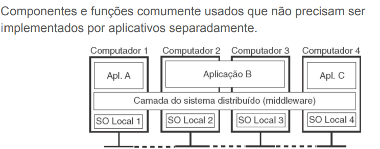

## PEX0183 - SISTEMAS DISTRIBUÍDOS
- Objetivo da disciplina: prover os conceitos básicos dos sistema distribuídos
modernos com enfoque na produção de aplicações distribuídas, tolerantes a
falhas, escaláveis e seguras.
> Unidade I - Introdução aos Sistemas Distribuídos: definição, metas e tipos.Arquiteturas de Sistemas Distribuídos. Processos
> Unidade II - Comunicação. Nomeação. Sincronização.
> Unidade III - Consistência e replicação. Tolerância a falhas. Segurança.

> Utilizar o AWS Academy nas atividades práticas da disciplina;
* ○ https://aws.amazon.com/pt/training/awsacademy/
* ○ AWS Learner Labs;
* ○ AWS CPoC da UFERSA;

## Definição de um Sistema Distribuído.
- Um Sistema Distribuído é uma coleção de elementos computacionais autônomos que se apresenta aos seus usuários como um sistema único e coerente.
> Elementos computacionais autônomos; 
- Também referenciados como nós. Podem ser entendidos como dispositivos físicos (hardware) ou processos (softwares). 
> Percepção de um único sistema (para usuários e aplicações); 
> Não há premissas sobre as tecnologias de interconexão e tipos de componentes.

## Sistema coerente
- Essência: a coleção de nós que opera como um todo, não importa onde, quando, e como ocorre a interação entre um usuário e o sistema.
> Ex: Um usuário final não pode dizer onde um cálculo está ocorrendo;
> Ex: Onde os dados são armazenados exatamente deve ser irrelevante para uma aplicação;

- Obstáculo: É inevitável que, a qualquer momento, apenas uma parte do sistema distribuído
falhe.

### Os pilares do framework
- Excelência operacional
- Segurança
- Confiabilidade
- Eficiência de performance
- Otimização de custo
- Sustentabilidade


> Exemplo:
````
+ Sistema de compras on-line 
● Pedidos realizado por múltiplos dispositivos (notebooks, celulares, etc);
● Diversos departamentos de vendas podem estar envolvidos;
● Para os usuários, o sistema se apresenta como um único sistema centralizado

````


## Middleware
> Conceito: é um software que atua como uma camada intermediária, facilitando a comunicação e o gerenciamento de dados entre diferentes aplicações, sistemas operacionais e componentes.

--- 


---
> Ex: sistema de armazenamento on-line:
- Usuário não tem ciência onde e em qual local físico os arquivos estão armazenados no sistema; 
- Os dados são apresentados de maneira coerente aos usuários que podem ter acesso aos dados em diferentes sistemas operacionais e dispositivos;

```
● Permitir o compartilhamento de recursos;
● Transparência de distribuição;
● Abertura;
● Escalabilidade.
- Basicamente, as metas de um sistema distribuído é fornecer fácil acesso aos recursos, tentar ocultar o fato dos recursos estarem distribuídos, manter sua abertura e possibilitar ser expandido.
```

### Compartilhando recursos
- Permitir que recursos remotos sejam facilmente acessados e compartilhados entre os usuários de maneira controlada;
> economia.
> conectar usuários.
> questões de segurança - Dificuldade de se proteger os recursos se torna maior.
- Ex: Armazenamento e arquivos compartilhados baseados em nuvem;

### Transparência da distribuição
- Um sistema distribuído é dito transparente se for capaz de se apresentar como um único sistema computacional aos usuários.
- Ocultar que os recursos são fisicamente distribuídos através de diversas plataformas computacionais.

| Transparência | Descrição |
|---------------|-----------|
| Acesso        | Oculta as diferenças na representação de dados e como um recurso é acessado. |
| Localização   | Oculta as informações do lugar (onde) um recurso está localizado. |
| Relocação     | Oculta a possibilidade de um recurso poder ser movido de uma localização para outra, **durante o uso**, sem que os usuários percebam. |
| Migração      | Oculta que um recurso pode se mover para outro local sem que o usuário perceba. |
| Replicação    | Oculta que um recurso é replicado. |
| Concorrência  | Oculta que um recurso pode ser compartilhado por vários usuários independentes. |
| Falha         | Oculta a falha e recuperação de um recurso. |


---

#### **De Acesso**

* Oculta as diferenças de sistemas operacionais, arquiteturas e representações de dados.
* O usuário acessa o recurso da mesma forma, independente da plataforma.

> **Exemplo:** O arquivo `/home/faminto/Dropbox/janta/pao-com-ovo.txt` no *Ubuntu* é acessado do mesmo jeito que `C:\Users\Faminto\Dropbox\janta\pao-com-ovo.txt` no *Windows*.


#### **De Localização**

* O usuário acessa o recurso sem precisar saber onde ele está fisicamente.
* O nome do recurso não revela a localização.

> **Exemplo:** `www.google.com/index.html` não mostra em qual servidor do Google o arquivo está.


#### **De Realocação**

* Um recurso pode ser movido para outro local durante o uso, sem afetar o acesso do usuário.
* O sistema mantém a transparência da movimentação.

> **Exemplo:** O arquivo `index.html` pode ser transferido para outro servidor enquanto você o acessa, e você não percebe essa mudança.


#### **De Migração**

* O recurso pode mudar de local (lógico ou físico) sem que o usuário perceba.
* Diferente da realocação: a migração não acontece durante o uso, mas entre usos.

> **Exemplo:** Um site hospedado em uma máquina virtual muda de datacenter, mas os usuários continuam acessando com a mesma URL.


#### **De replicação**
* Mesmo que existam várias cópias (réplicas) de um recurso para melhorar desempenho ou disponibilidade, o usuário não percebe, pois acessa todas elas pelo mesmo nome.
> Ex: Quando você acessa www.google.com/index.html, não dá para saber se o arquivo vem de um único servidor ou de várias cópias espalhadas pelo mundo — para você parece sempre o mesmo recurso.


#### **De Concorrência**

* Vários usuários podem acessar e compartilhar o mesmo recurso ao mesmo tempo, sem perceber conflitos.
* O sistema garante que todos vejam o recurso de forma consistente.

> **Exemplo:** Várias pessoas podem editar simultaneamente um documento no **Google Docs**, mas cada uma tem a impressão de que está usando o arquivo sozinha e de forma correta.

## **De Falha**
* Exemplo: Quando um servidor da Netflix cai, outro assume automaticamente e você continua assistindo ao filme sem notar a falha.

Boa! Vou explicar isso de forma simples, com exemplos para você entender fácil:

---

### **1.2.2 Grau de Transparência**

👉 **O que significa:**
Nem sempre é possível (ou desejável) esconder totalmente que o sistema é distribuído. Às vezes, mostrar um pouco dessa "realidade" ajuda mais do que tentar esconder tudo.

---

### **Por que não dá para ter transparência total?**

* **Latência (atraso de rede):** sempre vai existir, não dá para esconder.

  > Exemplo: uma chamada de vídeo pode travar por causa da internet lenta.

* **Falhas de rede ou servidores:** não tem como esconder completamente.

  > Exemplo: você não sabe se o servidor está lento ou se caiu de vez.

* **Desempenho:** se tentar esconder tudo, o sistema fica mais lento.

  > Exemplo: manter várias cópias de um arquivo (replicação) sempre atualizadas exige tempo extra.

-
### **Quando é bom expor a distribuição (mostrar ao usuário)?**

* **Serviços baseados em localização:**

  > Exemplo: um app de rede social mostra seus amigos próximos.

* **Usuários em fusos horários diferentes:**

  > Exemplo: um site de notícias mostra o horário local da publicação.

* **Para facilitar a compreensão do usuário:**

  > Exemplo: se um servidor não responde, mostrar “Servidor indisponível” é melhor do que deixar o usuário esperando para sempre.


### **Conclusão**

A transparência é importante, mas deve ser usada **na medida certa**.

* Esconder o necessário para facilitar o uso.
* Mostrar o suficiente para que o usuário entenda o que está acontecendo.

