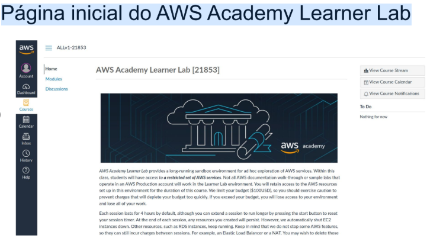
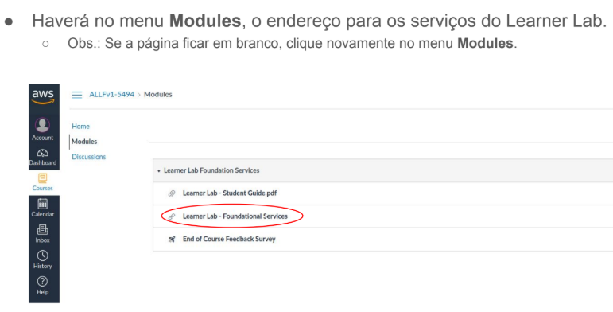
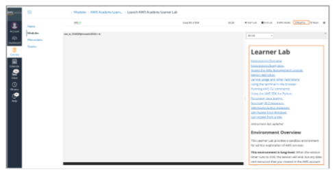
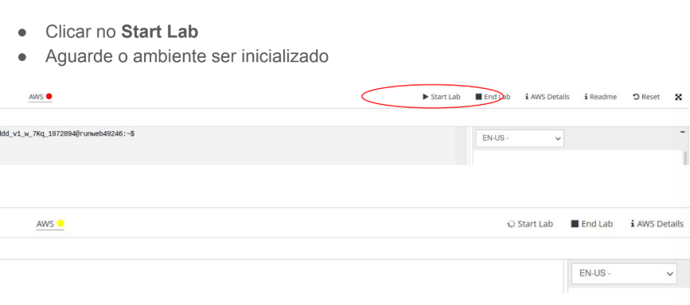
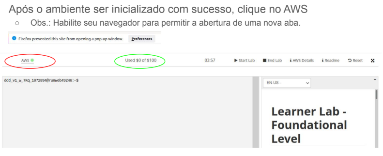
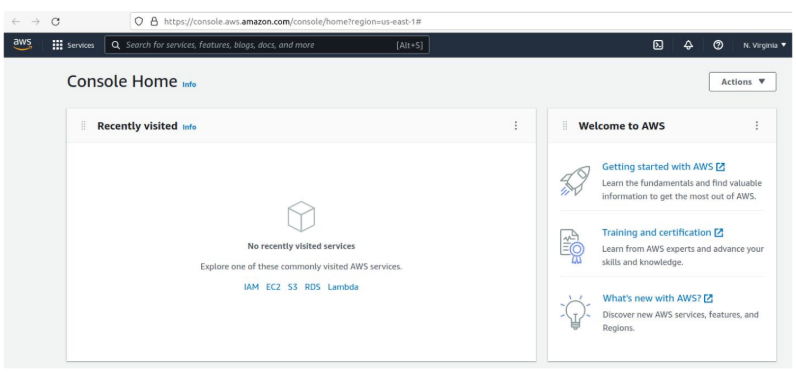
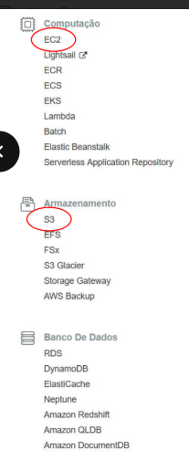

## Apresentação do AWS Academy;
> O que é o programa AWS Academy?
- Capacitar as instituições de ensino superior para preparar estudantes para certificações reconhecidas no setor e carreiras na nuvem.
- Serviços de plataforma e infraestrutura em nuvem.
> AWS Academy Learner Lab;
---
> 1.To start the lab, choose Start Lab

---

> 2. Quando o ícone do círculo à direita do link da AWS no canto superior esquerdo ficar verde, o ambiente de laboratório estará pronto para uso. Para iniciar o AWS Management Console em uma nova guia, escolha o link da AWS
> Você está conectado ao console com uma conta temporária da AWS, que pode ser usada enquanto o cronômetro da sessão de laboratório estiver ativo. O sistema salvará seu trabalho quando você encerrar a sessão ou o cronômetro da sessão expirar.
---
> 3. Para ver as instruções do laboratório, retorne ao LMS e escolha Leia-me. As instruções explicam como acessar e usar sua conta da AWS, os serviços da AWS que estão disponíveis para você e as restrições impostas a alguns serviços da AWS.

---
> 4. Para monitorar os gastos, consulte a área na parte superior das instruções do laboratório. Observação: Essas informações são fornecidas pelo serviço de Orçamentos da AWS e podem apresentar atraso de até 8 horas. Esta é uma visão aproximada dos gastos. 
- Observação: Se você gastar todo o orçamento, perderá todo o seu trabalho e o sistema desativará sua conta temporária da AWS. Seu orçamento de US$ 50 da plataforma AWS é suficiente para a maioria dos projetos acadêmicos, desde que você se atenha às diretrizes orçamentárias.

---

---

> ! IMPORTANTE: . When you are finished with the session, choose End Lab.
- Ao concluir a sessão, selecione Encerrar Laboratório.
- Instâncias como EC2,  execução em segundo plano e serão cobrados, mesmo fora do horário da sua sessão de laboratório.

---
### O que é a Amazon AWS?
- É um provedor com uma plataforma de serviços web que oferece soluções de computação,
armazenamento e rede em diferentes camadas de abstração.
- Hospedagem de sites.
> AWS é uma nuvem pública.

### O que é a computação em nuvem?
* A nuvem é um grande sistema de virtualização de recursos computacionais
- Computação (Processamento)
- Armazenamento
- Rede
* O usuário cria versões virtuais dos recursos para executar suas aplicações

> Estrutura:
### 0.1: **tradicional**.
- No Software: Isso é ter um servidor físico na sua empresa (datacenter). Você compra o computador (hardware), instala o sistema operacional, o banco de dados e, finalmente, cria e roda sua aplicação.
- Resumo: Você controla TUDO, mas também tem TODO o trabalho. 

### 0.2: **Infraestrutura como Serviço**.
- No Software: Isso é a IaaS. Você aluga os servidores virtuais (Amazon EC2) e o armazenamento (Amazon S3) da AWS. A infraestrutura física é deles, mas você ainda precisa instalar o sistema operacional, os bancos de dados e sua aplicação.
- Resumo: Você aluga a base, mas ainda monta o produto.

### 0.3: **Plataforma como Serviço (PaaS)**.
- No Software: Isso é a PaaS. A AWS te dá uma plataforma pronta para rodar seu código. Você não se preocupa com o servidor, nem com o sistema operacional. Você só se preocupa em enviar sua aplicação e seus dados.
- Resumo: Eles te entregam a "plataforma" pronta, você só coloca sua criação em cima.

### 0.4: **Software como Serviço**.
- No Software: Isso é a SaaS. É o Gmail, YouTube, Netflix, Google Docs. Você simplesmente usa o aplicativo pronto. Não se preocupa com absolutamente nada: nem com o código, nem com os servidores, nem com a infraestrutura.
- Resumo: Você apenas consome o serviço final, sem nenhum trabalho de criação.

## Regiões e Zonas de Disponibilidade
- AWS é uma Nuvem pública organizada em Regiões
- Cada região corresponde a uma localidade geográfica onde a Amazon mantém
1 ou mais datacenters.
- Cada datacenter é chamado de Zona de Disponibilidade.
> Para efeitos de aprendizado, é melhor fazer tudo na região us-east-1, pois costuma ser a mais barata.

## Acesso aws.
- HTTPS
- JSON
## Quais os serviços da AWS?
- Existem vários serviços da AWS;
- Os estruturais são:
- EC2 (virtualização de servidores)
- S3 (virtualização de armazenamento de objetos)
- VPC (redes virtuais)
- Em cima dos serviços básicos, novas camadas de abstrações são criadas;

---

---

## Criação e execução de uma instância no AWS/EC2
- ``GuiaEC2.md``

